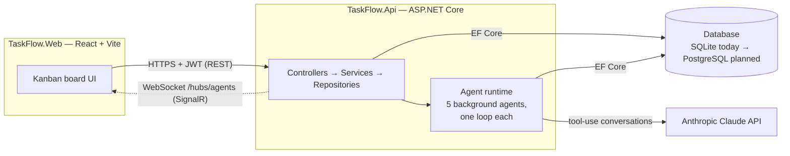

# TaskFlow

A job-application tracker where the Kanban board isn't just worked by you — a set of always-on
Claude agents claim tasks, tailor documents, and hand work back for your approval, live over
WebSockets. Full-stack .NET + React, built with strict TDD from the ground up.

## What it is

TaskFlow is a single-tenant application tracker built around one idea: **an AI agent should work
the board the same way a human collaborator would** — claim a task, do the work, leave a record,
hand it back for review. Feed it a job posting and a base resume and two agents work in parallel
to produce a tailored resume and matching cover letter; approve or reject them as a pair. Every
claim, progress note, and status change pushes to the UI in real time, so the board never needs a
refresh to reflect what the agents are doing.

## Highlights

- **Agentic architecture, not a single chatbot call.** Five independent background agents
  (generic task executor, resume tailoring, cover-letter writing, task prioritization, stale-task
  detection) each run their own observe → reason → act loop, driving bounded Claude tool-use
  conversations rather than one-shot prompts.
- **Human-in-the-loop by construction.** Agents can move a task to Review; only a human can move
  it to Done. The executor's guardrails (an enable/disable switch, a daily spend cap, atomic
  task-claiming) are checked before every cycle, not bolted on after.
- **Real-time by design.** A single shared SignalR connection pushes every agent event and task
  move to the client — no polling.
- **Cost-aware AI usage.** Document ingestion runs a free rule-based parser first and only
  escalates to Claude when that pass can't produce a clean result, backed by a daily spend guard
  on every paid call.
- **Security-conscious.** Job-posting URL import validates DNS at both resolve time and actual
  connect time to close the classic "resolve-then-check" SSRF/DNS-rebinding gap, with a
  negative test proving each mitigation actually rejects the attack it exists to stop.
- **Strict TDD throughout.** Every backend and frontend change ships with its test coverage in the
  same commit — RED confirmed failing before GREEN, hundreds of tests across both suites.

## Architecture



The client never talks to the database or to Claude directly — every path runs through the API.
Full breakdown of every layer (controllers, the agent execution loop, the data model, key flows)
is in [`TaskFlow.Epics/TaskFlow_Architecture_Overview.md`](TaskFlow.Epics/TaskFlow_Architecture_Overview.md).

## Tech stack

| Layer | Stack |
|---|---|
| Backend | ASP.NET Core 10, EF Core, JWT auth, SignalR |
| Frontend | React 19, TypeScript, Vite, Tailwind CSS, `@dnd-kit` for drag-and-drop |
| AI | Anthropic Claude, tool-use agent loops |
| Export | Typst (Markdown → PDF for tailored resumes/cover letters) |
| Testing | xUnit + coverage (backend), Vitest + Testing Library + MSW (frontend) |
| Data | SQLite today; PostgreSQL migration planned |

## A few engineering decisions worth reading the code for

- **Per-cycle DI scoping with a cancel-the-loser wake race.** Each agent loop opens a fresh
  dependency-injection scope per cycle and waits on `Task.WhenAny(interval, wakeSignal)` racing
  against a linked, cancelled-afterward `CancellationTokenSource` — so a human re-enabling the
  executor wakes it immediately without leaving a stale wait registered to be satisfied by a later,
  unrelated signal.
- **Ownership checks collapse to one failure mode.** Every owned resource check returns the same
  `NotFound` whether the resource doesn't exist or just isn't yours — no 403-vs-404 distinction
  that would leak which IDs belong to other users.
- **Filenames are sanitized against a fixed cross-OS character set,** not just
  `Path.GetInvalidFileNameChars()` — that call reflects the *server's* host OS, not the client
  saving the file, so relying on it alone silently breaks downloads if the API and the browser are
  ever on different platforms.
- **A paired-review gate, not two independent approvals.** The board only renders a combined
  review card once *both* sibling tasks (resume + cover letter) reach Review — a lone task that
  finishes early waits, so review always happens on a matched pair.

## Getting started

Prerequisites: [.NET 10 SDK](https://dotnet.microsoft.com/download), [Node.js 20+](https://nodejs.org/).

```bash
git clone <this-repo>
cd TaskFlow
```

Run the whole app (API on `:5002`, web on `:5173`, browser opens automatically):

```bash
.\run
```

Or run each side manually:

```bash
dotnet run --project TaskFlow.Api
```

```bash
cd TaskFlow.Web
npm install
npm run dev
```

An Anthropic API key is required for the agents to do real work (set `Anthropic:ApiKey` via user
secrets or environment config) — the app runs without one, but Claude-backed agents stay idle.

## Testing

```bash
.\test
```

Runs the full backend (`dotnet test` with coverage) and frontend (`vitest run` with coverage)
suites and writes results to `test-results.txt` at the repo root.

## Roadmap

Ongoing and planned work is tracked in detail under [`TaskFlow.Epics/`](TaskFlow.Epics/):

| Epic | What it changes |
|---|---|
| Database migration | SQLite → PostgreSQL |
| Deployment & infrastructure | Standalone executable, plus a Docker/Kubernetes track |
| Per-user credentials | Each user configures their own Claude API key and model |
| Job-posting URL import | SSRF-safe server-side fetch for job postings pasted as a URL |
