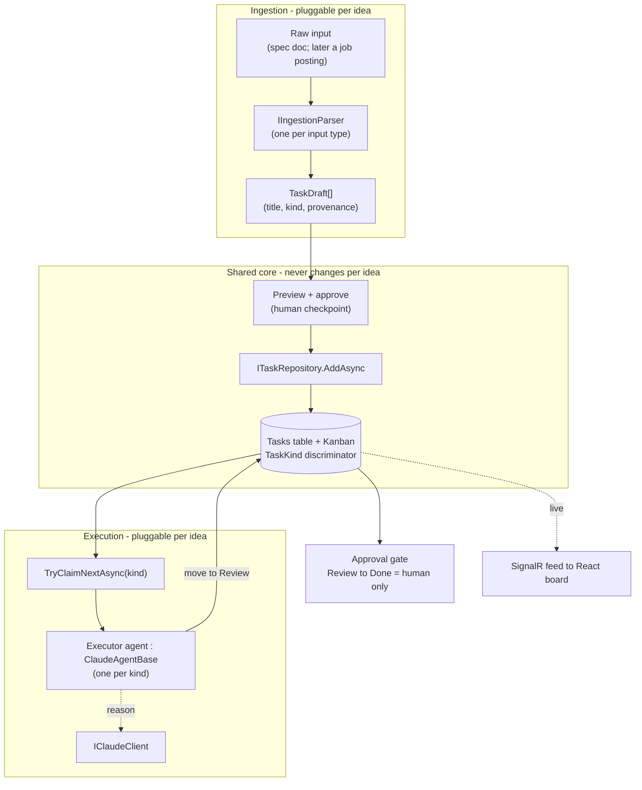

# TaskFlow — North Star Epic: Document-Driven Autonomous Execution

This is a standalone working document for the next epic, built on top of the completed
architecture-and-TDD refactor (Slices A–L, shipped and green: 39 backend tests + 14 frontend).
That refactor is the finished record; **this** document is the live source of truth going
forward. The unit of work here is a **sprint**, not a slice.

**The one-sentence goal:** hand TaskFlow a specification document (like this one), and it parses
the document into tasks on its *own* Kanban board, then executor agents pick those tasks up and
do the work live while you watch on the dashboard.

**Guiding rule (unchanged):** the app builds and runs at the end of every sprint. We never tear
the house down. We add rooms while people are still living in it.

---

# Epic Roadmap and the Extensibility Bet

This is **Epic 2**. The sequence:

- **Epic 1 — Architecture & TDD refactor.** Complete. The layered, tested foundation.
- **Epic 2 — Generic document-driven execution (this doc).** Build the ingestion and executor
  framework *generically*, so a new idea is a plug-in, not a rewrite.
- **Epic 3 — Resume & cover-letter builder (planned, not started).** The first concrete
  application: a job posting is the "document," and the executor writes a tailored resume and
  cover letter. It will be added as a new ingestion parser plus a new executor agent type on top
  of Epic 2's generic core, with no change to the board, repositories, or transport.

**The extensibility bet (the whole point of Epic 2):** every future idea reduces to two
pluggable pieces on top of the shared platform:

1. an **ingestion parser** that turns some input into task drafts, and
2. an **executor agent type** (a `ClaudeAgentBase` subclass) that does the work.

The Kanban board, repositories, the `IClaudeClient` seam, the live SignalR feed, and the
guardrails are shared and generic. Build Epic 2 so those never need to change when a new
application is added. If a new idea forces a change to that shared core, that is a design smell
to fix, not a change to accept.

---

# Rules to follow for AI who are reading this

- **TDD is how we build everything.** Red (failing test) → green (simplest code) → refactor.
  When adding code, add its test coverage in the same change, up front, not later.
- **Strict DRY and SOLID.** Fix name collisions and duplication at the source, never by
  band-aiding (no aliasing a collision, no copy-pasted helper).
- **Do not agree on everything.** Come back with sound advice from the principles.
- **Do not band-aid.** If it is wrong, we fix it properly.
- **How to work:** follow this document top to bottom. Each sprint has explicit file paths,
  RED tests, GREEN code, a pastable PR description, and merge/delete steps. Bring bugs to chat;
  every fix gets recorded back into this document so the chat stays disposable.
- **Tooling boundary (important):** Claude can create and edit files directly in the repo, but
  Claude's sandbox CANNOT run `git` and does not run `dotnet` or `npm`. Claude writes the code
  and tests into the repo; YOU run every `git` / `dotnet` / `npm` command on your machine and
  report the result. This matches the TDD loop: you run, Claude writes.

**Standing rules (carried from the refactor, do not repeat the mistakes):**

- **Never claim you verified something you did not actually check.** Confirm against the real
  artifact: exact file name, real contents, actual test output. A false verification is worse
  than admitting you have not checked.
- **Separate facts from inferences; never state an inference as fact.** Say what you actually
  checked; label the rest as an inference for the user to confirm. The truth is whatever
  `dotnet test` / `npm run test` prints.
- **Never assume progress or mark work done without confirmation.** Do not tick off a step
  unless the repo or the user confirms it.
- **Enforce TDD order; halt the moment implementation lands before its failing test.** Call it
  out and stop, even if the user is moving ahead.
- **When the deliverable is code, deliver the actual code** with file path, namespace, and
  usings, paste-ready. Prose is for the test to encode, not a substitute for the class.
- **Never hand over anything you claim works but have not tested.** Test it, or state plainly it
  is untested and why.
- **Hold the whole map.** Read the whole document before advising so guidance fits overall scope.
- **Do not invent scope, and never slip unspecified work into a "next step."** If something is
  missing and should be added, say so explicitly and record it in the doc as a labeled decision
  before acting. (Violated: dropped "thread a source name into provenance" as if it were task
  `T1.3`, which it was not.)
- **Refer to a task by exactly what the doc says it is.** Do not silently relabel or re-scope a
  numbered task in passing. (Violated: called `T1.3` "thread a source name" when `T1.3` was
  "stamp kind + provenance," already satisfied.)
- **Own the decisions that are yours; do not punt "your call" on an architect/developer choice.**
  Decide, record it in the doc, and commit. Reserve "your call" for genuine product decisions.
  (Violated: flagged the provenance gap, then deferred where it goes back to the user.)

**Naming conventions (carried forward):** domain types never reuse a .NET BCL name (the old
`TaskStatus` collided with `System.Threading.Tasks.TaskStatus`, hence `WorkflowStatus`); result
types live in `Common/`; npm package names stay lowercase.

---

# The Vision

Hand TaskFlow a specification document. TaskFlow:

1. **Parses** the document into discrete, well-formed work items.
2. **Creates** them as tasks on the Kanban board (To Do column).
3. **Agents pick them up** autonomously, move them across the board
   (To Do → In Progress → Review → Done), and actually do the work.
4. **You watch it happen live** on the dashboard via the SignalR feed already built.

In other words: the reactive agents (prioritize, detect staleness) grow into *executing* agents
(ingest, plan, act).

**The key point: it feeds TaskFlow's *own* board.** Ingestion does not build a separate pipeline
or a new task store. It writes through the *same repositories* into the *same `Tasks` table*
that backs the *same Kanban board* you already built. The executor agent is the *same agent
layer*. You watch on the *same React board* over the *same SignalR feed*. The document simply
becomes cards on your board, and the agents work them.

```mermaid
flowchart LR
    DOC["Spec document<br/>(a doc like this)"]
    ING["IngestionService<br/>parse → task drafts<br/>(a Service)"]
    RP["Repositories<br/>AddAsync"]
    BOARD[("TaskFlow board<br/>same Tasks table + Kanban")]
    EX["Executor agent<br/>claims + does work<br/>IClaudeClient"]
    CLAUDE["Claude API<br/>reason step"]
    YOU["You<br/>watching live"]

    DOC -->|1. hand it in| ING
    ING -->|2. write tasks| RP
    RP -->|3. tasks appear| BOARD
    BOARD -->|4. claim a To Do card| EX
    EX -. reason .-> CLAUDE
    EX -->|5. do work, move card| BOARD
    BOARD -. 6. SignalR live push .-> YOU
```

Everything in that diagram already exists except the two new boxes, `IngestionService` and the
executor agent, and both are built on seams the refactor already put in place. Nothing new is
invented at the data or transport layer.

---

# The Seams This Epic Builds On (already shipped and tested)

This epic does not start from scratch. It plugs into work that already exists and is covered:

- **Service layer.** The `Result<T>` type (`Common/`), interface-plus-implementation services,
  and mocked-repository unit tests. New services (like ingestion) follow this exact pattern.
- **Repositories.** `ITaskRepository` / `IUserRepository` / `IAgentLogRepository` with
  `AddAsync` / `SaveChangesAsync`. All task writes go through these. `TaskItem` uses
  `WorkflowStatus` (Todo / InProgress / Review / Done) and `TaskPriority`.
- **The Claude seam.** `IClaudeClient` (with `IsConfigured` + `SendAsync`) and the abstract
  `ClaudeAgentBase` that owns the tool-use loop, action logging, and lifecycle broadcasts.
  Executor agents subclass `ClaudeAgentBase`. Agents are unit-testable with `StubClaude`.
- **Agent runner.** `AgentRunner` (an `IHostedService`) discovers every `ITaskFlowAgent` and
  runs it on its interval.
- **Live feed.** `AgentHub` (SignalR) + `IAgentNotifier` + `HubEvents` (`AgentAction`,
  `AgentCycle`). The React dashboard already renders this feed via `useAgentFeed`.
- **Frontend layers.** `api/ hooks/ components/ features/ lib/`, with a Vitest + RTL + MSW test
  harness (`__mocks__/@microsoft/signalr.ts` for the SignalR stub).

If a sprint needs a seam that does not exist yet, that is a signal to build the seam test-first,
not to reach around it.

---

# Architecture — the 10,000ft View (the design to build toward)

Epic 2 adds exactly two new capabilities to the existing layered app: turning input into task
drafts (**ingestion**) and working tasks off the board (**execution**). Both are built as
generic, pluggable seams so Epic 3 and anything after is a plug-in, not a rewrite.

## The one new idea: tasks have a *kind*, and executors self-select by kind

Today every task is generic. To let different agents do different work on the same board,
`TaskItem` gains a **`TaskKind`** discriminator (`Generic` now, `ResumeTailoring` later).
Ingestion stamps a kind on every draft; each executor declares the one kind it works. The
`AgentRunner` already discovers every agent, so adding an executor for a new kind is just
registering a new agent. That single discriminator is what makes the platform extensible:

> **A new application = a new parser that emits a new kind + a new executor that claims that
> kind.** The board, repositories, transport, and guardrails never change.



## New building blocks (all generic)

- **`TaskDraft`** — a proposed task (title, description, priority, `TaskKind`, provenance).
  Ingestion output; not yet persisted.
- **`IIngestionParser`** — returns `Result<IReadOnlyList<TaskDraft>>` from raw content. Two
  implementations sit behind the seam: the free deterministic `SpecDocumentParser` (rules) and the
  paid `ClaudeIngestionParser` (agent, `IClaudeClient`, `StubClaude`-tested). A
  `TieredIngestionParser` composes them **free-first**: run the rules parser, and escalate to
  Claude only when it returns zero drafts (unstructured content rules cannot handle). Free when it
  reaches the outcome, agent when it must, still works with no Claude key.
- **Source-agnostic input** — file, paste, and link are acquisition adapters that all reduce to
  content plus a source name; the parser never knows where the content came from. Paste and
  file-to-text first; the link adapter fetches server-side (with the usual fetch caveats) as a
  follow-up.
- **Provenance** — every agent-created task records where it came from. `Section` (the source
  heading) is captured on the draft at ingestion (Sprint 1). The **source-document id** is stamped
  when a draft is persisted as a board task (Sprint 3), completing provenance = source id +
  section. The nullable provenance fields on `TaskItem` and their migration land in Sprint 3, not
  earlier.
- **Atomic claiming** — `ITaskRepository.TryClaimNextAsync(kind, agentName)` moves the next
  unclaimed `Todo` task of a kind to `InProgress` with an owner stamp, guarded so two agents never
  grab the same card. Concurrency stays in the repository (its single responsibility).
- **Executor agents** — each a `ClaudeAgentBase` subclass for one `TaskKind`: claim, work via
  Claude tools, move to `Review` (never straight to `Done`). Epic 2's generic executor does a
  minimal real step (ask Claude to draft a plan/result for the task and record it) so the whole
  pipeline runs end-to-end before any domain work exists.
- **Guardrails** — the approval gate (`Review → Done` is a human action, never the agent), a
  spend cap around Claude calls, rollback (a failed step returns the task to `Todo` and logs,
  never leaves it stuck `InProgress`), and the existing per-cycle tool-loop cap.

## Dependency direction (unchanged from Epic 1)

React board → api → hooks; controllers → services → repositories → EF; executors → repositories
+ `IClaudeClient`; live updates → SignalR. Every arrow already exists. Ingestion is a new
service; executors are new agents. Nothing new at the data or transport layer.

## Decisions this design makes (confirm before Sprint 1)

1. **`TaskKind` discriminator on `TaskItem`** is the extensibility mechanism (enum + migration).
2. **Claiming = an atomic `Todo → InProgress` transition** via a guarded repository method, not an
   app-level lock.
3. **Executors always stop at `Review`;** only a human moves `Review → Done`. The approval gate is
   in from the start and hardened in Sprint 6.
4. **Epic 2's generic executor does a trivial real step** so the pipeline is demonstrable
   end-to-end; Epic 3 registers the first domain executor.
5. **Left open (product calls, decided when we reach them):** parsing granularity and
   rules-vs-Claude (Sprint 1); whether a `Blocked`/`Failed` column is worth adding for rollback
   visibility (Sprint 6).

---

# The TDD Loop and Git Workflow (per sprint)

The loop is identical to the refactor:

1. Claude writes a failing test (RED) with exact file path, namespace, and usings.
2. You run `dotnet test` / `npm run test` and confirm it is red.
3. Claude writes the simplest code to pass (GREEN).
4. You run again and confirm green.
5. Refactor if needed, tests staying green.

**Per-sprint PR cadence.** One branch and one PR per sprint into `develop`, merged and deleted.
`develop → main` is the release point at natural milestones. Branch names use
`feature/sprint-N-short-name`. Both `main` and `develop` are protected, so releases go through a
PR, never a local fast-forward.

---

# Sprint Plan

The old refactor mapped this destination as future slices M–R. Renumbered fresh for this epic:

| Sprint | What | Leans on |
|--------|------|----------|
| **1** | `IDocumentIngestionService`: parse a spec doc into task drafts | Service-layer pattern |
| **2** | Ingestion endpoint + UI to upload a document and preview drafts | Thin controller + frontend layers |
| **3** | Task drafts → board tasks with provenance (which doc, which section) | Repositories |
| **4** | Executor agent: claims a To Do task, plans sub-steps, works it | `IClaudeClient` + `ClaudeAgentBase` |
| **5** | Board transitions driven by the executor, streamed live | Repositories + SignalR |
| **6** | Guardrails: human approval gates, cost caps, rollback on failure | All of the above |
| **7** | UX & Integration: reachable ingestion, single-origin dev, polished login | Frontend layers + router |

Each sprint is specified in full, small and test-first, when we reach it. The stubs below fix
the destination and the seams; they are not yet the RED/GREEN code.

---

## Sprint 1 — Document Ingestion Service

**Goal:** a testable service that turns a specification document into a list of well-formed task
drafts, with no HTTP and no Claude in the test.

**Produces:** `IDocumentIngestionService` + implementation (service-layer style, returning
`Result<IReadOnlyList<TaskDraft>>`), and a `TaskDraft` shape (title, description, provenance
placeholder). Unit tests over the parsing/splitting rules using plain in-memory input.

**Test approach:** feed representative document text, assert the draft count and fields. The
parsing rule (see open questions) is the unit under test, so it must be deterministic; if a
Claude-assisted parse is chosen, put it behind the `IClaudeClient` seam so the test uses
`StubClaude`.

**Decided (2026-07-26):** the first parser is **rules-based and deterministic** — one draft per
markdown heading and per top-level checklist item. Zero Claude in Sprint 1, so
`SpecDocumentParser` is fully unit-testable with plain string input. A `ClaudeIngestionParser`
can be added later behind the same `IIngestionParser` interface (DIP) without touching anything
downstream.

### RED — the failing test (T1.2)

**FILE — create new: `TaskFlow.Tests/Ingestion/SpecDocumentParserTests.cs`**

```csharp
using FluentAssertions;
using TaskFlow.Api.Ingestion;
using TaskFlow.Api.Models;
using Xunit;

namespace TaskFlow.Tests.Ingestion;

public class SpecDocumentParserTests
{
    // Two headings + three checklist items = five drafts.
    private const string Doc =
        "# Set up auth\n" +
        "Add JWT login and registration.\n" +
        "\n" +
        "- [ ] Create the login endpoint\n" +
        "- [ ] Protect the task routes\n" +
        "\n" +
        "# Build the board\n" +
        "- [ ] Render the columns\n";

    [Fact]
    public void Parses_one_draft_per_heading_and_per_checklist_item()
    {
        var result = new SpecDocumentParser().Parse(Doc);

        result.IsSuccess.Should().BeTrue();
        result.Value!.Should().HaveCount(5);
    }

    [Fact]
    public void Heading_becomes_a_draft_titled_and_sectioned_by_the_heading()
    {
        var drafts = new SpecDocumentParser().Parse(Doc).Value!;

        drafts.Should().Contain(d => d.Title == "Set up auth" && d.Section == "Set up auth");
    }

    [Fact]
    public void Checklist_item_becomes_a_draft_under_its_parent_heading()
    {
        var drafts = new SpecDocumentParser().Parse(Doc).Value!;

        drafts.Should().Contain(d =>
            d.Title == "Create the login endpoint" && d.Section == "Set up auth");
    }

    [Fact]
    public void Every_draft_is_kind_Generic()
    {
        var drafts = new SpecDocumentParser().Parse(Doc).Value!;

        drafts.Should().OnlyContain(d => d.Kind == TaskKind.Generic);
    }
}
```

**Expect RED.** `TaskDraft`, `IIngestionParser`, `SpecDocumentParser`, and `TaskKind` do not exist
yet, so `dotnet test` will not compile. That is the red. The test encodes the contract: a parser
whose `Parse(string)` returns `Result<IReadOnlyList<TaskDraft>>`, where each `TaskDraft` has a
`Title`, a `Section` (its source heading, i.e. provenance), and a `Kind`.

### GREEN — the implementation

Four new files in `TaskFlow.Api`. Nothing more than the tests demand: descriptions are left
null (no test asks for them yet).

**FILE — `TaskFlow.Api/Models/TaskKind.cs`**

```csharp
namespace TaskFlow.Api.Models;

/// <summary>
/// Discriminator that lets different executor agents self-select which tasks they work.
/// New applications (epics) add their own kinds; the shared core never changes.
/// </summary>
public enum TaskKind
{
    Generic
}
```

**FILE — `TaskFlow.Api/Ingestion/TaskDraft.cs`**

```csharp
using TaskFlow.Api.Models;

namespace TaskFlow.Api.Ingestion;

/// <summary>
/// A proposed task produced by ingestion, before it is persisted to the board.
/// <c>Section</c> is the source heading it came from (provenance).
/// </summary>
public sealed record TaskDraft(string Title, string? Description, TaskKind Kind, string Section);
```

**FILE — `TaskFlow.Api/Ingestion/IIngestionParser.cs`**

```csharp
using TaskFlow.Api.Common;

namespace TaskFlow.Api.Ingestion;

public interface IIngestionParser
{
    Result<IReadOnlyList<TaskDraft>> Parse(string documentText);
}
```

**FILE — `TaskFlow.Api/Ingestion/SpecDocumentParser.cs`**

```csharp
using System.Text.RegularExpressions;
using TaskFlow.Api.Common;
using TaskFlow.Api.Models;

namespace TaskFlow.Api.Ingestion;

/// <summary>
/// Rules-based, deterministic parser: one draft per markdown heading and per top-level
/// checklist item. A pure function of the input text - no Claude, no I/O. Each checklist
/// item is filed under the most recent heading (its provenance).
/// </summary>
public sealed class SpecDocumentParser : IIngestionParser
{
    private static readonly Regex Heading =
        new(@"^\s*#+\s+(?<text>.+?)\s*$", RegexOptions.Compiled);

    private static readonly Regex ChecklistItem =
        new(@"^\s*[-*]\s*\[[ xX]\]\s+(?<text>.+?)\s*$", RegexOptions.Compiled);

    public Result<IReadOnlyList<TaskDraft>> Parse(string documentText)
    {
        var drafts = new List<TaskDraft>();
        var currentHeading = string.Empty;

        foreach (var rawLine in documentText.Split('\n'))
        {
            var line = rawLine.TrimEnd('\r');

            var heading = Heading.Match(line);
            if (heading.Success)
            {
                currentHeading = heading.Groups["text"].Value;
                drafts.Add(new TaskDraft(currentHeading, null, TaskKind.Generic, currentHeading));
                continue;
            }

            var item = ChecklistItem.Match(line);
            if (item.Success)
            {
                drafts.Add(new TaskDraft(item.Groups["text"].Value, null, TaskKind.Generic, currentHeading));
            }
        }

        return Result<IReadOnlyList<TaskDraft>>.Ok(drafts);
    }
}
```

### Sprint 1 status

`T1.1`, `T1.2`, and `T1.3` are all satisfied by the single red-green cycle above: `TaskDraft` +
`IIngestionParser` (T1.1), the deterministic `SpecDocumentParser` (T1.2), and stamping
`TaskKind.Generic` + `Section` provenance on every draft (T1.3, asserted by the tests). Sprint 1
is complete once `dotnet test` is green. Scope line: provenance here is the `Section` only; the
source-document id is deliberately deferred to Sprint 3 (see that sprint), not added now.

**PR body (shipped):**

```markdown
## Sprint 1 — Document ingestion service

Adds the first pluggable ingestion seam: a rules-based, deterministic parser that turns a
markdown spec document into task drafts.

### What
- `TaskKind` enum (executor self-selection discriminator; `Generic` for now).
- `TaskDraft` record (title, description, kind, section-as-provenance).
- `IIngestionParser` seam.
- `SpecDocumentParser`: one draft per heading and per top-level checklist item, pure function.

### Tests
4 new `SpecDocumentParserTests`; full backend suite 43 passing.

### Type of change
- [x] Feature (backend) + tests
```

---

## Sprint 2 — Agent-capable Ingestion + Source-agnostic Endpoint + Preview

**Goal:** hand content to the app from any source (file, paste, link), parse it into drafts
free-first (rules, escalating to a Claude agent only when needed), and preview the drafts before
they hit the board.

**Decided (this sprint's shape):**
- Parsing is a **tiered** `IIngestionParser`: free `SpecDocumentParser` first, escalate to
  `ClaudeIngestionParser` only when the rules parser returns zero drafts. Works with no Claude key.
- The endpoint is **source-agnostic**: it accepts content plus a source name. File, paste, and
  link are acquisition adapters that produce that content (paste and file-to-text now; the link
  adapter, which fetches server-side, is a follow-up with the usual fetch caveats).
- Preview is the human checkpoint before anything is written, setting up the approval surface
  Sprint 6 hardens.

**Parts (each its own red-green):**
- `T2.1` (BE) `ClaudeIngestionParser : IIngestionParser` — agent parsing via `IClaudeClient`,
  `StubClaude`-tested.
- `T2.2` (BE) `TieredIngestionParser : IIngestionParser` — free-first with escalation; registered
  as the app's `IIngestionParser`. Tests: structured input never calls Claude; unstructured does.
- `T2.3` (BE) source-agnostic endpoint: `IngestDocumentDto { content, sourceName }`,
  `POST /api/Ingestion`, returns drafts via `.ToActionResult()`. Controller test with a mocked parser.
- `T2.4` (FE) `TaskDraft` type, `api/ingestion.ts`, a `useIngestion` hook, and a paste/file preview
  container in `features/`. MSW + RTL tests.

**Leans on:** the `IClaudeClient` + `StubClaude` seam, the thin-controller pattern, and the
`api/ hooks/ components/ features/` split.

**Implementation notes / issues found (backend, 2026-07-26):**
- **Issue (fixed): `IIngestionParser` was synchronous.** A Claude-backed parser must await
  `IClaudeClient.SendAsync`, and blocking on it risks deadlocks, so the seam is now
  `Task<Result<IReadOnlyList<TaskDraft>>> ParseAsync(...)`. `SpecDocumentParser` and its Sprint 1
  tests were updated to match; the parsing logic is unchanged.
- **Decision: the endpoint takes `Content` only.** A source name/id is provenance and lands in
  Sprint 3, so adding it to `IngestDocumentDto` now would be a dead field. How the content was
  obtained (file, paste, link) stays the caller's concern, which keeps the endpoint source-agnostic.
- **Decision: `IngestionController` is `[Authorize]`,** matching the task routes; the preview lives
  in the authed area.
- **Backend files:** `ClaudeIngestionParser`, `TieredIngestionParser` (free-first), `IngestDocumentDto`,
  `IngestionController`, DI wiring in `Program.cs`, and `StubClaude.ThatReturnsText`. Tests cover each
  parser and the controller. The live-Claude path (prompt + JSON shape) is validated against a real
  key at runtime, not in tests.
- **Frontend (T2.4, done):** `TaskDraft` type, `api/ingestion.ts`, the `useIngestion` hook, and the
  paste/file `IngestDocument` preview in `features/`, plus an `/api/Ingestion` MSW handler. Tests:
  api (MSW), hook (`renderHook`), component (RTL). Not yet wired into the app nav (it is standalone
  and tested); hooking the preview into the dashboard is a small follow-up.

**PR body (target — we work to make it true):**

```markdown
## Sprint 2 — Agent-capable ingestion + source-agnostic endpoint + preview

Adds agent parsing behind the ingestion seam, a tiered free-first parser, a source-agnostic
endpoint, and a paste/file preview screen.

### What
- `ClaudeIngestionParser : IIngestionParser` — agent parsing via `IClaudeClient`.
- `TieredIngestionParser : IIngestionParser` — free rules first, escalate to Claude only on zero
  drafts, graceful with no key; registered as the app's `IIngestionParser`.
- `IngestDocumentDto` (content + source name) + `IngestionController` (`POST /api/Ingestion`).
- Frontend: `TaskDraft` type, `api/ingestion.ts`, `useIngestion` hook, paste/file preview.

### Tests
- `ClaudeIngestionParser` via `StubClaude`; `TieredIngestionParser` (structured input skips Claude,
  unstructured escalates); controller with a mocked parser; MSW api/hook + RTL preview.
- `dotnet test` and `npm run test` green.

### Type of change
- [x] Feature (backend + frontend) + tests
```

---

## Sprint 3 — Drafts Become Board Tasks (with provenance)

**Goal:** approved drafts are written as real tasks in the To Do column, each carrying provenance
(which document and section it came from).

**Produces:** persistence of drafts through `ITaskRepository.AddAsync`, `Kind` + provenance fields
on `TaskItem`, and repository/service tests over the write path using real in-memory SQLite. The
schema-management approach is decided in the analysis below.

**Leans on:** the repositories and the existing `Tasks` table. This is the point where the
document truly becomes cards on the same board.

### Analysis and plan (2026-07-26, before writing code)

**Issue found — the project uses `EnsureCreated()`, not migrations, yet a `Migrations/` folder
exists.** `Program.cs` startup calls `db.Database.EnsureCreated()`, which builds the schema
straight from the current model and neither runs nor records migrations. The three migrations in
`Migrations/` are dead at runtime, so adding a new migration would not take effect. Two
consequences: new model fields appear only on a *fresh* database (EnsureCreated never alters an
existing table), so the dev `taskflow.db` must be deleted once to pick them up (tests always get a
fresh DB and see them automatically); and the migrations and the model are now out of sync.

**Decision (DECIDED 2026-07-26) — adopt migrations.** `T3.0` is this ordered checklist. Every step
is mandatory; run them in order.
1. **(Claude, done)** `Program.cs` startup: `db.Database.EnsureCreated()` -> `db.Database.Migrate()`.
2. **(Claude, done in T3.1)** add the `TaskItem` fields (`Kind`, `SourceName`, `SourceSection`).
3. **(You)** generate the migration:
   `dotnet ef migrations add AddTaskKindAndProvenance --project TaskFlow.Api`.
   Claude cannot run EF tooling, and a hand-written migration must not be guessed.
4. **(You)** delete the old dev database, a one-time reset. It was built by `EnsureCreated` and has
   no migration history, so `Migrate()` would try to re-create existing tables and fail. From the
   solution root: `Remove-Item TaskFlow.Api\taskflow.db` (and `taskflow.db-wal` / `taskflow.db-shm`
   if present). Migrations are the only schema workflow after this.
5. **(You)** `dotnet test` — unit tests plus the integration test, which now boots through `Migrate()`.
6. **(You)** `dotnet run --project TaskFlow.Api` once to confirm the app starts and migrates a fresh
   dev DB.

**Test implications:** the in-memory unit/repo/agent tests (`SqliteInMemoryContext`) keep using
`EnsureCreated`, which builds the current model on a separate throwaway DB, so they pick up new
fields automatically and need no migration. Only the app runtime and the `WebApplicationFactory`
integration test go through `Migrate()`. The two stay in sync as long as a migration is generated
whenever the model changes.

**Bug found during T3.0 verification (fixed 2026-07-27).** `dotnet run` applied all migrations,
then the agents immediately failed with `SQLite Error 1: 'no such table: Tasks'` — a table the
migration had just created. Root cause: there was no `ConnectionStrings:DefaultConnection`
configured anywhere (no `appsettings.json`; the Development file has only logging; user secrets
held only the Anthropic key), so `UseSqlite(null)` fell back to a private per-connection SQLite
database. The schema built during `Migrate()` was destroyed when that connection closed, and the
agents' new connections saw an empty DB. Nothing caught it earlier because the unit tests keep one
in-memory connection open (`SqliteInMemoryContext`) and the integration test injects a temp-file
connection string through the factory; the dev app was the only context with no connection string.
Fix: `dotnet user-secrets set "ConnectionStrings:DefaultConnection" "Data Source=taskflow.db" --project TaskFlow.Api`.
Confirmed: the app runs clean and the agents execute end-to-end against Claude.

**Second dev-config bug (fixed 2026-07-27) — missing JWT settings.** The first real authenticated
request (the ingestion call) crashed at `Program.cs` with `ArgumentNullException` from
`Encoding.UTF8.GetBytes(jwtKey)`: `Jwt:Key` (and `Jwt:Issuer`/`Jwt:Audience`) were not in dev config
either. The JWT handler only initializes on the first `[Authorize]` request, so it stayed hidden
until the app was actually used. Same class as the connection string — config the test factory
injects via env vars but dev never had. Fix: `dotnet user-secrets set "Jwt:Key" <32+ byte random>`,
plus `Jwt:Issuer` = `TaskFlowApi` and `Jwt:Audience` = `TaskFlowClient`, then a fresh login (the old
token was signed with a different key). Confirmed working.

**Future hardening (noted only, not built — avoids scope creep):** fail fast at startup if required
config (`ConnectionStrings:DefaultConnection`, `Jwt:Key`) is missing, so neither a silent DB
fallback nor a lazy crash on first use can recur. Captured here; not part of Sprint 3.

**Decision (owned) — provenance is two nullable strings, not a foreign key.** There is no
`Document` entity (a document is transient ingested text), so "which document" is a `SourceName`
string and "which section" is a `SourceSection` string, both nullable on `TaskItem` (ingested
tasks carry them; hand-created tasks do not).

**Decision (owned) — the source name re-enters here.** Sprint 2 deferred it; the commit step
carries it. The client sends the approved drafts plus a `sourceName` to a new endpoint.

**Code plan (written test-first when we start Sprint 3):**
- `TaskItem`: add `Kind` (`TaskKind`, default `Generic`, `HasConversion<string>()` like `Status`)
  plus nullable `SourceName` and `SourceSection`. Seed tasks default to `Generic`.
- Persist path: a `CommitDraftsDto { SourceName, Drafts[] }`, a service method mapping each
  `TaskDraft` to a `TaskItem` (`Todo`, `Kind`, `SourceName`, `SourceSection = draft.Section`) and
  writing it via `ITaskRepository.AddAsync`, and a thin `POST /api/Ingestion/commit`. RED:
  in-memory SQLite asserts tasks land as `Todo` with kind + provenance.
- Frontend (small): the Sprint 2 preview gains an "Approve" action that calls the commit endpoint.

**PR body (target — we work to make it true):**

```markdown
## Sprint 3 — Drafts become board tasks (with provenance)

Approved drafts are persisted as real To Do tasks carrying provenance, and the app adopts EF
migrations for schema changes.

### What
- Adopt migrations: `Program.cs` startup `EnsureCreated()` -> `Migrate()`, plus a generated
  `AddTaskKindAndProvenance` migration.
- `TaskItem` gains `Kind` (default `Generic`, stored as a string) and nullable `SourceName` +
  `SourceSection`. Provenance is two strings; there is no `Document` entity to key off.
- `CommitDraftsDto { SourceName, Drafts[] }` + a service mapping drafts to `TaskItem`
  (`Todo`, kind, provenance) via `ITaskRepository.AddAsync` + thin `POST /api/Ingestion/commit`.
- Frontend: the ingestion preview gains an Approve action that commits the drafts.

### Tests
- Repository round-trips kind + provenance (in-memory SQLite); commit service lands tasks as
  `Todo`; controller with a mocked service; MSW + RTL for the Approve action.
- `dotnet test` and `npm run test` green; the integration test exercises `Migrate()`.

### Type of change
- [x] Feature (backend + frontend) + tests + migration
```

---

## Sprint 4 — Executor Agent

**Goal:** an agent that claims a To Do task, plans sub-steps, and does the work, tested with
canned Claude responses rather than live calls.

**Produces:** a new `ClaudeAgentBase` subclass registered as an `ITaskFlowAgent`, its tool set
(claim, record progress, request review), and agent tests using `StubClaude` and in-memory
SQLite, asserting real board/log side effects.

**Leans on:** `IClaudeClient`, `ClaudeAgentBase`, `AgentRunner`. This is the reactive-to-executing
jump: the same agent layer, now doing work instead of only re-prioritizing.

**Design point (carried forward):** an executor doing real work needs firm limits. We already
have a per-task iteration cap on the tool loop; this sprint keeps the leash short and defers the
spend ceiling and destructive-action gate to Sprint 6. The one limit that cannot wait is the
terminal-state guarantee (`T4.4`): the executor must never orphan a claimed task in `InProgress`.

### Analysis and plan (plan mode, before writing code)

**Grounded current state.** `ClaudeAgentBase` gives subclasses `RunToolConversationAsync(prompt,
tools, dispatch, ct)`, `DefineTool`, `ToolResult`, `WasSuccessful`, `RecordActionAsync` (persist +
broadcast), `RecordCycleSummaryAsync`, `ClaudeConfigured`, and the cycle broadcasts. `ITaskRepository`
has no claim method today. `TaskItem` has `Status`, `Kind`, and provenance but no field for which
agent owns an in-progress task. `WorkflowStatus` is `Todo/InProgress/Review/Done`. `AgentRunner`
discovers every `ITaskFlowAgent` and runs it on its interval.

**Missing pieces and decisions:**

1. **Claiming needs an atomic DB guard and an owner field.** Decision:
   `ITaskRepository.TryClaimNextAsync(TaskKind kind, string agentName, CancellationToken)` finds the
   oldest `Todo` task of the kind and claims it with a guarded `ExecuteUpdateAsync`
   (`WHERE Id = candidate AND Status == Todo` -> set `InProgress`, `ClaimedBy`, `UpdatedAt`). The
   rows-affected count is the winner check, atomic even under real concurrency; if it lost (0 rows),
   try the next candidate; return the claimed, now-tracked task or `null`. Add a nullable `ClaimedBy`
   string to `TaskItem` (the design's "owner stamp"; shows on the live board, lets parallel executors
   coexist later). Schema change, so `T4.0`: add the field and `dotnet ef migrations add
   AddTaskClaimedBy` — a plain migration now that we are on migrations (no DB reset).

2. **What is a Claude tool vs an agent step.** Claiming is the agent's own repository step, not a
   Claude tool. Claude gets two tools: `record_progress(note)` and `request_review(summary)`. Per
   cycle: claim the next `Todo` `Generic` task (it becomes `InProgress`); run
   `RunToolConversationAsync` with those two tools; `record_progress` writes a progress `AgentLog`;
   `request_review` moves the task `InProgress -> Review` and logs the summary. The executor never
   sets `Done` — a human does that in Sprint 6.

3. **The generic executor does a minimal real step** (per the architecture): Claude reads the task,
   produces a short plan/result, records progress, requests review — enough to watch a card go
   `Todo -> InProgress -> Review` end to end. Epic 3's domain executors register their own kind and
   agent behind the same seam.

4. **New `AgentActions` constants:** `Claimed`, `ProgressRecorded`, `ReviewRequested`. Additive to
   `AgentConstants`; the React dashboard color map keys off these strings.

5. **Stuck-`InProgress` edge (OBSERVED LIVE — see Live-run findings):** if Claude never calls
   `request_review`, the task stays `InProgress`. This fired on the first real run: the executor
   claimed Task 3, recorded progress twice, then Claude ended its turn with a long text answer and
   never called `request_review`, stranding the card in InProgress. Decision on how to finalize is
   pending (see Live-run findings below).

6. **Agent wiring.** `GenericExecutorAgent : ClaudeAgentBase`, constructor
   `(IClaudeClient claude, ITaskRepository tasks, IAgentLogRepository logs, IAgentNotifier notifier,
   IConfiguration config, ILogger<GenericExecutorAgent> logger) : base(claude, logs, notifier, config, logger)`;
   `Name = "GenericExecutor"`; `Interval` from `Agents:ExecutorIntervalMinutes` (default 15);
   registered `AddScoped<ITaskFlowAgent, GenericExecutorAgent>()` so `AgentRunner` picks it up.

**Principles.** Extends `ClaudeAgentBase` with no base change (OCP/LSP); depends only on
`IClaudeClient` and `ITaskRepository` (DIP); the claim's concurrency lives in the repository (SRP);
reuses `RunToolConversationAsync`, `RecordActionAsync`, `DefineTool`, `ToolResult` (DRY).

**Revised order (test-first):** `T4.0` field + migration, `T4.1` `TryClaimNextAsync`, `T4.2` the
executor agent, `T4.3` DI registration. RED tests are in the backlog.

**Build note (T4.1):** `ExecuteUpdateAsync` runs immediate SQL and does not refresh entities the
change tracker already holds, so a plain read after a claim can return a stale `Todo`/null snapshot.
`TryClaimNextAsync` returns an `AsNoTracking()` read to reflect the claim. The same applies to the
`InProgress -> Review` move in `T4.2`: do it as a guarded `ExecuteUpdateAsync` (or reload), not a
mutate-tracked-entity-then-save that assumes the claim is tracked.

### Live-run findings (first `dotnet run` on `feature/sprint4`)

Confirmed from the startup log and a refreshed board. No data was lost; all five seed tasks were
present after a hard refresh (To Do 1, In Progress 1, Done 3). Three separate issues surfaced:

- **F1 (Sprint 4 defect) — executor strands tasks in `InProgress`.** The executor claimed Task 3,
  called `record_progress` twice, then Claude ended its turn with a long code essay and never called
  `request_review`. The card is left `InProgress` with `ClaimedBy` set, never reaching Review, and
  will not be re-claimed (it is no longer `Todo`). This is a guaranteed-every-run defect, so a slice
  of the Sprint 6 stuck-task concern is pulled forward. Fix approach is a pending decision (see below).
- **F2 (Sprint 5) — board re-fetches the whole list on every agent log.** `Dashboard.tsx` passes
  `refreshKey={logs.length}` to `KanbanBoard`, so each SignalR log re-runs `getTasks()`. With three
  agents logging, the board churns and fights in-flight drags; this is what made a card appear to
  "disappear." Proper fix is targeted SignalR task-changed events applied to the affected card, not a
  full refetch. Belongs to Sprint 5 (Live transitions).
- **F3 (Sprint 6) — executor moves the human's cards mid-session.** The executor claims the oldest
  `Todo` task on startup and every interval, so it will move a card the user just placed. Correct
  behavior, but it needs gating / opt-in / an interval control before it is demo-friendly. Sprint 6.

**F1 decision (RESOLVED) — the executor guarantees a terminal state every cycle.** Chosen: option
(a), auto-finalize to Review. Reasoning: a claimed task must never be orphaned `InProgress`. Releasing
it back to `Todo` (option b) would re-claim and re-run the same task every interval forever, because
the generic executor reliably ends without `request_review` — an unbounded spend leak with zero
progress. Forcing tool use (option d) is unreliable and can loop `record_progress` to the iteration
cap. So at the end of the tool loop, if the claimed task is still `InProgress`, move it to `Review`
with a distinct `AutoFinalized` log (separate from `ReviewRequested`, so a human can tell the executor
bailed vs. completed), and tighten the prompt so the model knows it cannot literally write files and
should summarize then request review (the guarantee is the safety net, not the prompt).

**Placement:** this is a correctness gap in the Sprint 4 executor, not a new guardrail. A
guaranteed-every-run strand means Sprint 4 is not done, so it is **`T4.4` in Sprint 4**. The *broader*
stuck-task handling — a task orphaned by an exception, process crash, or cancellation mid-cycle —
stays in Sprint 6 as `T6.3` (rollback to `Todo`). Clean split by cause: a clean cycle end with no
review means the executor is done trying and hands off to a human (`T4.4` → Review); an abnormal
termination means the work never ran and should retry (`T6.3` → Todo). F2 → Sprint 5 (`T5.3`), F3 →
Sprint 6 (`T6.5`), both below. No Sprint 8 is warranted: the findings map cleanly onto existing
sprints, and adding an empty sprint would be scope for its own sake.

**PR body (target — we work to make it true):**

```markdown
## Sprint 4 — Executor agent

An agent claims a To Do task, works it via Claude, and moves it to Review.

### What
- `ClaimedBy` field on `TaskItem` + `AddTaskClaimedBy` migration.
- `ITaskRepository.TryClaimNextAsync(kind, agentName)` — atomic claim via a guarded `ExecuteUpdateAsync`.
- `ITaskRepository.MarkForReviewAsync(taskId)` — atomic `InProgress -> Review` via a guarded
  `ExecuteUpdateAsync` (avoids the stale-tracked-entity trap after a no-tracking claim).
- `GenericExecutorAgent : ClaudeAgentBase` for `TaskKind.Generic` with `record_progress` /
  `request_review` tools bound to the claimed task: claims a Todo task, works it via Claude, moves
  it to Review. Registered as `ITaskFlowAgent` so `AgentRunner` discovers it.
- Terminal-state guarantee (`T4.4`): if the model ends without `request_review`, auto-finalize the
  claimed task to Review so it is never orphaned `InProgress`.
- New `AgentActions`: `Claimed`, `ProgressRecorded`, `ReviewRequested`, `AutoFinalized`.

### Tests
- Repo: `ClaimedBy` round-trips; `TryClaimNextAsync` claims once (task -> `InProgress`, `ClaimedBy`
  set), returns null when none / after the one task is taken (no double-claim); `MarkForReviewAsync`
  moves `InProgress -> Review` and no-ops otherwise. Agent: `StubClaude` scripts
  `record_progress` then `request_review`, asserting the card reaches `Review` with the owner stamped
  and `Claimed`/`ProgressRecorded`/`ReviewRequested` logs; a no-Todo cycle never calls Claude. `T4.4`
  adds an auto-finalize test: the model ends without `request_review`, and the card still reaches
  `Review` with an `AutoFinalized` log.
- `dotnet test` green (57 through `T4.3`; `T4.4` adds one more).

### Type of change
- [x] Feature (backend) + tests
```

---

## Sprint 5 — Live Board Transitions

> **This section is a self-contained guide.** A new chat with no prior context can execute it top to
> bottom. It states the goal, the one architecture decision, the exact seams (with file paths), and
> then each task as RED → GREEN → principle. Follow the standing rules at the top of this doc (TDD,
> DRY, SOLID, the AI writes code + tests, the user runs `dotnet`/`npm`/`git`).

**Status: COMPLETE.** T5.1–T5.6 shipped; findings F2, F4, F5 resolved. 59 backend tests green,
frontend green, and the live board verified (executor moves and human drags both update single cards;
the dragged card follows the cursor unclipped). This section is now the historical record for Sprint 5.

**Goal.** When a task changes status — the executor claiming it (`Todo → InProgress`), handing it to
review (`InProgress → Review`), or a human dragging a card — every connected dashboard updates *that
one card* live, without reloading the whole board.

**Why this sprint exists (finding F2).** Today `Dashboard.tsx` passes `refreshKey={logs.length}` to
`KanbanBoard`, so the board re-runs `getTasks()` on every agent log that streams in. With three agents
logging, the board churns and fights in-flight drags; that churn is what made a card appear to vanish
during Sprint 4 testing. The fix is to stop refetching the whole list and instead apply a targeted
`TaskMoved` event to the single affected card.

### Architecture decision (read before writing code)

Three decisions are locked so the guide is unambiguous:

1. **Event payload is compact: `{ id, status }`.** A `TaskMoved` event says "task `id` is now in
   column `status`". Rationale: the agent always knows both values at the moment it makes the
   transition, with no re-read (so it never hits the `ExecuteUpdate` stale-entity trap from Sprint 4),
   and the board already holds every task from its initial load, so patching one card's status is
   enough. `status` is sent as its string name (`"InProgress"`), matching the frontend `TaskStatus`
   union and how the DB stores it. *Limitation, accepted:* a task the board has not loaded yet will
   not appear from a move alone; live task *creation* is a future `TaskCreated` event, out of scope
   here.

2. **The agent broadcasts; the repository never does.** The repository is data access only (SRP — see
   its interface doc comment). SignalR concerns stay in `IAgentNotifier` / `SignalRAgentNotifier`. The
   executor, which decides each transition, calls the notifier after each successful move.

3. **One SignalR connection for the whole app, shared via a provider.** Sprint 5 adds a second event
   stream (`TaskMoved`) alongside the existing agent feed. Rather than open a second websocket, extract
   the single connection (today owned inline by `useAgentFeed`) into an `AgentHubProvider` that both the
   agent feed and the board subscribe to. This is the DRY/SRP-correct moment to extract it; opening a
   second connection would duplicate setup and auth for no reason.

### Grounded current state (the seams you will touch)

Backend:

- `TaskFlow.Api/Hubs/HubEvents.cs` — event-name constants (`AgentAction`, `AgentCycle`). Add `TaskMoved`.
- `TaskFlow.Api/Services/IAgentNotifier.cs` — `AgentActionAsync`, `AgentCycleAsync`. Add `TaskMovedAsync`.
- `TaskFlow.Api/Services/SignalRAgentNotifier.cs` — implements the above over `IHubContext<AgentHub>`,
  each broadcast wrapped in try/catch so a broadcast failure never breaks a cycle. Add the impl here.
- `TaskFlow.Api/Agents/ClaudeAgentBase.cs` — holds a private `_notifier`; exposes `RecordActionAsync`,
  `NotifyCycleStartedAsync/CompletedAsync`. Add a `protected NotifyTaskMovedAsync`.
- `TaskFlow.Api/Agents/GenericExecutorAgent.cs` — the three transition points (claim,
  `RequestReviewAsync`, the T4.4 auto-finalize block).

Frontend:

- `TaskFlow.Web/src/hooks/useAgentFeed.ts` — currently builds and owns the `HubConnection` inline,
  seeds logs from `getAgentLogs`, subscribes to `AgentAction`/`AgentCycle`, exposes `{ logs, cycles,
  connected }`.
- `TaskFlow.Web/src/lib/hubEvents.ts` — mirror of the C# `HubEvents`; keep both ends in sync.
- `TaskFlow.Web/src/features/KanbanBoard.tsx` — owns board state via its own `getTasks` + optimistic
  `handleDragEnd`; takes `refreshKey`.
- `TaskFlow.Web/src/features/Dashboard.tsx` — renders `<KanbanBoard refreshKey={logs.length} />` (the
  F2 anti-pattern).
- `TaskFlow.Web/src/api/tasks.ts` — `getTasks()`, `updateTaskStatus(id, status)`.
- `TaskFlow.Web/__mocks__/@microsoft/signalr.ts` — `FakeHubConnection` whose `on()` is a no-op; it
  must be upgraded so tests can register handlers and emit events.
- `TaskFlow.Web/src/types.ts` — `TaskItem`, `TaskStatus`.

### Backend

**T5.1 — broadcast `TaskMoved` from the executor.**

- *Files:* `HubEvents.cs` (+ `public const string TaskMoved = "TaskMoved";`); `IAgentNotifier.cs`
  (+ `Task TaskMovedAsync(int taskId, WorkflowStatus status, CancellationToken ct = default);`);
  `SignalRAgentNotifier.cs` (implement it: `await _hub.Clients.All.SendAsync(HubEvents.TaskMoved,
  new { id = taskId, status = status.ToString() }, ct)` inside the same try/catch as the others);
  `ClaudeAgentBase.cs` (`protected Task NotifyTaskMovedAsync(int taskId, WorkflowStatus status,
  CancellationToken ct) => _notifier.TaskMovedAsync(taskId, status, ct);`); `GenericExecutorAgent.cs`
  (after a successful claim → `await NotifyTaskMovedAsync(task.Id, WorkflowStatus.InProgress, ct)`; in
  `RequestReviewAsync` after `MarkForReviewAsync` returns true → `... WorkflowStatus.Review ...`; in the
  T4.4 auto-finalize block → `... WorkflowStatus.Review ...`).
- *RED:* in `GenericExecutorAgentTests`, replace `Mock.Of<IAgentNotifier>()` with a
  `Mock<IAgentNotifier>` and assert `notifier.Verify(n => n.TaskMovedAsync(task.Id,
  WorkflowStatus.InProgress, It.IsAny<CancellationToken>()), Times.Once)` and the `Review` move
  `Times.AtLeastOnce`. (Existing agent tests keep using `Mock.Of<IAgentNotifier>()`, which Moq already
  auto-satisfies for `Task`-returning methods, so adding `TaskMovedAsync` does not break them.)
- *GREEN:* the wiring above.
- *Principle:* DIP — the executor depends on `IAgentNotifier`, not SignalR. DRY — reuses the existing
  notifier seam and its swallow-and-log pattern. SRP — the repository stays SignalR-free.

**T5.4 (optional, recommended) — broadcast human drags too.**

- A card dragged by one user should also move live on *other* clients. The acting client already
  updates optimistically, so this only matters for multi-client. *Files:* inject `IAgentNotifier` into
  `TaskService`; in `UpdateStatusAsync`, after the save, call `TaskMovedAsync(id, dto.Status, ct)`.
- *RED:* a `TaskService` test with a `Mock<IAgentNotifier>` verifying `TaskMovedAsync(id, newStatus,
  ...)` is called once after a status update.
- *Principle:* the same broadcast seam serves agent moves and human moves (DRY). Marked optional so
  single-user demos are not blocked on it; decide with the user before starting.

### Frontend

**T5.2 — extract one shared hub connection (`AgentHubProvider`), refactor `useAgentFeed` onto it.**

- *Files:* new `TaskFlow.Web/src/lib/agentHub.tsx` — a context provider that builds ONE
  `HubConnection` (same `withUrl('${BASE_URL}/hubs/agents', { accessTokenFactory })` +
  `withAutomaticReconnect()` as today), starts it, tracks `connected`, and exposes
  `{ connection, connected }` via `useAgentHub()`. Refactor `useAgentFeed.ts` to read the connection
  from `useAgentHub()` and register its `AgentAction`/`AgentCycle` handlers on it (guard on
  `connection` being non-null; keep seeding from `getAgentLogs` unchanged). Wrap the dashboard subtree
  in `<AgentHubProvider>` in `Dashboard.tsx`.
- *RED / regression guard:* the existing `useAgentFeed.test.ts` (seeds from `getAgentLogs`) must stay
  green. Because seeding is independent of the connection and the hook is null-safe when no provider is
  present, it passes unchanged; that is the proof the refactor is behavior-preserving.
- *Principle:* SRP — connection lifecycle lives in one provider; feature hooks only subscribe. DRY —
  one connection, one auth setup, many subscribers.

**T5.3 — `useBoardTasks` hook + delete the full-refetch (resolves F2).**

- *Files:* new `TaskFlow.Web/src/hooks/useBoardTasks.ts` — on mount, `getTasks()` once into state; via
  `useAgentHub()`, subscribe to `HubEvents.TaskMoved` and patch only the matching card
  (`setTasks(prev => prev.map(t => t.id === evt.id ? { ...t, status: evt.status } : t))`), returning
  the handler in a cleanup with `connection.off`; expose `moveTask(id, newStatus)` that does the
  optimistic update + `updateTaskStatus` PATCH + rollback (moved out of `KanbanBoard`). Refactor
  `KanbanBoard.tsx` to consume `useBoardTasks` instead of its own `getTasks`/`handleDragEnd` state and
  drop the `refreshKey` prop. In `Dashboard.tsx`, render `<KanbanBoard />` with no `refreshKey`.
- Add `TaskMoved: 'TaskMoved'` to `src/lib/hubEvents.ts` (cross-language contract; see below).
- *Test-support prerequisite:* upgrade `__mocks__/@microsoft/signalr.ts` so `FakeHubConnection`
  records handlers (`on(event, cb)` pushes into a map, `off(event, cb)` removes) and exposes an
  `emit(event, payload)` test helper; export a way to reach the last-built connection so a test can
  emit. This is what lets a test simulate a server push.
- *RED:* a hook/RTL test that (1) after initial load, emitting `TaskMoved { id: A, status: 'Review' }`
  moves only card A and leaves card B untouched; (2) an in-flight optimistic `moveTask` on card A is
  not clobbered by an unrelated `TaskMoved` for card B (id-scoped patching). Same-card drag-vs-agent
  collisions resolve to server truth and are acceptable.
- *Principle:* SRP — board data/state lives in one hook; the component renders. Killing
  `refreshKey={logs.length}` removes the churn (F2) at its root rather than debouncing around it
  (no band-aid).

### Cross-language contract

`TaskMoved` must be added to **both** `TaskFlow.Api/Hubs/HubEvents.cs` and
`TaskFlow.Web/src/lib/hubEvents.ts`. There is no shared type across the boundary; a typo on either side
silently stops the live update. The payload keys (`id`, `status`) and the string form of `status`
(`"Todo" | "InProgress" | "Review" | "Done"`) are the contract.

### Test strategy

- Backend unit tests target the agent's calls to `IAgentNotifier` (the DIP seam), not the SignalR
  wire — `SignalRAgentNotifier` needs `IHubContext` and is verified by the live run, not a unit test.
- Frontend tests run offline against the upgraded signalr mock; `emit` drives the `TaskMoved` path.
- Live check: `dotnet run` + the board open; watch a card move `Todo → InProgress → Review` on its own
  as the executor runs, with no full-board flicker.

### Live-run finding F4 — dropping a card onto another card blanked it (fixed as T5.5)

Dragging a card onto another card (common when dragging over a populated column) made it vanish. Root
cause: cards are `useSortable` (id = task id), columns are `useDroppable` (id = status), and
`handleDragEnd` treated `over.id` as a status unconditionally. Dropping onto a card set the moved
task's status to a task-id number, which matches no column, so the card disappeared. This predates
Sprint 5, but the old full-board refetch masked it by reloading correct statuses on every log;
removing that refetch (F2) exposed it.

Fix (`T5.5`): a pure `resolveDropColumn(overId, tasks)` in `src/lib/board.ts` maps either a column or
a card drop target to the destination column; `handleDragEnd` uses it. Unit-tested in `board.test.ts`.
`BOARD_COLUMNS` also moved into `board.ts` as the single source of columns (DRY).

Watch items (recorded): (a) a `TaskMoved` echo arriving mid-drag jostling the sortable list — now
resolved by the DragOverlay in F5 below; (b) the API binds `WorkflowStatus` from a numeric string
without range-checking, so a malformed client could set an out-of-range status — a small DTO/enum
guard belongs with Sprint 6 hardening.

### Live-run finding F5 — the drag visual broke on cross-column drags (fixed as T5.6)

The drop worked, but the card being dragged vanished mid-gesture and the grab was lost. Cause: cards
move via in-place sortable transforms, but the board container has `overflow-x-auto`, so a card
dragged toward another column was clipped out of view; dnd-kit still tracked the pointer, so the drop
still landed. Fix (`T5.6`): render the dragged card in a `DragOverlay` (a portal above the board),
which is not clipped by overflow and is unaffected by live re-renders during the drag (this also
resolves watch item (a)). `TaskCard` was split into a presentational `TaskCardView` (no drag hooks, so
it can render inside the overlay) and the sortable wrapper. Verified by the live run; `TaskCardView`
has a standalone render test.

### Definition of done (Sprint 5)

`TaskMoved` broadcast on every executor transition and on human status updates (T5.4); the board
patches single cards from the event; `refreshKey={logs.length}` is gone; one shared hub connection;
drop-target resolution fixed (T5.5); `dotnet test` and `npm run test` green; F2 and F4 marked resolved.

### Ship it — commit, push, PR, merge

Assumes this work is on a `feature/sprint5` branch cut from `develop`, and Sprint 4 has already landed
on `develop`.

Commit and push:

```bash
git add -A
git commit -m "Sprint 5: live board transitions

- HubEvents.TaskMoved + IAgentNotifier.TaskMovedAsync + SignalR impl + ClaudeAgentBase helper
- Executor broadcasts on claim/review/auto-finalize; TaskService broadcasts human status updates (T5.4)
- Frontend: single shared SignalR connection (AgentHubProvider); useAgentFeed refactored onto it
- useBoardTasks: initial load + TaskMoved single-card patches + optimistic moveTask; removed
  refreshKey full-board refetch (resolves F2)
- Fix F4: resolveDropColumn maps card/column drop targets so a drop onto a card can't blank it
- Fix F5: DragOverlay + presentational TaskCardView so the dragged card isn't clipped mid-drag
- 59 backend tests green; frontend green"
git push -u origin feature/sprint5
```

PR description (`feature/sprint5` → `develop`):

```markdown
## Sprint 5 — Live board transitions

Task status changes stream to every dashboard and update a single card, with no whole-board refetch.

### What
- New `HubEvents.TaskMoved` + `IAgentNotifier.TaskMovedAsync(taskId, status)`, broadcast by the
  executor on claim (`InProgress`) and review / auto-finalize (`Review`), and by
  `TaskService.UpdateStatusAsync` on human moves (T5.4).
- One shared SignalR connection (`AgentHubProvider`); `useAgentFeed` refactored onto it.
- `useBoardTasks` drives the board from an initial load + `TaskMoved` patches; `refreshKey={logs.length}`
  removed (resolves F2).
- `resolveDropColumn` maps card/column drop targets so dropping onto a card no longer blanks it (F4).
- `DragOverlay` + presentational `TaskCardView` so the dragged card follows the cursor unclipped (F5).

### Tests
- Agent verifies `TaskMovedAsync(InProgress)` then `(Review)`; `TaskService` verifies the broadcast on
  a move; `useBoardTasks` patches one card on a `TaskMoved` emit; `resolveDropColumn` and
  `TaskCardView` unit-tested; `useAgentFeed` regression green.
- `dotnet test` (59) and `npm run test` green.

### Type of change
- [x] Feature (backend + frontend) + tests
```

Merge once approved:

```bash
git checkout develop
git pull
git merge --no-ff feature/sprint5
git push
git branch -d feature/sprint5
```

---

## Sprint 6 — Guardrails

**Goal:** make autonomous execution safe: human approval gates, a spend ceiling, and rollback on
failure, designed in rather than bolted on.

**Produces:** a human-approval checkpoint (approve each task, approve the batch, or fully
autonomous with a kill switch, per the open question), a cost cap on Claude usage, a rollback path
when an executor step fails (abnormal termination; the clean no-review end is handled in Sprint 4
`T4.4`), and an executor enable/pause gate so it does not move the human's cards uninvited (finding
F3), all covered by tests.

**Leans on:** everything above. This is the "give the agent an escape hatch and a leash"
principle from the stale-task agent, scaled up to an agent that changes real state.

**PR body (target — we work to make it true):**

```markdown
## Sprint 6 — Guardrails

Makes autonomous execution safe before it touches anything destructive.

### What
- Approval endpoint for `Review → Done` (human only); the agent path can never reach Done.
- Spend cap around Claude calls.
- Rollback: a failed executor step returns the task to Todo and logs.
- Frontend approval control.

### Tests
- Agent-cannot-reach-Done test; spend-cap skip test; rollback test; RTL approval control.
- `dotnet test` and `npm run test` green.

### Type of change
- [x] Feature (backend + frontend) + tests
```

---

## Sprint 7 — UX & Integration (make it one usable app)

**Context — why this sprint exists.** Running the app end to end surfaced three frustrations, none
of which touch the autonomous-execution pipeline (Sprints 4-6), so they are collected here as an
independent sprint: (1) the ingestion feature built in Sprints 2-3 is not reachable from the UI at
all — `IngestDocument` is a tested component linked nowhere; (2) the frontend (`:5173`) and API
(`:5002`) feel like two separate applications in dev — two commands to start, a CORS policy, and an
env var pointing one at the other; (3) the login screen is a bare form that reads as dated. This
sprint is independent of Sprints 4-6 and can be slotted whenever, but doing it now is recommended
because it makes everything built so far actually usable.

**Goal.** One coherent app: log in on a polished screen, move between the Board and the Ingest page
from a shared nav bar, all served as a single origin in dev, started with one command.

**Current state (grounded now, so the build is clean when we start):**
- There is no client-side router. `App.tsx` wraps `AuthProvider` around a `Shell` that renders
  `Login` when unauthenticated and `Dashboard` when authenticated. `Dashboard` is the only screen,
  and it owns the header (TaskFlow title, user name, Sign out).
- `IngestDocument` lives in `features/` and is imported nowhere.
- `client.ts` builds URLs from `BASE_URL = import.meta.env.VITE_API_BASE_URL`; in dev that points at
  `http://localhost:5002`. The API enables a CORS policy for `http://localhost:5173`. `useAgentFeed`
  connects SignalR to `${BASE_URL}/hubs/agents`.
- `Login.tsx` is one Tailwind form (email, password, a register toggle, an error box, a submit
  button named "Sign in"/"Create account"). The Sprint L integration test (`Login.test.tsx`) drives
  it via `getByPlaceholderText('Email')`, `('Password')`, and `getByRole('button', { name: /sign in/i })`,
  then asserts the signed-in name renders. **Those handles must survive any polish.**

### T7.1 — Navigation: make the Ingest page reachable

**Decision (owned): introduce `react-router-dom`.** The app is about to grow past one screen
(Board and Ingest now; executor/approval views in Sprints 5-6), so a router earns its place: real
URLs (`/board`, `/ingest`), a single nav bar, and route-level auth, instead of a hand-rolled view
toggle we would later rip out. The lighter alternative (a `useState` view switch in the shell) is
noted and rejected only because more routes are imminent; if that changes, the toggle is the fallback.

Steps:
1. `npm install react-router-dom` in `TaskFlow.Web`.
2. `main.tsx`: wrap `<App />` in `<BrowserRouter>`.
3. Rewrite `App.tsx` from the `Shell` swap to routes, keeping `AuthProvider` at the top. Add a
   `ProtectedRoute` that reads `useAuth` and redirects to `/login` when not authenticated. Routes:
   `/login` -> `Login` (redirect to `/board` if already authenticated), `/board` -> `Dashboard`
   (protected), `/ingest` -> `IngestDocument` (protected), `/` -> redirect to `/board`.
4. New `components/NavBar.tsx` (presentational): TaskFlow title, `NavLink`s to Board and Ingest
   (active styling), the signed-in user name, and Sign out. Move the header/sign-out that currently
   lives in `Dashboard` into `NavBar` so every authenticated screen shares one header.
5. `Login` calls `signIn`, then `useNavigate` to `/board`, rather than relying on the removed
   `Shell` swap.

TDD (RED first): rendering the app at `/ingest` while authenticated shows the "Ingest a document"
heading; while unauthenticated it redirects to the login form; clicking the Ingest nav link from the
board navigates to the Ingest page. RTL, the existing login MSW handler, and the shared
`__mocks__/@microsoft/signalr.ts` stub (Dashboard opens SignalR).

Files: `package.json` (+dep), `main.tsx`, `App.tsx`, new `components/NavBar.tsx`, `features/Login.tsx`,
`features/Dashboard.tsx` (header moves out), plus tests.

### T7.2 — Dev experience: one origin, one command

**Part A — Vite proxy (single origin, no CORS in dev).** Configure `vite.config.ts` `server.proxy`
to forward `/api` and `/hubs` to `http://localhost:5002`, with `ws: true` on `/hubs` for the SignalR
websocket. The frontend then talks to its own origin and Vite relays to the API.
- `client.ts`: default `BASE_URL` to `''` when `VITE_API_BASE_URL` is unset, so requests become
  same-origin `/api/...` that the proxy handles; `useAgentFeed`'s hub URL becomes `/hubs/agents`.
  Production can still set a real base URL via the env var.
- Test impact: none. MSW handlers match `*/api/...` regardless of origin; `BASE_URL = ''` makes the
  path `/api/...`, still matched.

**Part B — one startup command.** Add `concurrently` as a dev dependency and a script in
`TaskFlow.Web/package.json`: `"dev:all": "concurrently \"dotnet run --project ../TaskFlow.Api\" \"vite\""`.
`npm run dev:all` then launches both processes together.

TDD: config and tooling, not unit-testable. Acceptance check: run `npm run dev:all`, open
`http://localhost:5173`, confirm the board and agent feed load through the proxy with no CORS error
and SignalR connects.

Files: `vite.config.ts`, `src/api/client.ts`, `package.json`.

### T7.3 — Polish the login screen

**Constraint (do not break the guard test):** keep the `Email`/`Password` placeholders and the
"Sign in"/"Create account" button names, because `Login.test.tsx` and the login flow rely on them.
Polish is presentational only.

Steps: give the form a centered card with the TaskFlow brand and a subtitle, tidy input styling and
focus states, a clearer primary button (keeping the existing loading text), a friendlier error
banner, and a cleaner register/sign-in toggle. Optionally a show/hide password control (if added,
it is new behavior, so cover it with a small RTL test).

TDD: the existing `Login` flow integration test guards the behavior. Add one RTL test for the
register/sign-in toggle if it is not already covered (clicking the toggle swaps the button label and
reveals the Name field).

Files: `features/Login.tsx` (and its test if the toggle test is added).

### Sequencing

Independent of Sprints 4-6. Order within the sprint: T7.1 (navigation) first, since it unlocks
reaching the Ingest page; then T7.2 (dev experience); then T7.3 (login polish). Each is its own
red/green where testable.

**PR body (target — we work to make it true):**

```markdown
## Sprint 7 — UX & Integration

Makes TaskFlow feel like one app: reachable ingestion, single-origin dev, a polished login.

### What
- Routing with `react-router-dom`: `/board`, `/ingest`, `/login`, a shared `NavBar`, and
  route-level auth. The ingestion page is now reachable.
- Vite dev proxy for `/api` and `/hubs` (single origin, no CORS in dev); `BASE_URL` defaults to `''`.
- `npm run dev:all` (concurrently) launches API + web together.
- Polished login screen (placeholders and button names preserved for the guard tests).

### Tests
- RTL: nav to the Ingest page, unauthenticated redirect to login, register/sign-in toggle.
- Existing login-flow integration test still green.
- `npm run test` and `dotnet test` green.

### Type of change
- [x] Feature (frontend) + tooling + tests
```

---

# Product Owner — Sprint Backlog (assigned, test-first)

Every task is **RED first**: the developer writes the failing test, we confirm red, then the
simplest green, then refactor with tests staying green. Owners: **BE** = backend developer,
**FE** = frontend developer. The principle note names the SOLID/DRY idea each task is meant to
exercise. Nothing merges without its tests.

**Sprint 1 — Ingestion service (BE)**

- `T1.1` — `TaskDraft` model + `IIngestionParser` interface. RED: a contract test pinning the
  shape. *ISP: a small, focused interface.*
- `T1.2` — `SpecDocumentParser : IIngestionParser` turning generic spec-doc text into drafts,
  deterministic. RED: feed sample text, assert draft count and fields. *SRP: it only parses. DIP:
  returns `Result<T>`, no HTTP or Claude.*
- `T1.3` — stamp `TaskKind.Generic` and provenance on each draft. RED: assert kind + provenance on
  the output.

**Sprint 2 — Agent-capable ingestion + source-agnostic endpoint + preview (BE + FE)**

- `T2.1` (BE) — `ClaudeIngestionParser : IIngestionParser`, agent parsing via `IClaudeClient`. RED:
  `StubClaude` canned response, assert drafts. *DIP: depends on `IClaudeClient`. OCP: new parser
  behind the seam, no change to the seam.*
- `T2.2` (BE) — `TieredIngestionParser : IIngestionParser`, free rules first, escalate to Claude on
  zero drafts, graceful with no key. RED: structured input does not call Claude; unstructured does.
  *Composite behind the seam; SRP per parser.*
- `T2.3` (BE) — `IngestDocumentDto` (content + source name) + `IngestionController`
  `POST /api/Ingestion`, `.ToActionResult()`; register the tiered parser in DI. RED: controller
  test with a mocked `IIngestionParser`. *SRP thin controller; DIP.*
- `T2.4` (FE) — `TaskDraft` type, `api/ingestion.ts`, `useIngestion` hook, paste/file preview
  container in `features/`. RED: MSW test of the call + RTL test rendering drafts.

**Sprint 3 — Drafts become board tasks (BE + small FE)**

- `T3.0` — adopt migrations: `Program.cs` startup `EnsureCreated()` → `Migrate()`; generate the new
  migration with `dotnet ef` after `T3.1`; delete the dev `taskflow.db` once. The `Migrate()` path
  is exercised by the existing `WebApplicationFactory` integration test.
- `T3.1` — add `Kind` (default `Generic`, `HasConversion<string>()`) plus nullable `SourceName`
  and `SourceSection` to `TaskItem`. Schema applies per the Sprint 3 analysis decision (migrations
  via `dotnet ef`, or a fresh `EnsureCreated`). RED: repository round-trips kind + provenance.
- `T3.2` — `CommitDraftsDto { SourceName, Drafts[] }` + a service mapping drafts to `TaskItem`
  (`Todo`, kind, provenance) via `ITaskRepository.AddAsync` + thin `POST /api/Ingestion/commit`.
  RED: in-memory SQLite asserts the tasks land; controller test with a mocked service. *DIP; SRP.*
- `T3.3` (FE) — the preview gains an Approve action that POSTs the drafts to the commit endpoint.
  RED: MSW + RTL.

**Sprint 4 — Executor agent (BE)**

- `T4.0` — add nullable `ClaimedBy` to `TaskItem`; `dotnet ef migrations add AddTaskClaimedBy`. RED:
  repo round-trips `ClaimedBy` (extend the provenance round-trip test).
- `T4.1` — `ITaskRepository.TryClaimNextAsync(kind, agentName)` via a guarded `ExecuteUpdateAsync`.
  RED: claim once returns the task as `InProgress` with `ClaimedBy` set; a second claim returns null
  (no double-claim). *SRP: concurrency lives in the repository.*
- `T4.2` — `GenericExecutorAgent : ClaudeAgentBase` for `TaskKind.Generic`: claim, run the tool
  conversation (`record_progress`, `request_review`), and on `request_review` move `InProgress ->
  Review` with a `ReviewRequested` log. RED: `StubClaude` scripts `request_review`; assert the card
  reached `Review` with the log. *OCP/LSP: extends the base, no base change. DIP: `IClaudeClient`.*
- `T4.3` — register the agent in DI (`AddScoped<ITaskFlowAgent, GenericExecutorAgent>()`) so
  `AgentRunner` discovers it. RED: covered by the executor test exercising the runner path.
- `T4.4` — end-of-cycle terminal guarantee (resolves finding F1). After the tool loop, if the claimed
  task is still `InProgress`, `MarkForReviewAsync` it and log a new `AgentActions.AutoFinalized`; also
  tighten the executor prompt (it cannot write files; summarize then request review). RED: `StubClaude`
  ends its turn WITHOUT `request_review`; assert the card still reaches `Review` with an `AutoFinalized`
  log (not `ReviewRequested`). *Invariant: the executor never leaves a claimed task orphaned InProgress.*

**Sprint 5 — Live transitions (BE + FE)** — full guide in the Sprint 5 section above.

- `T5.1` (BE) — `HubEvents.TaskMoved` + `IAgentNotifier.TaskMovedAsync(taskId, status)` +
  `SignalRAgentNotifier` impl + `ClaudeAgentBase.NotifyTaskMovedAsync`; executor broadcasts on claim
  (`InProgress`) and on review / auto-finalize (`Review`). RED: `Mock<IAgentNotifier>` verifies both
  moves in the executor test. *DIP + SRP: agent broadcasts, repository stays SignalR-free.*
- `T5.2` (FE) — extract one shared connection (`AgentHubProvider` / `useAgentHub`) and refactor
  `useAgentFeed` onto it. RED: existing `useAgentFeed` seed test stays green (behavior-preserving).
  *SRP/DRY: one connection, many subscribers.*
- `T5.3` (FE) — `useBoardTasks` (initial load + `TaskMoved` single-card patch + optimistic
  `moveTask`); `KanbanBoard` consumes it; delete `refreshKey={logs.length}` from `Dashboard` (resolves
  finding F2). Upgrade the signalr mock to record handlers + `emit`. RED: emit `TaskMoved` moves only
  the target card and leaves others (and an in-flight drag) intact. *SRP: board state in one hook.*
- `T5.4` (BE, optional/recommended) — `TaskService.UpdateStatusAsync` also broadcasts `TaskMoved` so a
  human drag shows live on other clients. RED: `TaskService` test with `Mock<IAgentNotifier>`. Decide
  with the user before starting.
- `T5.5` (FE) — fix finding F4: pure `resolveDropColumn(overId, tasks)` maps a card or column drop
  target to the destination column so a drop onto a card can't blank the moved card; `handleDragEnd`
  uses it; `BOARD_COLUMNS` centralized in `lib/board.ts`. RED: `board.test.ts` unit tests. *SRP/DRY:
  pure drop-resolution helper, one source of columns.*
- `T5.6` (FE) — fix finding F5: `DragOverlay` renders the dragged card in a portal so it is not
  clipped by the board's `overflow-x-auto` and survives live re-renders mid-drag; `TaskCard` split into
  a presentational `TaskCardView` (renders in the overlay) plus the sortable wrapper. Standalone
  `TaskCardView` render test. *SRP: presentation vs drag behavior.*

**Sprint 6 — Guardrails (BE + FE)**

- `T6.1` (BE) — approval endpoint for `Review → Done` (human only). RED: a test proving the agent
  path can never reach `Done`, only the endpoint can.
- `T6.2` (BE) — spend-cap policy around Claude calls. RED: test that the executor skips when the
  cap is hit.
- `T6.3` (BE) — rollback for *abnormal* termination: a work step that throws / a cancelled cycle
  returns the task to `Todo` and logs (complements Sprint 4 `T4.4`, which handles the clean end where
  the model finishes without requesting review by moving to Review). RED: force an exception mid-cycle,
  assert the task is back in `Todo`, not stuck `InProgress`.
- `T6.4` (FE) — approval control in the UI. RED: RTL test.
- `T6.5` (BE + FE) — executor gating (resolves finding F3): an enable/pause switch so the executor
  does not claim and move the human's cards unless automation is on (config `Agents:ExecutorEnabled`
  and/or a runtime kill switch, tying into the approval / kill-switch open question). RED: test that a
  disabled executor claims nothing.

**Sprint 7 — UX & Integration (FE)**

- `T7.1` — routing with `react-router-dom`: `/board`, `/ingest`, `/login`, a shared `NavBar`, and a
  route-level auth guard; `Login` navigates after `signIn`. RED: RTL nav-to-Ingest and
  unauthenticated-redirect tests. *SRP: NavBar presentational; the auth guard has one job.*
- `T7.2` — dev experience: Vite proxy for `/api` and `/hubs`, `BASE_URL` defaults to `''`, and a
  `dev:all` `concurrently` script. Verified by running (config, not unit-tested).
- `T7.3` — polish the login screen, preserving the `Email`/`Password` placeholders and button names
  the tests rely on. RED: a register/sign-in toggle RTL test if not already covered.

---

# Open Questions to Resolve Before Sprint 1

Recorded now so they are not forgotten; answered when we reach the relevant sprint, not before:

- **RESOLVED (Sprint 1):** granularity is one draft per markdown heading and per top-level
  checklist item, rules-based.
- Do executor agents write code/files, or only orchestrate and report? (Scope and safety.)
- What is the human-in-the-loop checkpoint: approve each task, approve the batch, or fully
  autonomous with a kill switch?
- **RESOLVED:** parsing is rules-based and deterministic first; a `ClaudeIngestionParser` is added
  later behind the same interface.

---

# Definition of Done (this epic)

- A specification document handed to TaskFlow becomes tasks on its own Kanban board.
- An executor agent claims those tasks and moves them across the board, doing real work.
- Every new service, repository write, and agent tool handler is covered by a test in the
  established style (mocked repositories for services, real in-memory SQLite for repositories and
  agents, `StubClaude` for the Claude seam, MSW for the frontend).
- Guardrails (approval gate, spend cap, rollback) are in place and tested before execution is
  turned loose on anything destructive.
- `dotnet test` and `npm run test` both green; both apps build and run.
- Each sprint shipped as its own small PR into `develop`.
