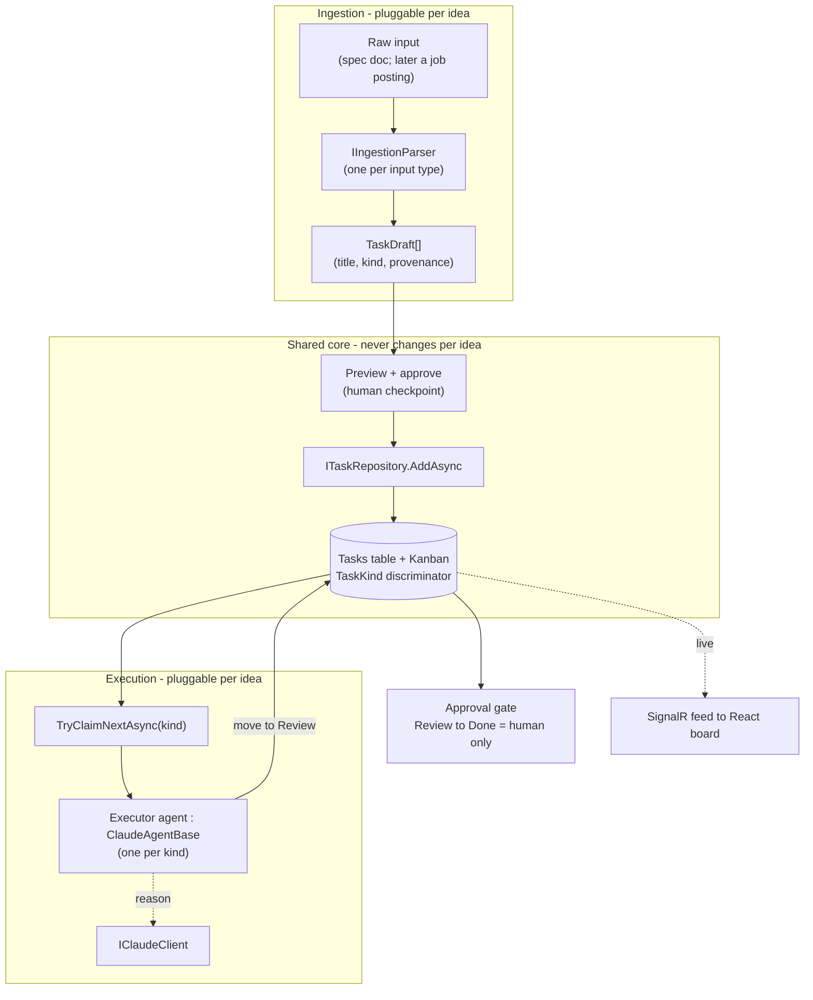

# TaskFlow — North Star Epic: Document-Driven Autonomous Execution

This is a standalone working document for the next epic, built on top of the completed
architecture-and-TDD refactor (Slices A–L, shipped and green: 39 backend tests + 14 frontend).
That refactor is the finished record; **this** document is the live source of truth going
forward. The unit of work here is a **sprint**, not a slice.

**The one-sentence goal:** hand TaskFlow a specification document (like this one), and it parses
the document into tasks on its *own* Kanban board, then executor agents pick those tasks up and
do the work live while you watch on the dashboard.

**Guiding rule (unchanged):** the app builds and runs at the end of every sprint. We never tear
the house down. We add rooms while people are still living in it.

---

# Epic Roadmap and the Extensibility Bet

This is **Epic 2**. The sequence:

- **Epic 1 — Architecture & TDD refactor.** Complete. The layered, tested foundation.
- **Epic 2 — Generic document-driven execution (this doc).** Build the ingestion and executor
  framework *generically*, so a new idea is a plug-in, not a rewrite.
- **Epic 3 — Resume & cover-letter builder (planned, not started).** The first concrete
  application: a job posting is the "document," and the executor writes a tailored resume and
  cover letter. It will be added as a new ingestion parser plus a new executor agent type on top
  of Epic 2's generic core, with no change to the board, repositories, or transport.

**The extensibility bet (the whole point of Epic 2):** every future idea reduces to two
pluggable pieces on top of the shared platform:

1. an **ingestion parser** that turns some input into task drafts, and
2. an **executor agent type** (a `ClaudeAgentBase` subclass) that does the work.

The Kanban board, repositories, the `IClaudeClient` seam, the live SignalR feed, and the
guardrails are shared and generic. Build Epic 2 so those never need to change when a new
application is added. If a new idea forces a change to that shared core, that is a design smell
to fix, not a change to accept.

---

# Rules to follow for AI who are reading this

- **TDD is how we build everything.** Red (failing test) → green (simplest code) → refactor.
  When adding code, add its test coverage in the same change, up front, not later.
- **Strict DRY and SOLID.** Fix name collisions and duplication at the source, never by
  band-aiding (no aliasing a collision, no copy-pasted helper).
- **Do not agree on everything.** Come back with sound advice from the principles.
- **Do not band-aid.** If it is wrong, we fix it properly.
- **How to work:** follow this document top to bottom. Each sprint has explicit file paths,
  RED tests, GREEN code, a pastable PR description, and merge/delete steps. Bring bugs to chat;
  every fix gets recorded back into this document so the chat stays disposable.
- **Tooling boundary (important):** Claude can create and edit files directly in the repo, but
  Claude's sandbox CANNOT run `git` and does not run `dotnet` or `npm`. Claude writes the code
  and tests into the repo; YOU run every `git` / `dotnet` / `npm` command on your machine and
  report the result. This matches the TDD loop: you run, Claude writes.

**Standing rules (carried from the refactor, do not repeat the mistakes):**

- **Never claim you verified something you did not actually check.** Confirm against the real
  artifact: exact file name, real contents, actual test output. A false verification is worse
  than admitting you have not checked.
- **Separate facts from inferences; never state an inference as fact.** Say what you actually
  checked; label the rest as an inference for the user to confirm. The truth is whatever
  `dotnet test` / `npm run test` prints.
- **Never assume progress or mark work done without confirmation.** Do not tick off a step
  unless the repo or the user confirms it.
- **Enforce TDD order; halt the moment implementation lands before its failing test.** Call it
  out and stop, even if the user is moving ahead.
- **When the deliverable is code, deliver the actual code** with file path, namespace, and
  usings, paste-ready. Prose is for the test to encode, not a substitute for the class.
- **Never hand over anything you claim works but have not tested.** Test it, or state plainly it
  is untested and why.
- **Hold the whole map.** Read the whole document before advising so guidance fits overall scope.
- **Do not invent scope, and never slip unspecified work into a "next step."** If something is
  missing and should be added, say so explicitly and record it in the doc as a labeled decision
  before acting. (Violated: dropped "thread a source name into provenance" as if it were task
  `T1.3`, which it was not.)
- **Refer to a task by exactly what the doc says it is.** Do not silently relabel or re-scope a
  numbered task in passing. (Violated: called `T1.3` "thread a source name" when `T1.3` was
  "stamp kind + provenance," already satisfied.)
- **Own the decisions that are yours; do not punt "your call" on an architect/developer choice.**
  Decide, record it in the doc, and commit. Reserve "your call" for genuine product decisions.
  (Violated: flagged the provenance gap, then deferred where it goes back to the user.)

**Naming conventions (carried forward):** domain types never reuse a .NET BCL name (the old
`TaskStatus` collided with `System.Threading.Tasks.TaskStatus`, hence `WorkflowStatus`); result
types live in `Common/`; npm package names stay lowercase.

---

# The Vision

Hand TaskFlow a specification document. TaskFlow:

1. **Parses** the document into discrete, well-formed work items.
2. **Creates** them as tasks on the Kanban board (To Do column).
3. **Agents pick them up** autonomously, move them across the board
   (To Do → In Progress → Review → Done), and actually do the work.
4. **You watch it happen live** on the dashboard via the SignalR feed already built.

In other words: the reactive agents (prioritize, detect staleness) grow into *executing* agents
(ingest, plan, act).

**The key point: it feeds TaskFlow's *own* board.** Ingestion does not build a separate pipeline
or a new task store. It writes through the *same repositories* into the *same `Tasks` table*
that backs the *same Kanban board* you already built. The executor agent is the *same agent
layer*. You watch on the *same React board* over the *same SignalR feed*. The document simply
becomes cards on your board, and the agents work them.

```mermaid
flowchart LR
    DOC["Spec document<br/>(a doc like this)"]
    ING["IngestionService<br/>parse → task drafts<br/>(a Service)"]
    RP["Repositories<br/>AddAsync"]
    BOARD[("TaskFlow board<br/>same Tasks table + Kanban")]
    EX["Executor agent<br/>claims + does work<br/>IClaudeClient"]
    CLAUDE["Claude API<br/>reason step"]
    YOU["You<br/>watching live"]

    DOC -->|1. hand it in| ING
    ING -->|2. write tasks| RP
    RP -->|3. tasks appear| BOARD
    BOARD -->|4. claim a To Do card| EX
    EX -. reason .-> CLAUDE
    EX -->|5. do work, move card| BOARD
    BOARD -. 6. SignalR live push .-> YOU
```

Everything in that diagram already exists except the two new boxes, `IngestionService` and the
executor agent, and both are built on seams the refactor already put in place. Nothing new is
invented at the data or transport layer.

---

# The Seams This Epic Builds On (already shipped and tested)

This epic does not start from scratch. It plugs into work that already exists and is covered:

- **Service layer.** The `Result<T>` type (`Common/`), interface-plus-implementation services,
  and mocked-repository unit tests. New services (like ingestion) follow this exact pattern.
- **Repositories.** `ITaskRepository` / `IUserRepository` / `IAgentLogRepository` with
  `AddAsync` / `SaveChangesAsync`. All task writes go through these. `TaskItem` uses
  `WorkflowStatus` (Todo / InProgress / Review / Done) and `TaskPriority`.
- **The Claude seam.** `IClaudeClient` (with `IsConfigured` + `SendAsync`) and the abstract
  `ClaudeAgentBase` that owns the tool-use loop, action logging, and lifecycle broadcasts.
  Executor agents subclass `ClaudeAgentBase`. Agents are unit-testable with `StubClaude`.
- **Agent runner.** `AgentRunner` (an `IHostedService`) discovers every `ITaskFlowAgent` and
  runs it on its interval.
- **Live feed.** `AgentHub` (SignalR) + `IAgentNotifier` + `HubEvents` (`AgentAction`,
  `AgentCycle`). The React dashboard already renders this feed via `useAgentFeed`.
- **Frontend layers.** `api/ hooks/ components/ features/ lib/`, with a Vitest + RTL + MSW test
  harness (`__mocks__/@microsoft/signalr.ts` for the SignalR stub).

If a sprint needs a seam that does not exist yet, that is a signal to build the seam test-first,
not to reach around it.

---

# Architecture — the 10,000ft View (the design to build toward)

Epic 2 adds exactly two new capabilities to the existing layered app: turning input into task
drafts (**ingestion**) and working tasks off the board (**execution**). Both are built as
generic, pluggable seams so Epic 3 and anything after is a plug-in, not a rewrite.

## The one new idea: tasks have a *kind*, and executors self-select by kind

Today every task is generic. To let different agents do different work on the same board,
`TaskItem` gains a **`TaskKind`** discriminator (`Generic` now, `ResumeTailoring` later).
Ingestion stamps a kind on every draft; each executor declares the one kind it works. The
`AgentRunner` already discovers every agent, so adding an executor for a new kind is just
registering a new agent. That single discriminator is what makes the platform extensible:

> **A new application = a new parser that emits a new kind + a new executor that claims that
> kind.** The board, repositories, transport, and guardrails never change.



## New building blocks (all generic)

- **`TaskDraft`** — a proposed task (title, description, priority, `TaskKind`, provenance).
  Ingestion output; not yet persisted.
- **`IIngestionParser`** — returns `Result<IReadOnlyList<TaskDraft>>` from raw content. Two
  implementations sit behind the seam: the free deterministic `SpecDocumentParser` (rules) and the
  paid `ClaudeIngestionParser` (agent, `IClaudeClient`, `StubClaude`-tested). A
  `TieredIngestionParser` composes them **free-first**: run the rules parser, and escalate to
  Claude only when it returns zero drafts (unstructured content rules cannot handle). Free when it
  reaches the outcome, agent when it must, still works with no Claude key.
- **Source-agnostic input** — file, paste, and link are acquisition adapters that all reduce to
  content plus a source name; the parser never knows where the content came from. Paste and
  file-to-text first; the link adapter fetches server-side (with the usual fetch caveats) as a
  follow-up.
- **Provenance** — every agent-created task records where it came from. `Section` (the source
  heading) is captured on the draft at ingestion (Sprint 1). The **source-document id** is stamped
  when a draft is persisted as a board task (Sprint 3), completing provenance = source id +
  section. The nullable provenance fields on `TaskItem` and their migration land in Sprint 3, not
  earlier.
- **Atomic claiming** — `ITaskRepository.TryClaimNextAsync(kind, agentName)` moves the next
  unclaimed `Todo` task of a kind to `InProgress` with an owner stamp, guarded so two agents never
  grab the same card. Concurrency stays in the repository (its single responsibility).
- **Executor agents** — each a `ClaudeAgentBase` subclass for one `TaskKind`: claim, work via
  Claude tools, move to `Review` (never straight to `Done`). Epic 2's generic executor does a
  minimal real step (ask Claude to draft a plan/result for the task and record it) so the whole
  pipeline runs end-to-end before any domain work exists.
- **Guardrails** — the approval gate (`Review → Done` is a human action, never the agent), a
  spend cap around Claude calls, rollback (a failed step returns the task to `Todo` and logs,
  never leaves it stuck `InProgress`), and the existing per-cycle tool-loop cap.

## Dependency direction (unchanged from Epic 1)

React board → api → hooks; controllers → services → repositories → EF; executors → repositories
+ `IClaudeClient`; live updates → SignalR. Every arrow already exists. Ingestion is a new
service; executors are new agents. Nothing new at the data or transport layer.

## Decisions this design makes (confirm before Sprint 1)

1. **`TaskKind` discriminator on `TaskItem`** is the extensibility mechanism (enum + migration).
2. **Claiming = an atomic `Todo → InProgress` transition** via a guarded repository method, not an
   app-level lock.
3. **Executors always stop at `Review`;** only a human moves `Review → Done`. The approval gate is
   in from the start and hardened in Sprint 6.
4. **Epic 2's generic executor does a trivial real step** so the pipeline is demonstrable
   end-to-end; Epic 3 registers the first domain executor.
5. **Left open (product calls, decided when we reach them):** parsing granularity and
   rules-vs-Claude (Sprint 1); whether a `Blocked`/`Failed` column is worth adding for rollback
   visibility (Sprint 6).

---

# The TDD Loop and Git Workflow (per sprint)

The loop is identical to the refactor:

1. Claude writes a failing test (RED) with exact file path, namespace, and usings.
2. You run `dotnet test` / `npm run test` and confirm it is red.
3. Claude writes the simplest code to pass (GREEN).
4. You run again and confirm green.
5. Refactor if needed, tests staying green.

**Per-sprint PR cadence.** One branch and one PR per sprint into `develop`, merged and deleted.
`develop → main` is the release point at natural milestones. Branch names use
`feature/sprint-N-short-name`. Both `main` and `develop` are protected, so releases go through a
PR, never a local fast-forward.

---

# Sprint Plan

The old refactor mapped this destination as future slices M–R. Renumbered fresh for this epic:

| Sprint | What | Leans on |
|--------|------|----------|
| **1** | `IDocumentIngestionService`: parse a spec doc into task drafts | Service-layer pattern |
| **2** | Ingestion endpoint + UI to upload a document and preview drafts | Thin controller + frontend layers |
| **3** | Task drafts → board tasks with provenance (which doc, which section) | Repositories |
| **4** | Executor agent: claims a To Do task, plans sub-steps, works it | `IClaudeClient` + `ClaudeAgentBase` |
| **5** | Board transitions driven by the executor, streamed live | Repositories + SignalR |
| **6** | Guardrails: human approval gates, cost caps, rollback on failure | All of the above |

Each sprint is specified in full, small and test-first, when we reach it. The stubs below fix
the destination and the seams; they are not yet the RED/GREEN code.

---

## Sprint 1 — Document Ingestion Service

**Goal:** a testable service that turns a specification document into a list of well-formed task
drafts, with no HTTP and no Claude in the test.

**Produces:** `IDocumentIngestionService` + implementation (service-layer style, returning
`Result<IReadOnlyList<TaskDraft>>`), and a `TaskDraft` shape (title, description, provenance
placeholder). Unit tests over the parsing/splitting rules using plain in-memory input.

**Test approach:** feed representative document text, assert the draft count and fields. The
parsing rule (see open questions) is the unit under test, so it must be deterministic; if a
Claude-assisted parse is chosen, put it behind the `IClaudeClient` seam so the test uses
`StubClaude`.

**Decided (2026-07-26):** the first parser is **rules-based and deterministic** — one draft per
markdown heading and per top-level checklist item. Zero Claude in Sprint 1, so
`SpecDocumentParser` is fully unit-testable with plain string input. A `ClaudeIngestionParser`
can be added later behind the same `IIngestionParser` interface (DIP) without touching anything
downstream.

### RED — the failing test (T1.2)

**FILE — create new: `TaskFlow.Tests/Ingestion/SpecDocumentParserTests.cs`**

```csharp
using FluentAssertions;
using TaskFlow.Api.Ingestion;
using TaskFlow.Api.Models;
using Xunit;

namespace TaskFlow.Tests.Ingestion;

public class SpecDocumentParserTests
{
    // Two headings + three checklist items = five drafts.
    private const string Doc =
        "# Set up auth\n" +
        "Add JWT login and registration.\n" +
        "\n" +
        "- [ ] Create the login endpoint\n" +
        "- [ ] Protect the task routes\n" +
        "\n" +
        "# Build the board\n" +
        "- [ ] Render the columns\n";

    [Fact]
    public void Parses_one_draft_per_heading_and_per_checklist_item()
    {
        var result = new SpecDocumentParser().Parse(Doc);

        result.IsSuccess.Should().BeTrue();
        result.Value!.Should().HaveCount(5);
    }

    [Fact]
    public void Heading_becomes_a_draft_titled_and_sectioned_by_the_heading()
    {
        var drafts = new SpecDocumentParser().Parse(Doc).Value!;

        drafts.Should().Contain(d => d.Title == "Set up auth" && d.Section == "Set up auth");
    }

    [Fact]
    public void Checklist_item_becomes_a_draft_under_its_parent_heading()
    {
        var drafts = new SpecDocumentParser().Parse(Doc).Value!;

        drafts.Should().Contain(d =>
            d.Title == "Create the login endpoint" && d.Section == "Set up auth");
    }

    [Fact]
    public void Every_draft_is_kind_Generic()
    {
        var drafts = new SpecDocumentParser().Parse(Doc).Value!;

        drafts.Should().OnlyContain(d => d.Kind == TaskKind.Generic);
    }
}
```

**Expect RED.** `TaskDraft`, `IIngestionParser`, `SpecDocumentParser`, and `TaskKind` do not exist
yet, so `dotnet test` will not compile. That is the red. The test encodes the contract: a parser
whose `Parse(string)` returns `Result<IReadOnlyList<TaskDraft>>`, where each `TaskDraft` has a
`Title`, a `Section` (its source heading, i.e. provenance), and a `Kind`.

### GREEN — the implementation

Four new files in `TaskFlow.Api`. Nothing more than the tests demand: descriptions are left
null (no test asks for them yet).

**FILE — `TaskFlow.Api/Models/TaskKind.cs`**

```csharp
namespace TaskFlow.Api.Models;

/// <summary>
/// Discriminator that lets different executor agents self-select which tasks they work.
/// New applications (epics) add their own kinds; the shared core never changes.
/// </summary>
public enum TaskKind
{
    Generic
}
```

**FILE — `TaskFlow.Api/Ingestion/TaskDraft.cs`**

```csharp
using TaskFlow.Api.Models;

namespace TaskFlow.Api.Ingestion;

/// <summary>
/// A proposed task produced by ingestion, before it is persisted to the board.
/// <c>Section</c> is the source heading it came from (provenance).
/// </summary>
public sealed record TaskDraft(string Title, string? Description, TaskKind Kind, string Section);
```

**FILE — `TaskFlow.Api/Ingestion/IIngestionParser.cs`**

```csharp
using TaskFlow.Api.Common;

namespace TaskFlow.Api.Ingestion;

public interface IIngestionParser
{
    Result<IReadOnlyList<TaskDraft>> Parse(string documentText);
}
```

**FILE — `TaskFlow.Api/Ingestion/SpecDocumentParser.cs`**

```csharp
using System.Text.RegularExpressions;
using TaskFlow.Api.Common;
using TaskFlow.Api.Models;

namespace TaskFlow.Api.Ingestion;

/// <summary>
/// Rules-based, deterministic parser: one draft per markdown heading and per top-level
/// checklist item. A pure function of the input text - no Claude, no I/O. Each checklist
/// item is filed under the most recent heading (its provenance).
/// </summary>
public sealed class SpecDocumentParser : IIngestionParser
{
    private static readonly Regex Heading =
        new(@"^\s*#+\s+(?<text>.+?)\s*$", RegexOptions.Compiled);

    private static readonly Regex ChecklistItem =
        new(@"^\s*[-*]\s*\[[ xX]\]\s+(?<text>.+?)\s*$", RegexOptions.Compiled);

    public Result<IReadOnlyList<TaskDraft>> Parse(string documentText)
    {
        var drafts = new List<TaskDraft>();
        var currentHeading = string.Empty;

        foreach (var rawLine in documentText.Split('\n'))
        {
            var line = rawLine.TrimEnd('\r');

            var heading = Heading.Match(line);
            if (heading.Success)
            {
                currentHeading = heading.Groups["text"].Value;
                drafts.Add(new TaskDraft(currentHeading, null, TaskKind.Generic, currentHeading));
                continue;
            }

            var item = ChecklistItem.Match(line);
            if (item.Success)
            {
                drafts.Add(new TaskDraft(item.Groups["text"].Value, null, TaskKind.Generic, currentHeading));
            }
        }

        return Result<IReadOnlyList<TaskDraft>>.Ok(drafts);
    }
}
```

### Sprint 1 status

`T1.1`, `T1.2`, and `T1.3` are all satisfied by the single red-green cycle above: `TaskDraft` +
`IIngestionParser` (T1.1), the deterministic `SpecDocumentParser` (T1.2), and stamping
`TaskKind.Generic` + `Section` provenance on every draft (T1.3, asserted by the tests). Sprint 1
is complete once `dotnet test` is green. Scope line: provenance here is the `Section` only; the
source-document id is deliberately deferred to Sprint 3 (see that sprint), not added now.

**PR body (shipped):**

```markdown
## Sprint 1 — Document ingestion service

Adds the first pluggable ingestion seam: a rules-based, deterministic parser that turns a
markdown spec document into task drafts.

### What
- `TaskKind` enum (executor self-selection discriminator; `Generic` for now).
- `TaskDraft` record (title, description, kind, section-as-provenance).
- `IIngestionParser` seam.
- `SpecDocumentParser`: one draft per heading and per top-level checklist item, pure function.

### Tests
4 new `SpecDocumentParserTests`; full backend suite 43 passing.

### Type of change
- [x] Feature (backend) + tests
```

---

## Sprint 2 — Agent-capable Ingestion + Source-agnostic Endpoint + Preview

**Goal:** hand content to the app from any source (file, paste, link), parse it into drafts
free-first (rules, escalating to a Claude agent only when needed), and preview the drafts before
they hit the board.

**Decided (this sprint's shape):**
- Parsing is a **tiered** `IIngestionParser`: free `SpecDocumentParser` first, escalate to
  `ClaudeIngestionParser` only when the rules parser returns zero drafts. Works with no Claude key.
- The endpoint is **source-agnostic**: it accepts content plus a source name. File, paste, and
  link are acquisition adapters that produce that content (paste and file-to-text now; the link
  adapter, which fetches server-side, is a follow-up with the usual fetch caveats).
- Preview is the human checkpoint before anything is written, setting up the approval surface
  Sprint 6 hardens.

**Parts (each its own red-green):**
- `T2.1` (BE) `ClaudeIngestionParser : IIngestionParser` — agent parsing via `IClaudeClient`,
  `StubClaude`-tested.
- `T2.2` (BE) `TieredIngestionParser : IIngestionParser` — free-first with escalation; registered
  as the app's `IIngestionParser`. Tests: structured input never calls Claude; unstructured does.
- `T2.3` (BE) source-agnostic endpoint: `IngestDocumentDto { content, sourceName }`,
  `POST /api/Ingestion`, returns drafts via `.ToActionResult()`. Controller test with a mocked parser.
- `T2.4` (FE) `TaskDraft` type, `api/ingestion.ts`, a `useIngestion` hook, and a paste/file preview
  container in `features/`. MSW + RTL tests.

**Leans on:** the `IClaudeClient` + `StubClaude` seam, the thin-controller pattern, and the
`api/ hooks/ components/ features/` split.

**Implementation notes / issues found (backend, 2026-07-26):**
- **Issue (fixed): `IIngestionParser` was synchronous.** A Claude-backed parser must await
  `IClaudeClient.SendAsync`, and blocking on it risks deadlocks, so the seam is now
  `Task<Result<IReadOnlyList<TaskDraft>>> ParseAsync(...)`. `SpecDocumentParser` and its Sprint 1
  tests were updated to match; the parsing logic is unchanged.
- **Decision: the endpoint takes `Content` only.** A source name/id is provenance and lands in
  Sprint 3, so adding it to `IngestDocumentDto` now would be a dead field. How the content was
  obtained (file, paste, link) stays the caller's concern, which keeps the endpoint source-agnostic.
- **Decision: `IngestionController` is `[Authorize]`,** matching the task routes; the preview lives
  in the authed area.
- **Backend files:** `ClaudeIngestionParser`, `TieredIngestionParser` (free-first), `IngestDocumentDto`,
  `IngestionController`, DI wiring in `Program.cs`, and `StubClaude.ThatReturnsText`. Tests cover each
  parser and the controller. The live-Claude path (prompt + JSON shape) is validated against a real
  key at runtime, not in tests.
- **Frontend (T2.4, done):** `TaskDraft` type, `api/ingestion.ts`, the `useIngestion` hook, and the
  paste/file `IngestDocument` preview in `features/`, plus an `/api/Ingestion` MSW handler. Tests:
  api (MSW), hook (`renderHook`), component (RTL). Not yet wired into the app nav (it is standalone
  and tested); hooking the preview into the dashboard is a small follow-up.

**PR body (target — we work to make it true):**

```markdown
## Sprint 2 — Agent-capable ingestion + source-agnostic endpoint + preview

Adds agent parsing behind the ingestion seam, a tiered free-first parser, a source-agnostic
endpoint, and a paste/file preview screen.

### What
- `ClaudeIngestionParser : IIngestionParser` — agent parsing via `IClaudeClient`.
- `TieredIngestionParser : IIngestionParser` — free rules first, escalate to Claude only on zero
  drafts, graceful with no key; registered as the app's `IIngestionParser`.
- `IngestDocumentDto` (content + source name) + `IngestionController` (`POST /api/Ingestion`).
- Frontend: `TaskDraft` type, `api/ingestion.ts`, `useIngestion` hook, paste/file preview.

### Tests
- `ClaudeIngestionParser` via `StubClaude`; `TieredIngestionParser` (structured input skips Claude,
  unstructured escalates); controller with a mocked parser; MSW api/hook + RTL preview.
- `dotnet test` and `npm run test` green.

### Type of change
- [x] Feature (backend + frontend) + tests
```

---

## Sprint 3 — Drafts Become Board Tasks (with provenance)

**Goal:** approved drafts are written as real tasks in the To Do column, each carrying provenance
(which document and section it came from).

**Produces:** persistence of drafts through `ITaskRepository.AddAsync`, `Kind` + provenance fields
on `TaskItem`, and repository/service tests over the write path using real in-memory SQLite. The
schema-management approach is decided in the analysis below.

**Leans on:** the repositories and the existing `Tasks` table. This is the point where the
document truly becomes cards on the same board.

### Analysis and plan (2026-07-26, before writing code)

**Issue found — the project uses `EnsureCreated()`, not migrations, yet a `Migrations/` folder
exists.** `Program.cs` startup calls `db.Database.EnsureCreated()`, which builds the schema
straight from the current model and neither runs nor records migrations. The three migrations in
`Migrations/` are dead at runtime, so adding a new migration would not take effect. Two
consequences: new model fields appear only on a *fresh* database (EnsureCreated never alters an
existing table), so the dev `taskflow.db` must be deleted once to pick them up (tests always get a
fresh DB and see them automatically); and the migrations and the model are now out of sync.

**Decision (DECIDED 2026-07-26) — adopt migrations.** `T3.0` is this ordered checklist. Every step
is mandatory; run them in order.
1. **(Claude, done)** `Program.cs` startup: `db.Database.EnsureCreated()` -> `db.Database.Migrate()`.
2. **(Claude, done in T3.1)** add the `TaskItem` fields (`Kind`, `SourceName`, `SourceSection`).
3. **(You)** generate the migration:
   `dotnet ef migrations add AddTaskKindAndProvenance --project TaskFlow.Api`.
   Claude cannot run EF tooling, and a hand-written migration must not be guessed.
4. **(You)** delete the old dev database, a one-time reset. It was built by `EnsureCreated` and has
   no migration history, so `Migrate()` would try to re-create existing tables and fail. From the
   solution root: `Remove-Item TaskFlow.Api\taskflow.db` (and `taskflow.db-wal` / `taskflow.db-shm`
   if present). Migrations are the only schema workflow after this.
5. **(You)** `dotnet test` — unit tests plus the integration test, which now boots through `Migrate()`.
6. **(You)** `dotnet run --project TaskFlow.Api` once to confirm the app starts and migrates a fresh
   dev DB.

**Test implications:** the in-memory unit/repo/agent tests (`SqliteInMemoryContext`) keep using
`EnsureCreated`, which builds the current model on a separate throwaway DB, so they pick up new
fields automatically and need no migration. Only the app runtime and the `WebApplicationFactory`
integration test go through `Migrate()`. The two stay in sync as long as a migration is generated
whenever the model changes.

**Bug found during T3.0 verification (fixed 2026-07-27).** `dotnet run` applied all migrations,
then the agents immediately failed with `SQLite Error 1: 'no such table: Tasks'` — a table the
migration had just created. Root cause: there was no `ConnectionStrings:DefaultConnection`
configured anywhere (no `appsettings.json`; the Development file has only logging; user secrets
held only the Anthropic key), so `UseSqlite(null)` fell back to a private per-connection SQLite
database. The schema built during `Migrate()` was destroyed when that connection closed, and the
agents' new connections saw an empty DB. Nothing caught it earlier because the unit tests keep one
in-memory connection open (`SqliteInMemoryContext`) and the integration test injects a temp-file
connection string through the factory; the dev app was the only context with no connection string.
Fix: `dotnet user-secrets set "ConnectionStrings:DefaultConnection" "Data Source=taskflow.db" --project TaskFlow.Api`.
Confirmed: the app runs clean and the agents execute end-to-end against Claude.

**Future hardening (noted only, not built — avoids scope creep):** fail fast at startup if
`ConnectionStrings:DefaultConnection` is missing, so a silent fallback to a throwaway DB cannot
recur. Captured here; not part of Sprint 3.

**Decision (owned) — provenance is two nullable strings, not a foreign key.** There is no
`Document` entity (a document is transient ingested text), so "which document" is a `SourceName`
string and "which section" is a `SourceSection` string, both nullable on `TaskItem` (ingested
tasks carry them; hand-created tasks do not).

**Decision (owned) — the source name re-enters here.** Sprint 2 deferred it; the commit step
carries it. The client sends the approved drafts plus a `sourceName` to a new endpoint.

**Code plan (written test-first when we start Sprint 3):**
- `TaskItem`: add `Kind` (`TaskKind`, default `Generic`, `HasConversion<string>()` like `Status`)
  plus nullable `SourceName` and `SourceSection`. Seed tasks default to `Generic`.
- Persist path: a `CommitDraftsDto { SourceName, Drafts[] }`, a service method mapping each
  `TaskDraft` to a `TaskItem` (`Todo`, `Kind`, `SourceName`, `SourceSection = draft.Section`) and
  writing it via `ITaskRepository.AddAsync`, and a thin `POST /api/Ingestion/commit`. RED:
  in-memory SQLite asserts tasks land as `Todo` with kind + provenance.
- Frontend (small): the Sprint 2 preview gains an "Approve" action that calls the commit endpoint.

**PR body (target — we work to make it true):**

```markdown
## Sprint 3 — Drafts become board tasks (with provenance)

Approved drafts are persisted as real To Do tasks carrying provenance, and the app adopts EF
migrations for schema changes.

### What
- Adopt migrations: `Program.cs` startup `EnsureCreated()` -> `Migrate()`, plus a generated
  `AddTaskKindAndProvenance` migration.
- `TaskItem` gains `Kind` (default `Generic`, stored as a string) and nullable `SourceName` +
  `SourceSection`. Provenance is two strings; there is no `Document` entity to key off.
- `CommitDraftsDto { SourceName, Drafts[] }` + a service mapping drafts to `TaskItem`
  (`Todo`, kind, provenance) via `ITaskRepository.AddAsync` + thin `POST /api/Ingestion/commit`.
- Frontend: the ingestion preview gains an Approve action that commits the drafts.

### Tests
- Repository round-trips kind + provenance (in-memory SQLite); commit service lands tasks as
  `Todo`; controller with a mocked service; MSW + RTL for the Approve action.
- `dotnet test` and `npm run test` green; the integration test exercises `Migrate()`.

### Type of change
- [x] Feature (backend + frontend) + tests + migration
```

---

## Sprint 4 — Executor Agent

**Goal:** an agent that claims a To Do task, plans sub-steps, and does the work, tested with
canned Claude responses rather than live calls.

**Produces:** a new `ClaudeAgentBase` subclass registered as an `ITaskFlowAgent`, its tool set
(claim, record progress, request review), and agent tests using `StubClaude` and in-memory
SQLite, asserting real board/log side effects.

**Leans on:** `IClaudeClient`, `ClaudeAgentBase`, `AgentRunner`. This is the reactive-to-executing
jump: the same agent layer, now doing work instead of only re-prioritizing.

**Design point (carried forward):** an executor doing real work needs firm limits. We already
have a per-task iteration cap on the tool loop; this sprint keeps the leash short and defers the
spend ceiling and destructive-action gate to Sprint 6.

**PR body (target — we work to make it true):**

```markdown
## Sprint 4 — Executor agent

An agent claims a To Do task, works it via Claude, and moves it to Review.

### What
- `ITaskRepository.TryClaimNextAsync(kind, agentName)` atomic claim (no double-claim).
- `GenericExecutorAgent : ClaudeAgentBase` for `TaskKind.Generic`, registered as `ITaskFlowAgent`.

### Tests
- Two-claim test proves no double-claim; agent test (`StubClaude` + in-memory SQLite) asserts the
  card reaches Review with a result log.
- `dotnet test` green.

### Type of change
- [x] Feature (backend) + tests
```

---

## Sprint 5 — Live Board Transitions

**Goal:** as the executor works, the task moves across the board (To Do → In Progress → Review →
Done) and the dashboard shows it live.

**Produces:** status transitions written through the repositories and broadcast over
`IAgentNotifier` / `HubEvents`, plus any dashboard adjustment to render executor activity
distinctly from the existing prioritizer/stale feeds.

**Leans on:** repositories + SignalR (`AgentHub`, `useAgentFeed`). No new transport is invented;
the transitions ride the feed that already exists.

**Design point:** what counts as Review vs Done for an autonomous executor, and whether Review
always requires a human (ties into Sprint 6).

**PR body (target — we work to make it true):**

```markdown
## Sprint 5 — Live board transitions

Task transitions stream to the dashboard as the executor works.

### What
- Broadcast transitions over `IAgentNotifier` / a new `HubEvents.TaskMoved`.
- Frontend renders card movement live on the board.

### Tests
- Notifier test; frontend hook/RTL test against the new event.
- `dotnet test` and `npm run test` green.

### Type of change
- [x] Feature (backend + frontend) + tests
```

---

## Sprint 6 — Guardrails

**Goal:** make autonomous execution safe: human approval gates, a spend ceiling, and rollback on
failure, designed in rather than bolted on.

**Produces:** a human-approval checkpoint (approve each task, approve the batch, or fully
autonomous with a kill switch, per the open question), a cost cap on Claude usage, and a
rollback path when an executor step fails, all covered by tests.

**Leans on:** everything above. This is the "give the agent an escape hatch and a leash"
principle from the stale-task agent, scaled up to an agent that changes real state.

**PR body (target — we work to make it true):**

```markdown
## Sprint 6 — Guardrails

Makes autonomous execution safe before it touches anything destructive.

### What
- Approval endpoint for `Review → Done` (human only); the agent path can never reach Done.
- Spend cap around Claude calls.
- Rollback: a failed executor step returns the task to Todo and logs.
- Frontend approval control.

### Tests
- Agent-cannot-reach-Done test; spend-cap skip test; rollback test; RTL approval control.
- `dotnet test` and `npm run test` green.

### Type of change
- [x] Feature (backend + frontend) + tests
```

---

# Product Owner — Sprint Backlog (assigned, test-first)

Every task is **RED first**: the developer writes the failing test, we confirm red, then the
simplest green, then refactor with tests staying green. Owners: **BE** = backend developer,
**FE** = frontend developer. The principle note names the SOLID/DRY idea each task is meant to
exercise. Nothing merges without its tests.

**Sprint 1 — Ingestion service (BE)**

- `T1.1` — `TaskDraft` model + `IIngestionParser` interface. RED: a contract test pinning the
  shape. *ISP: a small, focused interface.*
- `T1.2` — `SpecDocumentParser : IIngestionParser` turning generic spec-doc text into drafts,
  deterministic. RED: feed sample text, assert draft count and fields. *SRP: it only parses. DIP:
  returns `Result<T>`, no HTTP or Claude.*
- `T1.3` — stamp `TaskKind.Generic` and provenance on each draft. RED: assert kind + provenance on
  the output.

**Sprint 2 — Agent-capable ingestion + source-agnostic endpoint + preview (BE + FE)**

- `T2.1` (BE) — `ClaudeIngestionParser : IIngestionParser`, agent parsing via `IClaudeClient`. RED:
  `StubClaude` canned response, assert drafts. *DIP: depends on `IClaudeClient`. OCP: new parser
  behind the seam, no change to the seam.*
- `T2.2` (BE) — `TieredIngestionParser : IIngestionParser`, free rules first, escalate to Claude on
  zero drafts, graceful with no key. RED: structured input does not call Claude; unstructured does.
  *Composite behind the seam; SRP per parser.*
- `T2.3` (BE) — `IngestDocumentDto` (content + source name) + `IngestionController`
  `POST /api/Ingestion`, `.ToActionResult()`; register the tiered parser in DI. RED: controller
  test with a mocked `IIngestionParser`. *SRP thin controller; DIP.*
- `T2.4` (FE) — `TaskDraft` type, `api/ingestion.ts`, `useIngestion` hook, paste/file preview
  container in `features/`. RED: MSW test of the call + RTL test rendering drafts.

**Sprint 3 — Drafts become board tasks (BE + small FE)**

- `T3.0` — adopt migrations: `Program.cs` startup `EnsureCreated()` → `Migrate()`; generate the new
  migration with `dotnet ef` after `T3.1`; delete the dev `taskflow.db` once. The `Migrate()` path
  is exercised by the existing `WebApplicationFactory` integration test.
- `T3.1` — add `Kind` (default `Generic`, `HasConversion<string>()`) plus nullable `SourceName`
  and `SourceSection` to `TaskItem`. Schema applies per the Sprint 3 analysis decision (migrations
  via `dotnet ef`, or a fresh `EnsureCreated`). RED: repository round-trips kind + provenance.
- `T3.2` — `CommitDraftsDto { SourceName, Drafts[] }` + a service mapping drafts to `TaskItem`
  (`Todo`, kind, provenance) via `ITaskRepository.AddAsync` + thin `POST /api/Ingestion/commit`.
  RED: in-memory SQLite asserts the tasks land; controller test with a mocked service. *DIP; SRP.*
- `T3.3` (FE) — the preview gains an Approve action that POSTs the drafts to the commit endpoint.
  RED: MSW + RTL.

**Sprint 4 — Executor agent (BE)**

- `T4.1` — `ITaskRepository.TryClaimNextAsync(kind, agentName)` atomic claim. RED: a two-claim
  test proving no double-claim. *SRP: concurrency lives in the repository.*
- `T4.2` — `GenericExecutorAgent : ClaudeAgentBase` for `TaskKind.Generic`: claim, Claude work
  step, record result, move to `Review`. RED: `StubClaude` + in-memory SQLite, assert the card
  reached Review with a result log. *OCP/LSP: a new agent extends the base with no base change.
  DIP: `IClaudeClient`.*
- `T4.3` — register the agent in DI so `AgentRunner` discovers it. RED: covered by the executor
  test exercising the runner path.

**Sprint 5 — Live transitions (BE + FE)**

- `T5.1` (BE) — broadcast task transitions over `IAgentNotifier` / a new `HubEvents.TaskMoved`.
  RED: notifier test.
- `T5.2` (FE) — render card movement live on the board. RED: hook/RTL test against the new event.
  *DRY: extend `useAgentFeed` and the `HubEvents` constants, do not duplicate.*

**Sprint 6 — Guardrails (BE + FE)**

- `T6.1` (BE) — approval endpoint for `Review → Done` (human only). RED: a test proving the agent
  path can never reach `Done`, only the endpoint can.
- `T6.2` (BE) — spend-cap policy around Claude calls. RED: test that the executor skips when the
  cap is hit.
- `T6.3` (BE) — rollback: a failed work step returns the task to `Todo` and logs. RED: force a
  failure, assert the task is back in `Todo`, not stuck `InProgress`.
- `T6.4` (FE) — approval control in the UI. RED: RTL test.

---

# Open Questions to Resolve Before Sprint 1

Recorded now so they are not forgotten; answered when we reach the relevant sprint, not before:

- **RESOLVED (Sprint 1):** granularity is one draft per markdown heading and per top-level
  checklist item, rules-based.
- Do executor agents write code/files, or only orchestrate and report? (Scope and safety.)
- What is the human-in-the-loop checkpoint: approve each task, approve the batch, or fully
  autonomous with a kill switch?
- **RESOLVED:** parsing is rules-based and deterministic first; a `ClaudeIngestionParser` is added
  later behind the same interface.

---

# Definition of Done (this epic)

- A specification document handed to TaskFlow becomes tasks on its own Kanban board.
- An executor agent claims those tasks and moves them across the board, doing real work.
- Every new service, repository write, and agent tool handler is covered by a test in the
  established style (mocked repositories for services, real in-memory SQLite for repositories and
  agents, `StubClaude` for the Claude seam, MSW for the frontend).
- Guardrails (approval gate, spend cap, rollback) are in place and tested before execution is
  turned loose on anything destructive.
- `dotnet test` and `npm run test` both green; both apps build and run.
- Each sprint shipped as its own small PR into `develop`.
