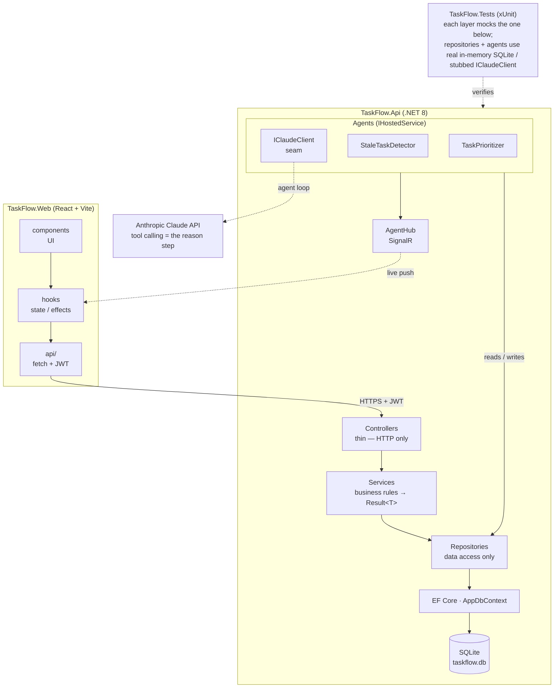

# TaskFlow — Architecture & TDD Refactor

This is a standalone effort layered on top of the working app. Goal: introduce a
clean layered architecture (controllers → services → repositories → EF), a real
test suite, and a Test-Driven Development workflow you follow for all code going
forward — without ever leaving the app in a broken state.

**Guiding rule:** the app builds and runs at the end of every slice. We never tear
the house down. We add rooms while people are still living in it.

---

# Rules to follow for AI who are reading this:

- TDD is How we will build everything
- we will adhere to strictly DRY and SOLID principles.
- Do not agree with me on everything. Come back with sound advice from the principles.
- Do not bandaid any fixes. If it is wrong then lets work to fix it.
- **How to work:** follow this document top to bottom. Each slice has explicit file paths,
  RED tests, GREEN code, a pastable PR description, and merge/delete steps. Bring bugs to
  chat; every fix gets recorded back into this document.
- **Tooling boundary (important):** Claude can create and edit files directly in the repo,
  but Claude's sandbox CANNOT run `git` (it is permission-blocked from writing `.git`) and
  does not run `dotnet`. So: Claude writes the code and tests into the repo; YOU run every
  `git` and `dotnet test`/`dotnet build` command on your machine and report the result.
  This matches the TDD loop (you run, Claude writes).
- **Standing rules that were violated once and must not be again:** domain types never
  reuse .NET BCL names (see Naming Conventions); fix collisions by renaming at the source,
  not aliasing; result types live in `Common/`.

**Rules added after the AI violated them in this session (do not repeat):**

- **Never claim you verified something you did not actually check.** Confirm against the
  real artifact: exact file name, real contents, actual git state. (Violated: reported
  `Result.cs` "missing" after checking the wrong name; the file was `Results.cs`. A false
  verification is worse than admitting you have not checked.)
- **Separate facts from inferences; never state an inference as fact.** Say what you
  actually checked, and label everything else as an inference for the user to confirm.
  (Violated: asserted "the solution does not build" without a build. The truth is whatever
  `dotnet build` prints.)
- **Never assume progress or mark work done without confirmation.** Do not tick off a step
  (git run, file created, test passed) unless the repo or the user confirms it. When
  unsure, check or ask. Do not guess. (Violated: marked D0/D1 complete on assumption.)
- **Enforce TDD order; halt the moment implementation is being written before its failing
  test.** If code is landing ahead of a confirmed RED, call it out and stop, even if the
  user is the one moving ahead. (Violated: let D3 service code exist before D2 was red.)
- **When the deliverable is code, deliver the actual code** with file path, namespace, and
  usings, not a prose description of what it would do. Prose is for the test to encode, not
  a substitute for the class. (Violated: gave an AuthService prose spec instead of the file.)
- **Never hand over anything you claim works but have not tested.** Test it first, or state
  plainly that it is untested and why. Applies to snippets, links, and commands. (Violated:
  shipped a self-anchor link twice without testing that it resolves.)
- **Hold the whole map, not just the slice in front of you.** Read the entire document
  before advising so guidance fits the overall scope, not one local step. (Violated:
  advised for several turns having only read part of the doc.)
- **Do not attempt `git` or `dotnet` from the AI sandbox.** It cannot write `.git` and has
  no `dotnet`; a failed attempt left a stale `.git/index.lock` the user had to remove by
  hand. Hand every git/build/test command to the user (see Tooling boundary above).

---

> **Baseline note (important):** The starting point for this refactor is the **sprint-8
> merge** (PR #6). An earlier "Chunk 1" experiment that extracted a `ClaudeAgentBase`
> class was reset away during a git cleanup and is NOT in the baseline. That is fine —
> the base-class extraction is folded into **Slice F**, done test-first there, which
> supersedes it. Do not try to hand-restore Chunk 1.

---

## Part 1 — The Target Architecture (the "why")

### The 10,000-foot view

The whole system on one page. A request flows straight down through the layers; the
agents run their own loop on the side; live updates push back up to the browser. Every
arrow is one direction of dependency, and that is deliberate: each layer knows only about
the layer directly beneath it, which is exactly what makes each layer testable in
isolation (see the Tests box).



**How to read it.** A browser request goes `api/ → Controllers → Services → Repositories
→ EF → SQLite`, and the response comes back up the same chain. The two agents run
independently as hosted background services: each loops observe → reason → act, doing its
"reason" step through `IClaudeClient` to the Claude API, and its "act" step through the
same repositories the controllers use. When an agent changes something, `AgentHub` pushes
it to the browser over SignalR (the dashed line), so the board updates live with no
refresh. The Tests project mirrors the layers: every layer is tested by faking the layer
beneath it.

**Where this is headed (Part 5).** The North Star reuses these exact layers: a document
ingestion *service*, an executor *agent* on `IClaudeClient`, writing through the
*repositories*, streamed live over *SignalR*. The refactor is not busywork before the fun
part — it is the foundation the fun part stands on.

### Why layers (the "why")

Right now a controller does three jobs: receives the web request, runs the business
rules, and queries the database. Three responsibilities in one class is exactly what
SOLID's Single Responsibility Principle warns against, and it is why the logic is
hard to test — you cannot exercise a rule without faking a whole web request and a
live database.

We are splitting those jobs into layers. The restaurant analogy:

```
Request →  Controller  →  Service   →  Repository  →  EF Core / DbContext  →  DB
           (waiter)       (chef)        (pantry clerk)  (the pantry)
```

- **Controller (waiter):** takes the HTTP request, returns the HTTP response. No
  cooking. Knows nothing about business rules or SQL.
- **Service (chef):** owns the business rules. "A task cannot be assigned to a user
  who does not exist." "Registration fails if the email is taken." This is where
  decisions live.
- **Repository (pantry clerk):** the only code that talks to EF. Fetch and store,
  nothing more. Knows no rules.
- **EF Core / DbContext (the pantry):** the actual data store.

### Why each layer earns its place

**Dependency Inversion (the D in SOLID).** Each layer depends on an *interface* of
the layer below, not the concrete class. The controller depends on `ITaskService`,
not `TaskService`. The service depends on `ITaskRepository`, not the EF class. This
is what makes testing possible: in a test you hand the service a *fake* repository
and check the service's decisions without any database at all.

**Single Responsibility.** Each class has one reason to change. Change a validation
rule → touch a service. Change how data is stored → touch a repository. Change an
HTTP route → touch a controller. They stop bleeding into each other.

### The folder shape we are building toward

```
TaskFlow.Api/
├── Controllers/        (thin — HTTP only)
├── Services/
│   ├── ITaskService.cs        + TaskService.cs
│   ├── IAuthService.cs        + AuthService.cs
│   └── (JwtService, IAgentNotifier already here)
├── Repositories/
│   ├── ITaskRepository.cs     + TaskRepository.cs
│   ├── IUserRepository.cs     + UserRepository.cs
│   └── IAgentLogRepository.cs + AgentLogRepository.cs
├── Data/ Models/ DTOs/ Agents/ Hubs/ Configuration/   (as today)

TaskFlow.Tests/         (NEW — the test project)
├── Services/           (unit tests: mock the repositories)
├── Repositories/       (integration tests: real SQLite in-memory)
└── Agents/             (tool handlers: SQLite in-memory, Claude mocked)
```

---

## Naming Conventions (standing rules)

These apply to all code from here on:

1. **A domain type must never reuse a name from the .NET base class library.** Names like
   `TaskStatus` (which shadows `System.Threading.Tasks.TaskStatus`) force a `using` alias
   in every file and are a landmine when one is forgotten. Pick a domain name instead.
   - Applied: the workflow enum was renamed `TaskStatus` → **`WorkflowStatus`**. All alias
     band-aids were deleted. `TaskPriority` has no BCL clash and kept its name.
   - No EF migration was needed: the enum is stored as a string and the value names
     (`Todo`/`InProgress`/`Review`/`Done`) did not change — only the C# type name did.
2. **Result/return types live in `TaskFlow.Api/Common/`**, not `Services/` (e.g.
   `TokenResult`, `Result<T>`). `Services/` is for classes with behavior.
3. Fix name collisions by renaming at the source, not by aliasing around them.
4. **Every code block in this document must name its exact file** on the line above it,
   using the `**FILE — create new: \`path\`**` or `**FILE — edit existing: \`path\`**`
   form, and the block must include its `namespace` and required `using` directives. A
   block with no path is a defect in this doc — flag it and fix the doc, do not guess.
   (Added after D3 shipped code blocks with no paths and left the reader unsure where the
   service files go.)

## Part 2 — The TDD Loop (the workflow you keep)

Test-Driven Development is three steps, repeated forever:

```
   ┌─────────────────────────────────────────────┐
   │  1. RED    Write a test for behavior that    │
   │            does not exist yet. Run it.       │
   │            It fails (often won't compile).   │
   │                                              │
   │  2. GREEN  Write the SIMPLEST code that      │
   │            makes the test pass. No more.     │
   │            Run it. It passes.                │
   │                                              │
   │  3. REFACTOR  Clean up the code you just     │
   │               wrote, tests still green.      │
   └─────────────────────────────────────────────┘
```

**Why write the test first?** Three reasons that matter:

1. It forces you to define "done" before you build. The test *is* the spec.
2. It guarantees the test actually tests something. A test written after the code
   often just rubber-stamps whatever the code already does, bugs included.
3. It gives you a safety net. Once green, you can refactor fearlessly — if you break
   behavior, a test goes red immediately.

**You run the tests, I write them.** Because tooling runs on your machine, our loop
is: I write a failing test → you run `dotnet test` and confirm RED → I write the code
→ you run `dotnet test` and confirm GREEN. Seeing red first is not a formality; it
proves the test can fail, so a later pass means something.

### The test stack

- **xUnit** — the test framework. `[Fact]` = one test. `[Theory]` = one test run with
  many inputs.
- **Moq** — builds fake implementations of interfaces on the fly, so a service test
  can run without a real repository.
- **FluentAssertions** — readable assertions: `result.Should().Be(5)` instead of
  `Assert.Equal(5, result)`. Failure messages are far clearer.
- **EF Core SQLite in-memory** — a real, disposable SQLite database living in RAM for
  tests that must exercise actual queries (repositories, agent handlers).

Rule of thumb for which to use:
- **No database involved** (JwtService, a pure rule) → mock the dependencies.
- **Database involved** (repositories, agent tool handlers) → SQLite in-memory.

---

## Part 3 — Slice Plan

Each slice leaves the app building and every test green. Order matters: we build the
harness first, learn the loop on the cheapest possible unit, then work up.

| Slice | What | Teaches |
|-------|------|---------|
| **A** | Scaffold `TaskFlow.Tests`, one trivial passing test | The harness runs |
| **B** | `JwtService` returns token + expiry, test-first | The red-green-refactor loop, no DB |
| **C** | Repository layer + interfaces + EF impls | Data access behind seams, SQLite in-memory tests |
| **D** | Service layer, rules moved out of controllers | Business logic test-first with mocked repos |
| **E** | Controllers depend only on services (thin) | Controllers as pure HTTP adapters |
| **F** | Agents depend on repositories, handlers tested | Testing the agent tool handlers |
| **G** | Final DRY/SOLID, docs, security patch | Whole solution builds, all green |

---

## Git Hygiene (resolved issue — recorded for reference)

Early in the refactor two problems showed up and were fixed:

1. **Work was uncommitted on `develop`** instead of on a feature branch. Fix: create the
   feature branch (uncommitted changes travel with you on `git checkout -b`), commit
   there, PR into `develop`. Never commit refactor work directly to `develop` or `main`.

2. **A line-ending flip (CRLF↔LF) made all ~40 files show as "modified"** when only two
   had real changes. Root cause: no `.gitattributes` and `core.autocrlf` unset. Fixes:
   - Added a repo-root `.gitattributes` with `* text=auto` (plus explicit text/binary
     types) so the repo stores LF and Git converts per platform. This prevents recurrence.
   - Reverted the noise files, keeping only real edits:
     ```powershell
     git diff --name-only --diff-filter=M |
       Where-Object { $_ -notmatch 'StaleTaskAgent|TaskPrioritizerAgent' } |
       ForEach-Object { git checkout -- $_ }
     ```
   - To tell noise from a real change on any file:
     `git diff --ignore-all-space -- <file>` — empty output means the diff is pure
     whitespace/line-ending noise and can be safely reverted.

**Also renamed** `taskflow-web/` → `TaskFlow.Web/` in this same cleanup commit to match
the C# project naming convention. Renaming the folder is not enough — two internal names
also carried the old value and were updated:
- `TaskFlow.Web/index.html` `<title>` → `TaskFlow` (this is what the browser tab shows).
- `TaskFlow.Web/package.json` `"name"` → `taskflow-client` (npm names must be lowercase,
  so it cannot literally be `TaskFlow.Web`).

3. **The `TaskFlow.Web` source went missing** after a reset (the rename commit was not in
   the reset branch), leaving only `node_modules`/`dist` on disk. Recovered intact from
   the rename commit, which has all 30 source files under the correct path and no
   `node_modules`:
   ```powershell
   git checkout 6ca203d -- TaskFlow.Web
   git commit -m "fix(web): restore TaskFlow.Web source"
   ```
   Recovery point commit: `6ca203d` ("rename web to TaskFlow.Web"). If the web source ever
   vanishes again, restore from there.

4. **The CRLF/LF churn came back (Slice D, D0) — because item 2's `.gitattributes` was
   never actually committed.** Resuming at Slice D, `develop`'s tree showed ~79 modified
   files; the doc's own diagnostic (`git diff --ignore-all-space -- <file>` = empty means
   pure noise) confirmed only `TaskFlow_Refactor_Architecture_and_TDD.md` had a real
   change. `ls .gitattributes` at the repo root returned nothing — the file item 2
   describes had never been added. Real fix, now applied: a root `.gitattributes` was
   created with `* text=auto` plus explicit text types (`*.cs *.csproj *.slnx *.json *.md
   *.ts *.tsx *.js *.jsx *.html *.css *.yml *.yaml *.http *.svg`), CRLF-pinned Windows
   scripts (`*.ps1 *.cmd *.bat text eol=crlf`), and binary types (`*.png *.jpg *.jpeg
   *.ico *.db *.db-shm *.db-wal`). Complete D0 on your machine:
   ```powershell
   git add TaskFlow_Refactor_Architecture_and_TDD.md
   git commit -m "docs: update refactor guide (resume at slice D)"
   git add .gitattributes
   git commit -m "chore: add .gitattributes (text=auto) to stop CRLF/LF churn"
   git add --renormalize .
   git commit -m "chore: normalize line endings to LF per .gitattributes"
   git status --short        # expect empty; if not, stop and investigate
   git push origin develop
   git checkout -b feature/slice-d-services
   ```
   The renormalize commit legitimately touches the ~79 files (that is the LF normalization
   landing, not noise) and will not recur now that `.gitattributes` governs the repo.

   **Gotcha recorded:** Claude's sandbox tried to run these commits and could not — it is
   permission-blocked from writing `.git` (`Operation not permitted` on `.git/objects`,
   plus no configured git identity) and it left a stale empty `.git/index.lock` it could
   not delete. If a commit ever fails with a lock error, remove it first:
   `Remove-Item .git\index.lock -Force`. All `git` commands must run in your own terminal,
   not via Claude.

---

## Slice A — Scaffold the Test Project

### A0. Recreate `develop` from `main` (one-time)

After the earlier git cleanup, only `main` remains and it holds all committed code
(including the Chunk 1 agent refactor and the `TaskFlow.Web` rename). Recreate the
integration branch from it, and protect it so an auto-delete can never remove it again.

```bash
cd C:\Users\Sirgimp\Desktop\TaskFlow
git checkout main
git pull origin main
git checkout -b develop
git push -u origin develop
```

Then protect both branches on GitHub so they cannot be deleted. GitHub has two UIs:

- **Rulesets** (Settings → Rules → Rulesets): enable **Restrict deletions**.
- **Classic branch protection** (Settings → Branches → Add rule): there is no explicit
  "deny delete" box. Instead, leave **"Allow deletions" unchecked** at the bottom.
  Unchecked = deletion blocked. Save.

Either way, having ANY protection rule on a branch also makes GitHub's
auto-delete-head-branch feature skip it — which is what stops a `develop → main` merge
from deleting `develop`. Skip required reviews — you are solo.

### A1. Branch for this slice

Per-slice PRs from here on. Each slice gets its own branch off `develop`:

```bash
git checkout develop
git pull origin develop
git checkout -b feature/slice-a-test-harness
```

### A2. Confirm the app builds first

The test project references the API project, so the API must compile. This also
confirms the Chunk 1 agent refactor is green.

```bash
cd TaskFlow.Api
dotnet build
```

If that is not clean, stop and fix it before continuing.

### A3. Create the test project

```bash
cd C:\Users\Sirgimp\Desktop\TaskFlow

# xUnit test project
dotnet new xunit -n TaskFlow.Tests

# Add it to the solution
dotnet sln TaskFlow.slnx add TaskFlow.Tests/TaskFlow.Tests.csproj

# Reference the API project so tests can see its classes.
# CRITICAL: without this, every test errors with CS0234 "TaskFlow.Api does not exist".
# Verify afterward that TaskFlow.Tests.csproj contains a <ProjectReference> to TaskFlow.Api.
dotnet add TaskFlow.Tests reference TaskFlow.Api

# Test-only packages
cd TaskFlow.Tests
dotnet add package Moq

# FluentAssertions v8+ is under a paid Xceed license (prints a nag on every run).
# v7.x is the last free (Apache) release and has the identical .Should() API.
# Pin to 7.x — after installing, open TaskFlow.Tests.csproj and set the version to:
#   <PackageReference Include="FluentAssertions" Version="7.*" />
dotnet add package FluentAssertions

dotnet add package Microsoft.EntityFrameworkCore.Sqlite

# EF Core Sqlite pulls a vulnerable native lib (NU1903). Add the patched lib directly
# to override it, same as the API project.
dotnet add package SQLitePCLRaw.lib.e_sqlite3

# then pin FluentAssertions to 7.* in the csproj (see note above) and:
cd ..
dotnet restore
```

**Two warnings this clears (recorded during Slice A):**
- `NU1903` — vulnerable `SQLitePCLRaw.lib.e_sqlite3` pulled transitively by EF Core
  Sqlite. Fixed by the direct `SQLitePCLRaw.lib.e_sqlite3` reference above.
- FluentAssertions license nag — fixed by pinning to `7.*` (last free version).

**Teaching note.** The test project is a separate assembly that *references* the API.
It can see any `public` type in the API. That is one reason interfaces and services
are public: so tests can construct and exercise them.

### A4. Delete the template's placeholder test

`dotnet new xunit` drops a `UnitTest1.cs`. Delete it:

```bash
del UnitTest1.cs
```

### A4b. Add a proper root `.gitignore` (do this BEFORE `git add`)

The repo had no working `.gitignore`, which caused `node_modules` (6,500+ files),
`bin/`, `obj/`, and `.env.local` to get committed and pushed (a 67 MiB push). Prevent
it with a root `.gitignore` covering .NET + Node/Vite + env + SQLite:

```gitignore
# .NET
bin/
obj/
*.user
.vs/

# Node / Vite
node_modules/
dist/
*.local
.vite/

# Env / secrets
.env
.env.*
!.env.example
appsettings.Secrets.json

# SQLite local db
*.db
*.db-shm
*.db-wal

# IDE / OS
.idea/
.DS_Store
Thumbs.db

# Test / coverage
[Tt]est[Rr]esults/
coverage/
*.trx
```

If junk was already committed, untrack it (keeps files on disk) before committing:

```powershell
git rm -r taskflow-web              # remove the pre-rename duplicate folder
git rm -r --cached . --quiet        # unstage everything
git add .                           # re-add only non-ignored files
# verify: these should print 0
git ls-files "TaskFlow.Web/node_modules/*" | Measure-Object | Select Count
git ls-files "*/bin/*" "*/obj/*"           | Measure-Object | Select Count
```

### A5. Establish the test folder structure + prove the harness runs

The test project mirrors the API's folders so a test's location tells you what it covers.
Create these folders now, even though most fill up in later slices:

```
TaskFlow.Tests/
├── Services/        (JwtService, TaskService, AuthService tests)
├── Repositories/    (repository integration tests)
├── Controllers/     (controller tests)
├── Agents/          (agent tool-handler tests)
└── TestSupport/     (shared fixtures, e.g. SqliteInMemoryContext)
```

The smoke test is the one exception — it is a throwaway that only proves the runner
works, and it is deleted at the very start of Slice B. To keep it from masquerading as a
real test, put it in `TaskFlow.Tests/TestSupport/`:

Create `TaskFlow.Tests/TestSupport/HarnessSmokeTest.cs`:

```csharp
using FluentAssertions;
using Xunit;

namespace TaskFlow.Tests.TestSupport;

// TEMPORARY: proves the runner, xUnit, and FluentAssertions are wired up.
// Deleted in Slice B1 once the first real test exists.
public class HarnessSmokeTest
{
    [Fact]
    public void Harness_is_working()
    {
        var sum = 2 + 2;
        sum.Should().Be(4);
    }
}
```

> Note: `TaskFlow.Web` has the same "flat folder" smell you may have noticed. That is
> addressed in Slice I, which restructures it into `api/ hooks/ components/ features/ lib/`.

### A6. Run it

```bash
cd C:\Users\Sirgimp\Desktop\TaskFlow
dotnet test
```

You should see `Passed!  - Failed: 0, Passed: 1`. If you do, the harness is live and
we can start real TDD in Slice B.

### A7. Commit

```bash
git add .
git commit -m "test: scaffold TaskFlow.Tests with xUnit, Moq, FluentAssertions, SQLite"
git push -u origin feature/slice-a-test-harness
```

**PR description — paste into the PR body:**

```markdown
## What does this PR do?
Scaffolds TaskFlow.Tests (xUnit + Moq + FluentAssertions 7.x + EF SQLite in-memory),
establishes the test folder structure, adds a root .gitignore, and untracks
node_modules/bin/obj/.env.local. Baseline for the TDD refactor.

## Type of change
- [x] Tests / tooling
- [x] Chore (gitignore, project setup)

## How to test it
1. `dotnet test` -> Passed: 1 (harness smoke test)
2. `dotnet build` is clean - no NU1903, no FluentAssertions license nag

## Checklist
- [x] Builds with no warnings
- [x] node_modules / bin / obj not tracked
- [x] Committed on a feature branch
```

Then open the PR into `develop`, merge, delete the branch.

### A8. PR cadence — one PR per slice

We open a small PR at the end of every slice rather than one giant PR at the end.
Each slice is a self-contained, buildable, green improvement, which makes each PR a
clean story ("added the repository layer and its tests") and keeps reviews small.

The rhythm for every slice from here on:

```bash
# start of a slice
git checkout develop && git pull origin develop
git checkout -b feature/slice-X-short-name

# ... do the slice (red -> green -> refactor) ...

git add . && git commit -m "..."
git push -u origin feature/slice-X-short-name
# open PR into develop on GitHub, merge it, delete the branch
```

For Slice A specifically, you already branched as `feature/architecture-and-tdd`;
use that branch name for the PR, merge it, then branch fresh per slice after.

---

---

## Slice B — First Red-Green-Refactor on JwtService

**Why this unit first:** `JwtService` has no database and no other dependencies, so it
is the cheapest possible place to learn the loop. We are going to make it return the
token *and* the expiry time together, so the controller stops re-deriving the expiry
itself (a DRY fix and a Single-Responsibility fix — the service owns "how long is a
token valid").

Branch: `feature/slice-b-jwt-tokenresult`

### B1. RED — write the failing test first

The test decodes the JWT to inspect its claims, so the test project needs the JWT
library directly (the API has it transitively, but the test assembly does not):

```powershell
dotnet add TaskFlow.Tests package System.IdentityModel.Tokens.Jwt
```

> If you skip this you get `CS0246: JwtSecurityTokenHandler could not be found`.

Create `TaskFlow.Tests/Services/JwtServiceTests.cs`:

```csharp
using System.IdentityModel.Tokens.Jwt;
using System.Security.Claims;
using FluentAssertions;
using Microsoft.Extensions.Configuration;
using TaskFlow.Api.Models;
using TaskFlow.Api.Services;
using Xunit;

namespace TaskFlow.Tests.Services;

public class JwtServiceTests
{
    // Builds a JwtService backed by throwaway in-memory config — no appsettings,
    // no file system. This is "mock the dependency" in its simplest form.
    private static JwtService CreateSut(int expiryHours = 8)
    {
        var config = new ConfigurationBuilder()
            .AddInMemoryCollection(new Dictionary<string, string?>
            {
                ["Jwt:Key"] = "test-signing-key-at-least-32-characters-long!!",
                ["Jwt:Issuer"] = "TaskFlowApi",
                ["Jwt:Audience"] = "TaskFlowClient",
                ["Jwt:ExpiryHours"] = expiryHours.ToString()
            })
            .Build();

        return new JwtService(config);
    }

    private static User SampleUser() => new()
    {
        Id = 42,
        Name = "Ada Lovelace",
        Email = "ada@taskflow.dev",
        PasswordHash = "irrelevant"
    };

    [Fact]
    public void GenerateToken_returns_a_nonempty_token()
    {
        var sut = CreateSut();

        var result = sut.GenerateToken(SampleUser());

        result.Token.Should().NotBeNullOrWhiteSpace();
    }

    [Fact]
    public void GenerateToken_embeds_the_user_id_and_email_as_claims()
    {
        var sut = CreateSut();

        var result = sut.GenerateToken(SampleUser());

        var jwt = new JwtSecurityTokenHandler().ReadJwtToken(result.Token);
        jwt.Claims.Should().Contain(c =>
            c.Type == ClaimTypes.NameIdentifier && c.Value == "42");
        jwt.Claims.Should().Contain(c =>
            c.Type == ClaimTypes.Email && c.Value == "ada@taskflow.dev");
    }

    [Fact]
    public void GenerateToken_sets_expiry_to_configured_hours_from_now()
    {
        var sut = CreateSut(expiryHours: 8);
        var before = DateTime.UtcNow;

        var result = sut.GenerateToken(SampleUser());

        // Allow a minute of slack so the test is not flaky on a slow machine.
        result.ExpiresAt.Should().BeCloseTo(before.AddHours(8), TimeSpan.FromMinutes(1));
    }
}
```

```bash
dotnet test
```

**Expect RED.** It will not even compile: `GenerateToken` currently returns a `string`,
so `result.Token` and `result.ExpiresAt` do not exist. A compile failure is a valid
red — the test is describing an API that does not exist yet.

### B2. GREEN — write the simplest code to pass

Every code block below names the **exact file** it goes in. Result-style types live in
`Common/` (this is also where `Result<T>` lands in Slice D), keeping `Services/` for
classes that have behavior — a Single-Responsibility split.

**FILE — create new: `TaskFlow.Api/Common/TokenResult.cs`**

```csharp
namespace TaskFlow.Api.Common;

/// <summary>A freshly minted JWT and the moment it expires.</summary>
public record TokenResult(string Token, DateTime ExpiresAt);
```

**FILE — edit existing: `TaskFlow.Api/Services/JwtService.cs`**

First add this using near the top so the service can see the type from `Common/`:

```csharp
using TaskFlow.Api.Common;
```

Then replace the whole `GenerateToken` method (the one that returns `string`) with the
version below, which returns both the token and the expiry:

```csharp
// Returns the token AND its expiry together, so callers stop re-deriving the expiry.
public TokenResult GenerateToken(User user)
{
    var claims = new[]
    {
        new Claim(ClaimTypes.NameIdentifier, user.Id.ToString()),
        new Claim(ClaimTypes.Email, user.Email),
        new Claim(ClaimTypes.Name, user.Name)
    };

    var key = new SymmetricSecurityKey(Encoding.UTF8.GetBytes(_config["Jwt:Key"]!));
    var credentials = new SigningCredentials(key, SecurityAlgorithms.HmacSha256);

    var expiresAt = DateTime.UtcNow.AddHours(
        double.Parse(_config["Jwt:ExpiryHours"] ?? "8"));

    var token = new JwtSecurityToken(
        issuer: _config["Jwt:Issuer"],
        audience: _config["Jwt:Audience"],
        claims: claims,
        expires: expiresAt,
        signingCredentials: credentials);

    return new TokenResult(
        new JwtSecurityTokenHandler().WriteToken(token),
        expiresAt);
}
```

This breaks `AuthController`, which still expects a string — so the project will not
build yet. That is fine; fixing the caller is part of GREEN.

### B3. GREEN — fix the caller (and DRY it while we are here)

**FILE — edit existing: `TaskFlow.Api/Controllers/AuthController.cs`**

First add this using near the top (AuthController references `TokenResult`, which lives
in `Common/`). Without it you get `CS0246: TokenResult could not be found`:

```csharp
using TaskFlow.Api.Common;
```

`AuthController.Register` and `Login` both parse the expiry and build the same DTO.
Collapse that into one helper and use the new `TokenResult`.

**In `Register`, DELETE the old token/expiry tail** — these lines:

```csharp
var token = _jwtService.GenerateToken(user);
var expiryHours = double.Parse(_config["Jwt:ExpiryHours"] ?? "8");
return CreatedAtAction(nameof(Register), new AuthResponseDto { ... });
```

**and REPLACE with:**

```csharp
var result = _jwtService.GenerateToken(user);
return CreatedAtAction(nameof(Register), BuildAuthResponse(user, result));
```

**In `Login`, DELETE the old token/expiry tail:**

```csharp
var token = _jwtService.GenerateToken(user);
var expiryHours = double.Parse(_config["Jwt:ExpiryHours"] ?? "8");
return Ok(new AuthResponseDto { ... });
```

**and REPLACE with:**

```csharp
var result = _jwtService.GenerateToken(user);
return Ok(BuildAuthResponse(user, result));
```

> Critical: actually DELETE the old `var token` and `var expiryHours` lines. If you only
> add the new lines and leave the old ones, `_config` still shows references and will not
> be removable in the next step.

**Add the shared helper** (one place that maps a user + token into the response DTO):

```csharp
private static AuthResponseDto BuildAuthResponse(User user, TokenResult token) => new()
{
    Token = token.Token,
    Name = user.Name,
    Email = user.Email,
    ExpiresAt = token.ExpiresAt
};
```

Now `_config` is unused (the expiry parsing was its only use). Remove all three spots:
the field `private readonly IConfiguration _config;`, the `IConfiguration config,`
constructor parameter, and the `_config = config;` assignment. If the IDE still shows
references, you left an old `var expiryHours` line behind — find and delete it.

```bash
dotnet test
```

**Expect GREEN.** All three JwtService tests pass and the harness smoke test still passes.

### B4. REFACTOR

The code is already clean. Confirm nothing else references the old string return.
Tests stay green.

### B5. Commit + PR

```bash
git add .
git commit -m "refactor(auth): JwtService returns token+expiry; dedupe AuthController"
git push -u origin feature/slice-b-jwt-tokenresult
```

**PR description — paste into the PR body:**

```markdown
## What does this PR do?
JwtService now returns a TokenResult (token + expiry) instead of a bare string, so the
controller no longer re-derives the expiry. Dedupes AuthController's register/login into
one BuildAuthResponse helper. First real TDD slice.

## Type of change
- [x] Refactor
- [x] Tests

## How to test it
1. `dotnet test` -> JwtService tests pass (token non-empty, claims present, expiry correct)
2. Register + login still return a token and ExpiresAt via Swagger

## Checklist
- [x] Tests written first (red), then code (green)
- [x] Builds with no warnings
```

Open PR into `develop`, merge, delete branch. **Slice B teaches the whole loop in
miniature.** Everything after is the same rhythm on bigger units.

---

## Slice C — Repository Layer

**Goal:** introduce the "pantry clerk." Interfaces plus EF implementations for the
three entities, registered in DI, covered by SQLite in-memory tests. Controllers and
agents are NOT changed yet — the repositories exist alongside the current code so the
app keeps building. We wire callers onto them in Slices D–F.

Branch: `feature/slice-c-repositories`

### C1. A reusable SQLite in-memory fixture (test infrastructure)

Every data test needs a fresh disposable database. Write that once.

Create `TaskFlow.Tests/TestSupport/SqliteInMemoryContext.cs`:

```csharp
using Microsoft.Data.Sqlite;
using Microsoft.EntityFrameworkCore;
using TaskFlow.Api.Data;

namespace TaskFlow.Tests.TestSupport;

/// <summary>
/// Creates an AppDbContext backed by a private in-memory SQLite database.
/// The connection is held open for the lifetime of the object; when disposed,
/// the database vanishes. Real SQLite, so foreign keys and constraints apply.
/// </summary>
public sealed class SqliteInMemoryContext : IDisposable
{
    private readonly SqliteConnection _connection;

    public AppDbContext Context { get; }

    public SqliteInMemoryContext()
    {
        _connection = new SqliteConnection("DataSource=:memory:");
        _connection.Open();

        var options = new DbContextOptionsBuilder<AppDbContext>()
            .UseSqlite(_connection)
            .Options;

        Context = new AppDbContext(options);
        Context.Database.EnsureCreated();
    }

    public void Dispose()
    {
        Context.Dispose();
        _connection.Dispose();
    }
}
```

**Teaching note.** SQLite's in-memory database lives only as long as a connection to it
is open. That is why we open the connection ourselves and hold it — otherwise EF would
close it between calls and the schema would disappear.

### C2. RED — repository tests

Start with the task repository. Create `TaskFlow.Tests/Repositories/TaskRepositoryTests.cs`:

```csharp
using FluentAssertions;
using TaskFlow.Api.Models;
using TaskFlow.Api.Repositories;
using TaskFlow.Tests.TestSupport;
using Xunit;

namespace TaskFlow.Tests.Repositories;

public class TaskRepositoryTests
{
    [Fact]
    public async Task AddAsync_then_GetByIdAsync_roundtrips_a_task()
    {
        using var db = new SqliteInMemoryContext();
        var sut = new TaskRepository(db.Context);

        var task = new TaskItem { Title = "Write tests" };
        await sut.AddAsync(task);
        await sut.SaveChangesAsync();

        var found = await sut.GetByIdAsync(task.Id);
        found.Should().NotBeNull();
        found!.Title.Should().Be("Write tests");
    }

    [Fact]
    public async Task GetStaleAsync_returns_only_open_tasks_older_than_cutoff()
    {
        using var db = new SqliteInMemoryContext();
        var sut = new TaskRepository(db.Context);

        var cutoff = DateTime.UtcNow.AddHours(-48);
        await sut.AddAsync(new TaskItem { Title = "fresh", UpdatedAt = DateTime.UtcNow });
        await sut.AddAsync(new TaskItem { Title = "stale", UpdatedAt = cutoff.AddHours(-1) });
        await sut.AddAsync(new TaskItem { Title = "done-stale", Status = WorkflowStatus.Done, UpdatedAt = cutoff.AddHours(-1) });
        await sut.SaveChangesAsync();

        var stale = await sut.GetStaleAsync(cutoff);

        stale.Should().ContainSingle(t => t.Title == "stale");
    }
}
```

(`WorkflowStatus` is the task workflow enum; the test has `using TaskFlow.Api.Models;`
so no namespace prefix is needed. See the naming convention in Part 1.)

```bash
dotnet test
```

**Expect RED** — `TaskRepository` and `ITaskRepository` do not exist yet.

### C3. GREEN — interfaces and EF implementations

Create the interfaces and implementations under `TaskFlow.Api/Repositories/`. The
method sets below are exactly what the current controllers and agents need (I derived
them from the existing code), nothing speculative.

`ITaskRepository.cs`:

```csharp
using TaskFlow.Api.Models;

namespace TaskFlow.Api.Repositories;

public interface ITaskRepository
{
    Task<TaskItem?> GetByIdAsync(int id, bool includeAssignee = false, CancellationToken ct = default);
    Task<List<TaskItem>> GetAllAsync(WorkflowStatus? status, TaskPriority? priority, CancellationToken ct = default);
    Task<List<TaskItem>> GetOpenAsync(CancellationToken ct = default);
    Task<List<TaskItem>> GetStaleAsync(DateTime cutoff, CancellationToken ct = default);
    Task<Dictionary<int, int>> GetOpenCountsByUserAsync(CancellationToken ct = default);
    Task AddAsync(TaskItem task, CancellationToken ct = default);
    void Remove(TaskItem task);
    Task SaveChangesAsync(CancellationToken ct = default);
}
```

`TaskRepository.cs`:

```csharp
using Microsoft.EntityFrameworkCore;
using TaskFlow.Api.Data;
using TaskFlow.Api.Models;

namespace TaskFlow.Api.Repositories;

/// <summary>EF Core implementation of <see cref="ITaskRepository"/>.</summary>
public class TaskRepository : ITaskRepository
{
    private readonly AppDbContext _db;
    public TaskRepository(AppDbContext db) => _db = db;

    public async Task<TaskItem?> GetByIdAsync(int id, bool includeAssignee = false, CancellationToken ct = default)
    {
        var query = _db.Tasks.AsQueryable();
        if (includeAssignee) query = query.Include(t => t.AssignedTo);
        return await query.FirstOrDefaultAsync(t => t.Id == id, ct);
    }

    public async Task<List<TaskItem>> GetAllAsync(WorkflowStatus? status, TaskPriority? priority, CancellationToken ct = default)
    {
        var query = _db.Tasks.Include(t => t.AssignedTo).AsQueryable();
        if (status.HasValue)   query = query.Where(t => t.Status == status.Value);
        if (priority.HasValue) query = query.Where(t => t.Priority == priority.Value);
        return await query.OrderBy(t => t.DueDate).ThenBy(t => t.Priority).ToListAsync(ct);
    }

    public Task<List<TaskItem>> GetOpenAsync(CancellationToken ct = default) =>
        _db.Tasks.Include(t => t.AssignedTo)
            .Where(t => t.Status != WorkflowStatus.Done)
            .OrderBy(t => t.Id)
            .ToListAsync(ct);

    public Task<List<TaskItem>> GetStaleAsync(DateTime cutoff, CancellationToken ct = default) =>
        _db.Tasks.Include(t => t.AssignedTo)
            .Where(t => t.Status != WorkflowStatus.Done && t.UpdatedAt < cutoff)
            .OrderBy(t => t.UpdatedAt)
            .ToListAsync(ct);

    public async Task<Dictionary<int, int>> GetOpenCountsByUserAsync(CancellationToken ct = default) =>
        await _db.Tasks
            .Where(t => t.Status != WorkflowStatus.Done && t.AssignedToId != null)
            .GroupBy(t => t.AssignedToId!.Value)
            .Select(g => new { UserId = g.Key, Count = g.Count() })
            .ToDictionaryAsync(x => x.UserId, x => x.Count, ct);

    public async Task AddAsync(TaskItem task, CancellationToken ct = default) =>
        await _db.Tasks.AddAsync(task, ct);

    public void Remove(TaskItem task) => _db.Tasks.Remove(task);

    public Task SaveChangesAsync(CancellationToken ct = default) => _db.SaveChangesAsync(ct);
}
```

`IUserRepository.cs` / `UserRepository.cs` — the members the code uses today.
Note the `using` directives at the top of each; without them you get `CS0246: User`
and `CS0246: AppDbContext could not be found`:

```csharp
using TaskFlow.Api.Models;

namespace TaskFlow.Api.Repositories;

public interface IUserRepository
{
    Task<bool> ExistsAsync(int id, CancellationToken ct = default);
    Task<User?> GetByEmailAsync(string email, CancellationToken ct = default);
    Task<List<User>> GetAllAsync(CancellationToken ct = default);
    Task AddAsync(User user, CancellationToken ct = default);
    Task SaveChangesAsync(CancellationToken ct = default);
}
```

```csharp
using Microsoft.EntityFrameworkCore;
using TaskFlow.Api.Data;
using TaskFlow.Api.Models;

namespace TaskFlow.Api.Repositories;

public class UserRepository : IUserRepository
{
    private readonly AppDbContext _db;
    public UserRepository(AppDbContext db) => _db = db;

    public Task<bool> ExistsAsync(int id, CancellationToken ct = default) =>
        _db.Users.AnyAsync(u => u.Id == id, ct);

    public Task<User?> GetByEmailAsync(string email, CancellationToken ct = default) =>
        _db.Users.FirstOrDefaultAsync(u => u.Email == email, ct);

    public Task<List<User>> GetAllAsync(CancellationToken ct = default) =>
        _db.Users.ToListAsync(ct);

    public async Task AddAsync(User user, CancellationToken ct = default) =>
        await _db.Users.AddAsync(user, ct);

    public Task SaveChangesAsync(CancellationToken ct = default) => _db.SaveChangesAsync(ct);
}
```

`IAgentLogRepository.cs` / `AgentLogRepository.cs`:

```csharp
using TaskFlow.Api.Models;

namespace TaskFlow.Api.Repositories;

public interface IAgentLogRepository
{
    Task<List<AgentLog>> GetRecentAsync(string? agentName, int limit, CancellationToken ct = default);
    Task<List<AgentLog>> GetTaskScopedSinceAsync(string agentName, DateTime since, int limit, CancellationToken ct = default);
    Task AddAsync(AgentLog log, CancellationToken ct = default);
    Task SaveChangesAsync(CancellationToken ct = default);
}
```

```csharp
using Microsoft.EntityFrameworkCore;
using TaskFlow.Api.Data;
using TaskFlow.Api.Models;

namespace TaskFlow.Api.Repositories;

public class AgentLogRepository : IAgentLogRepository
{
    private readonly AppDbContext _db;
    public AgentLogRepository(AppDbContext db) => _db = db;

    public async Task<List<AgentLog>> GetRecentAsync(string? agentName, int limit, CancellationToken ct = default)
    {
        var query = _db.AgentLogs.AsQueryable();
        if (!string.IsNullOrWhiteSpace(agentName))
            query = query.Where(l => l.AgentName == agentName);
        return await query.OrderByDescending(l => l.CreatedAt)
            .Take(Math.Clamp(limit, 1, 200)).ToListAsync(ct);
    }

    public Task<List<AgentLog>> GetTaskScopedSinceAsync(string agentName, DateTime since, int limit, CancellationToken ct = default) =>
        _db.AgentLogs
            .Where(l => l.AgentName == agentName && l.CreatedAt > since && l.TaskId != null)
            .OrderByDescending(l => l.CreatedAt)
            .Take(limit)
            .ToListAsync(ct);

    public async Task AddAsync(AgentLog log, CancellationToken ct = default) =>
        await _db.AgentLogs.AddAsync(log, ct);

    public Task SaveChangesAsync(CancellationToken ct = default) => _db.SaveChangesAsync(ct);
}
```

### C4. Register in DI

First add the repositories namespace to the usings at the top of `Program.cs`
(without it you get `CS0246: ITaskRepository could not be found`):

```csharp
using TaskFlow.Api.Repositories;
```

Then, near the other service registrations:

```csharp
builder.Services.AddScoped<ITaskRepository, TaskRepository>();
builder.Services.AddScoped<IUserRepository, UserRepository>();
builder.Services.AddScoped<IAgentLogRepository, AgentLogRepository>();
```

```bash
dotnet test
```

**Expect GREEN.** Repository tests pass; nothing else changed so the app still builds
and runs exactly as before.

### C5. Commit + PR

```bash
git add .
git commit -m "feat(data): add repository layer with SQLite in-memory tests"
git push -u origin feature/slice-c-repositories
```

**PR description — paste into the PR body:**

```markdown
## What does this PR do?
Adds the repository layer: ITaskRepository / IUserRepository / IAgentLogRepository with
EF Core implementations, registered in DI. Introduces the SqliteInMemoryContext test
fixture. Controllers and agents are unchanged; the repos exist in parallel for now.

## Type of change
- [x] New feature (data layer)
- [x] Tests

## How to test it
1. `dotnet test` -> repository tests pass against real in-memory SQLite
2. `dotnet build` clean; app still runs unchanged (Swagger endpoints behave as before)

## Checklist
- [x] Tests written first (red), then code (green)
- [x] No controller/agent behavior changed this slice
```

PR into `develop`, merge, delete.

---

## Slice D — Service Layer (business logic, test-first)

**Goal:** move the decisions out of the controllers into services that depend on the
repositories. Services return a small `Result<T>` so they can report "not found" or
"conflict" without knowing anything about HTTP. Tests mock the repositories with Moq.

Branch: `feature/slice-d-services`

Slice D adds three steps in order: D1 the `Result<T>` type, D2 the failing service
tests, D3 the services that make them pass.

### D1. A transport-agnostic result type

Create `TaskFlow.Api/Common/Result.cs` (singular file name). If you already made a
`Results.cs`, rename it to `Result.cs`:

```csharp
namespace TaskFlow.Api.Common;

public enum ResultStatus { Ok, NotFound, Conflict, Validation, Unauthorized }

/// <summary>
/// Outcome of a service operation, free of any HTTP concept. Controllers translate
/// the status into a status code; services never reference IActionResult.
/// </summary>
public record Result<T>(ResultStatus Status, T? Value, string? Error)
{
    public bool IsSuccess => Status == ResultStatus.Ok;

    public static Result<T> Ok(T value)               => new(ResultStatus.Ok, value, null);
    public static Result<T> NotFound(string error)    => new(ResultStatus.NotFound, default, error);
    public static Result<T> Conflict(string error)    => new(ResultStatus.Conflict, default, error);
    public static Result<T> Invalid(string error)     => new(ResultStatus.Validation, default, error);
    public static Result<T> Unauthorized(string error) => new(ResultStatus.Unauthorized, default, error);
}
```

**Why `Unauthorized` is its own status.** `AuthController.Login` returns a 401 for bad
credentials. The service models that outcome directly instead of reusing `Validation`
(which maps to 400), so the controller stays a pure status-code mapper and the auth
decision lives in the service, not the web layer. Slice E maps `Unauthorized => 401`.

**Teaching note.** This is the Dependency Inversion payoff: the service depends on an
abstract idea of success/failure, not on ASP.NET. That is what lets you unit-test the
rules with no web server in sight.

### D2. RED — service tests (mock the repositories)

We prove the service's rules with tests *before* the service exists. These are pure unit
tests: they exercise only the service's decision-making, with no database. Instead of a
real repository we hand the service a **mock** — a fake `ITaskRepository` / `IUserRepository`
whose behavior we script with Moq. That is the payoff of depending on interfaces: in a test
you swap the real data layer for a stand-in you fully control.

**Why mocks here, not the SQLite in-memory DB from Slice C?** The repositories run real
queries, so they earned real (in-memory) SQLite. A service has no SQL of its own — its job
is *rules and orchestration*. So we fake the data layer and assert on two things: the
decision it returns, and which repository calls it did or did not make. Right tool per layer.

Each test follows **Arrange / Act / Assert**:
- **Arrange** — script the mocks (e.g. "pretend user 99 does not exist").
- **Act** — call the service method under test.
- **Assert** — check the returned `Result`, *and* that the service called the repository the
  right number of times.

Create `TaskFlow.Tests/Services/TaskServiceTests.cs`:

```csharp
using FluentAssertions;
using Moq;
using TaskFlow.Api.Common;
using TaskFlow.Api.DTOs;
using TaskFlow.Api.Models;
using TaskFlow.Api.Repositories;
using TaskFlow.Api.Services;
using Xunit;

namespace TaskFlow.Tests.Services;

public class TaskServiceTests
{
    private readonly Mock<ITaskRepository> _tasks = new();
    private readonly Mock<IUserRepository> _users = new();

    private TaskService CreateSut() => new(_tasks.Object, _users.Object);

    [Fact]
    public async Task Create_fails_validation_when_assignee_does_not_exist()
    {
        _users.Setup(u => u.ExistsAsync(99, It.IsAny<CancellationToken>()))
              .ReturnsAsync(false);
        var sut = CreateSut();

        var result = await sut.CreateAsync(new CreateTaskDto { Title = "x", AssignedToId = 99 });

        result.Status.Should().Be(ResultStatus.Validation);
        _tasks.Verify(t => t.AddAsync(It.IsAny<TaskItem>(), It.IsAny<CancellationToken>()), Times.Never);
    }

    [Fact]
    public async Task Create_succeeds_and_defaults_status_to_Todo()
    {
        _users.Setup(u => u.ExistsAsync(It.IsAny<int>(), It.IsAny<CancellationToken>()))
              .ReturnsAsync(true);
        var sut = CreateSut();

        var result = await sut.CreateAsync(new CreateTaskDto { Title = "x", AssignedToId = 1 });

        result.IsSuccess.Should().BeTrue();
        result.Value!.Status.Should().Be(nameof(WorkflowStatus.Todo));
        _tasks.Verify(t => t.AddAsync(It.IsAny<TaskItem>(), It.IsAny<CancellationToken>()), Times.Once);
        _tasks.Verify(t => t.SaveChangesAsync(It.IsAny<CancellationToken>()), Times.Once);
    }
}
```

**Reading the two tests:**

**Test 1 — validation blocks a bad assignee.** We script the user mock so
`ExistsAsync(99)` returns `false`, call `CreateAsync` with `AssignedToId = 99`, and assert
two things. First, the status is `Validation` — the rule fired. Second, `AddAsync` was
**never** called (`Times.Never`) — the service must not write to the database when
validation fails. That second assertion is *behavior* verification: it is not enough that
the returned value looks wrong; nothing should have been persisted.

**Test 2 — the happy path.** The user exists, so `CreateAsync` should succeed, default the
new task's status to `Todo`, and persist exactly once (`AddAsync` and `SaveChangesAsync`
each `Times.Once`). This pins down both the return value and the side effects, so a later
refactor can't quietly drop the save.

Run it:

```bash
dotnet test
```

**Expect RED — and note why.** `TaskService` and `ITaskService` do not exist yet, so this
will not even compile. A compile failure is a legitimate red: the test describes an API you
have not built. You build exactly that API in D3 to turn it green — nothing more, nothing
less. That is the discipline: the test defines "done" first, the code chases it.

### D3. GREEN — the service

GREEN means writing the *smallest* code that makes D2's two tests pass — nothing
speculative. The failing tests are your spec: they demand a `TaskService` with a
`CreateAsync` that validates the assignee, defaults the status, and persists once. So that
is exactly what you build. The five other task methods have no tests yet, so they are not
written yet.

**Where every file in this step goes (all paths relative to the repo root
`C:\Users\Sirgimp\Desktop\TaskFlow`):**

| File | Path | New or edit |
|------|------|-------------|
| `ITaskService.cs` | `TaskFlow.Api/Services/ITaskService.cs` | create new |
| `TaskService.cs`  | `TaskFlow.Api/Services/TaskService.cs`  | create new |
| `IAuthService.cs` | `TaskFlow.Api/Services/IAuthService.cs` | create new |
| `AuthService.cs`  | `TaskFlow.Api/Services/AuthService.cs`  | create new |
| DI registration   | `TaskFlow.Api/Program.cs`               | edit existing |

The `Services/` folder already exists (it holds `JwtService.cs`). `Result<T>` was created
in D1 at `TaskFlow.Api/Common/Result.cs`. Each block below repeats its exact path,
namespace, and `using` directives — per the standing rule.

**FILE — create new: `TaskFlow.Api/Services/ITaskService.cs`**

```csharp
using TaskFlow.Api.Common;
using TaskFlow.Api.DTOs;

namespace TaskFlow.Api.Services;

public interface ITaskService
{
    Task<Result<TaskResponseDto>> CreateAsync(CreateTaskDto dto, CancellationToken ct = default);
}
```

**Only `CreateAsync` is declared now — on purpose.** `TaskService.cs` only implements
`CreateAsync`, and `CreateAsync` is the only method with a test (D2). Declaring the other
five here would force five untested implementations, which is the anti-TDD move this slice
exists to prevent. Add each remaining method **test-first, one at a time**, as you port its
endpoint, so the interface grows only as fast as its tests. Target end state (added
incrementally, before Slice E needs them):

```csharp
// Added later, each behind its own RED test — do NOT paste all of these now:
//   Task<Result<TaskResponseDto>> UpdateAsync(int id, UpdateTaskDto dto, CancellationToken ct = default);
//   Task<Result<TaskResponseDto>> UpdateStatusAsync(int id, UpdateTaskStatusDto dto, CancellationToken ct = default);
//   Task<Result<TaskResponseDto>> GetByIdAsync(int id, CancellationToken ct = default);
//   Task<Result<IReadOnlyList<TaskResponseDto>>> GetAllAsync(string? status, string? priority, CancellationToken ct = default);
//   Task<Result<bool>> DeleteAsync(int id, CancellationToken ct = default);
```

**FILE — create new: `TaskFlow.Api/Services/TaskService.cs`**

```csharp
using TaskFlow.Api.Common;
using TaskFlow.Api.DTOs;
using TaskFlow.Api.Models;
using TaskFlow.Api.Repositories;

namespace TaskFlow.Api.Services;

public class TaskService : ITaskService
{
    private readonly ITaskRepository _tasks;
    private readonly IUserRepository _users;

    public TaskService(ITaskRepository tasks, IUserRepository users)
    {
        _tasks = tasks;
        _users = users;
    }

    public async Task<Result<TaskResponseDto>> CreateAsync(CreateTaskDto dto, CancellationToken ct = default)
    {
        if (dto.AssignedToId.HasValue && !await _users.ExistsAsync(dto.AssignedToId.Value, ct))
            return Result<TaskResponseDto>.Invalid($"User {dto.AssignedToId} does not exist.");

        var task = new TaskItem
        {
            Title = dto.Title,
            Description = dto.Description,
            Priority = dto.Priority,
            DueDate = dto.DueDate,
            AssignedToId = dto.AssignedToId,
            Status = Models.WorkflowStatus.Todo,
            CreatedAt = DateTime.UtcNow,
            UpdatedAt = DateTime.UtcNow
        };

        await _tasks.AddAsync(task, ct);
        await _tasks.SaveChangesAsync(ct);

        return Result<TaskResponseDto>.Ok(TaskResponseDto.FromEntity(task));
    }

    // Update / UpdateStatus / GetById / GetAll / Delete follow the same pattern:
    // load via repository, apply the rule, return the right Result status.
}
```

**How this satisfies the two D2 tests.** Read the method top to bottom against the tests:
the **guard clause** (`if ... !ExistsAsync ... return Invalid`) is Test 1 — an unknown
assignee returns `Validation` and exits *before* `AddAsync`, which is why the test can
assert `AddAsync` was never called. The rest is Test 2 — build the task with `Status = Todo`,
`AddAsync` then `SaveChangesAsync` exactly once, return `Ok`. The order matters: validate
first, act second. A guard clause that returns early is how you keep a method's happy path
flat and its failure paths obvious.

The interface, derived directly from the two `AuthController` actions (mirrors the
`ITaskService` shape for consistency):

```csharp
using TaskFlow.Api.Common;
using TaskFlow.Api.DTOs;

namespace TaskFlow.Api.Services;

public interface IAuthService
{
    Task<Result<AuthResponseDto>> RegisterAsync(RegisterDto dto, CancellationToken ct = default);
    Task<Result<AuthResponseDto>> LoginAsync(LoginDto dto, CancellationToken ct = default);
}
```

**FILE — create new: `TaskFlow.Api/Services/AuthService.cs`**

Lifts the two `AuthController` bodies behind `IUserRepository`, verbatim in logic (email
lowercased, BCrypt work factor 12, single generic login-failure message so failures are
indistinguishable — no email enumeration). `BuildAuthResponse` is the same private mapper
that lives in `AuthController` today; it moves here and the controller loses it in Slice E.

```csharp
using TaskFlow.Api.Common;
using TaskFlow.Api.DTOs;
using TaskFlow.Api.Models;
using TaskFlow.Api.Repositories;

namespace TaskFlow.Api.Services;

public class AuthService : IAuthService
{
    private readonly IUserRepository _users;
    private readonly JwtService _jwt;

    public AuthService(IUserRepository users, JwtService jwt)
    {
        _users = users;
        _jwt = jwt;
    }

    public async Task<Result<AuthResponseDto>> RegisterAsync(RegisterDto dto, CancellationToken ct = default)
    {
        var existing = await _users.GetByEmailAsync(dto.Email.ToLower(), ct);
        if (existing is not null)
            return Result<AuthResponseDto>.Conflict("An account with that email already exists.");

        var user = new User
        {
            Name = dto.Name,
            Email = dto.Email.ToLower(),
            PasswordHash = BCrypt.Net.BCrypt.HashPassword(dto.Password, workFactor: 12),
            CreatedAt = DateTime.UtcNow
        };

        await _users.AddAsync(user, ct);
        await _users.SaveChangesAsync(ct);

        var token = _jwt.GenerateToken(user);
        return Result<AuthResponseDto>.Ok(BuildAuthResponse(user, token));
    }

    public async Task<Result<AuthResponseDto>> LoginAsync(LoginDto dto, CancellationToken ct = default)
    {
        var user = await _users.GetByEmailAsync(dto.Email.ToLower(), ct);
        if (user is null || !BCrypt.Net.BCrypt.Verify(dto.Password, user.PasswordHash))
            return Result<AuthResponseDto>.Unauthorized("Invalid email or password.");

        var token = _jwt.GenerateToken(user);
        return Result<AuthResponseDto>.Ok(BuildAuthResponse(user, token));
    }

    private static AuthResponseDto BuildAuthResponse(User user, TokenResult token) => new()
    {
        Token = token.Token,
        Name = user.Name,
        Email = user.Email,
        ExpiresAt = token.ExpiresAt
    };
}
```

Grounded in existing code: `IUserRepository.GetByEmailAsync/AddAsync/SaveChangesAsync`
(Slice C), `JwtService.GenerateToken(User) → TokenResult` (Slice B), and `RegisterDto`
/`LoginDto`/`AuthResponseDto` (already used by `AuthController`). `JwtService` is injected
as the concrete type, matching how `AuthController` and DI use it today.

> **TDD ordering:** the code above is the reference implementation. Per the loop, you make
> it land *green* only after D2's RED `AuthService` test fails first. The doc holds the code
> (same as it does for `TaskService`); the discipline is the order you type it, not whether
> the doc shows it.

**FILE — edit existing: `TaskFlow.Api/Program.cs`**

Register the two services next to the repository registrations added in Slice C. The
`using TaskFlow.Api.Services;` line should already be present from earlier; if the build
reports `CS0246: ITaskService could not be found`, add it at the top:

```csharp
builder.Services.AddScoped<ITaskService, TaskService>();
builder.Services.AddScoped<IAuthService, AuthService>();
```

```bash
dotnet test
```

**Expect GREEN.** Controllers are still using the old inline logic at this point — that
is fine, the services exist in parallel. We switch the controllers over in Slice E.

### D4. Commit + PR

```bash
git add .
git commit -m "feat(services): add task and auth services with unit tests"
git push -u origin feature/slice-d-services
```

**PR description — paste into the PR body:**

```markdown
## What does this PR do?
Adds the service layer: ITaskService / IAuthService holding the business rules (assignee
must exist, email-taken -> Conflict, bad credentials -> generic 401). Introduces the
transport-agnostic Result<T> type. Services depend on repositories; tests mock the repos
with Moq. Controllers still use inline logic; they switch over in Slice E.

## Type of change
- [x] New feature (service layer)
- [x] Tests

## How to test it
1. `dotnet test` -> service tests pass (validation, conflict, success paths)
2. `dotnet build` clean; app behavior unchanged this slice

## Checklist
- [x] Tests written first (red), then code (green)
- [x] Services contain no HTTP/IActionResult references
```

PR into `develop`, merge, delete.

---

## Slice E — Thin Out the Controllers

**Goal:** controllers become pure HTTP adapters. They call a service, then translate
the `Result` status into a status code. No EF, no rules. Controller tests mock the
service and assert the HTTP mapping.

Branch: `feature/slice-e-thin-controllers`

### E1. A shared Result → IActionResult mapper (DRY)

Every controller needs the same translation, so write it once. Create
`TaskFlow.Api/Common/ResultExtensions.cs`:

```csharp
using Microsoft.AspNetCore.Mvc;

namespace TaskFlow.Api.Common;

public static class ResultExtensions
{
    /// <summary>Maps a service Result onto the conventional HTTP status codes.</summary>
    public static IActionResult ToActionResult<T>(this Result<T> result) => result.Status switch
    {
        ResultStatus.Ok           => new OkObjectResult(result.Value),
        ResultStatus.NotFound     => new NotFoundObjectResult(new { message = result.Error }),
        ResultStatus.Conflict     => new ConflictObjectResult(new { message = result.Error }),
        ResultStatus.Validation   => new BadRequestObjectResult(new { message = result.Error }),
        ResultStatus.Unauthorized => new UnauthorizedObjectResult(new { message = result.Error }),
        _                         => new StatusCodeResult(500)
    };
}
```

**Teaching note — what this is and why it lives here.** `ToActionResult` is an *extension
method*: the `this Result<T>` in the parameter list lets you call `result.ToActionResult()`
as if it were a method on `Result<T>`, even though `Result<T>` (in the service layer) knows
nothing about ASP.NET. That keeps the direction of dependency right — the web layer knows
about the service, not the other way around. And the entire "which status becomes which HTTP
code" decision lives in this one table. If a `Conflict` should ever map to a 422 instead of
409, you change it once, here, and every controller follows. That is DRY made concrete: one
rule, one place.

### E2. RED — controller test with a mocked service

This test isolates the controller's *one* job: turn a service `Result` into the right HTTP
result. We mock the service so it returns a `Validation` result, then assert the controller
produces a `400 BadRequest`. No database, no real service — just the mapping. Note we mock
`ITaskService` here, not the repository: each layer's test fakes the layer directly beneath
it (the service faked the repository in D2; the controller fakes the service now).

**FILE — create new: `TaskFlow.Tests/Controllers/TasksControllerTests.cs`**

```csharp
using FluentAssertions;
using Microsoft.AspNetCore.Mvc;
using Moq;
using TaskFlow.Api.Common;
using TaskFlow.Api.Controllers;
using TaskFlow.Api.DTOs;
using TaskFlow.Api.Services;
using Xunit;

namespace TaskFlow.Tests.Controllers;

public class TasksControllerTests
{
    [Fact]
    public async Task Create_returns_400_when_service_reports_validation_error()
    {
        var service = new Mock<ITaskService>();
        service.Setup(s => s.CreateAsync(It.IsAny<CreateTaskDto>(), It.IsAny<CancellationToken>()))
               .ReturnsAsync(Result<TaskResponseDto>.Invalid("bad"));
        var sut = new TasksController(service.Object);

        var result = await sut.Create(new CreateTaskDto { Title = "x" });

        result.Should().BeOfType<BadRequestObjectResult>();
    }
}
```

**Expect RED** — `TasksController` still takes `AppDbContext`, not `ITaskService`, so
`new TasksController(service.Object)` will not compile. Compile-failure red again: the test
describes the controller you are about to build.

### E3. GREEN — rewrite the controller thin

**First, finish the service.** The thin controller below calls `GetAllAsync`, `GetByIdAsync`,
`UpdateAsync`, `UpdateStatusAsync`, and `DeleteAsync` — the five methods D3 deliberately left
out because they had no tests yet. A controller cannot call a method that does not exist, so
this is where they get built. Add each to `ITaskService` and `TaskService` now, **test-first,
one at a time**, exactly like `CreateAsync`: write its RED test in `TaskServiceTests`, watch it
fail, implement it, watch it pass. Only when the service is complete do you rewrite the
controller. (Each follows the same shape: load via the repository, apply any rule, return the
right `Result` status — `NotFound` when the id is missing, `Ok` otherwise.)

Once the service methods exist:

```csharp
[ApiController]
[Route("api/[controller]")]
[Authorize]
public class TasksController : ControllerBase
{
    private readonly ITaskService _tasks;
    public TasksController(ITaskService tasks) => _tasks = tasks;

    [HttpGet]
    public async Task<IActionResult> GetAll([FromQuery] string? status, [FromQuery] string? priority) =>
        (await _tasks.GetAllAsync(status, priority)).ToActionResult();

    [HttpGet("{id:int}")]
    public async Task<IActionResult> GetById(int id) =>
        (await _tasks.GetByIdAsync(id)).ToActionResult();

    [HttpPost]
    public async Task<IActionResult> Create([FromBody] CreateTaskDto dto) =>
        (await _tasks.CreateAsync(dto)).ToActionResult();

    // PUT (Update), PATCH (UpdateStatus), DELETE follow the same one-line pattern:
    // await the matching service method, then .ToActionResult().
}
```

**Teaching note — why the controller is now trivial.** Every action is a single line: call the
service, map the `Result`. There is no `if`, no `try/catch`, no `DbContext`, no validation —
all of that moved down to the service (where it is unit-tested) and the mapper (one place).
A controller shaped like this has exactly one job, HTTP translation, and it is nearly
impossible to hide a bug in one line. That flatness is the Single Responsibility Principle
paying out: give each layer one job and each layer turns simple. Compare it to the original
`TasksController`, which validated, queried EF, and shaped responses all at once — three jobs
that were hard to test precisely because they were tangled together.

Do the same for `AuthController` (inject `IAuthService`). Rename `TaskControllers.cs`
to `TasksController.cs` while we are here (filename should match the class):

```bash
git mv TaskFlow.Api/Controllers/TaskControllers.cs TaskFlow.Api/Controllers/TasksController.cs
```

```bash
dotnet test
```

**Expect GREEN**, and the app now runs with the full chain: controller → service →
repository → EF. Smoke-test the API in Swagger to confirm behavior is unchanged.

### E4. Commit + PR

```bash
git add .
git commit -m "refactor(api): thin controllers onto services; rename TasksController file"
git push -u origin feature/slice-e-thin-controllers
```

**PR description — paste into the PR body:**

```markdown
## What does this PR do?
Controllers become thin HTTP adapters: they call a service and map the Result onto a
status code via a shared ToActionResult extension. No EF or business rules left in
controllers. Renames TaskControllers.cs -> TasksController.cs. Full chain now:
controller -> service -> repository -> EF.

## Type of change
- [x] Refactor
- [x] Tests

## How to test it
1. `dotnet test` -> controller tests pass (correct status code per Result)
2. Swagger: every Tasks/Auth endpoint behaves exactly as before

## Checklist
- [x] Tests written first (red), then code (green)
- [x] Controllers contain no DbContext or business logic
```

PR into `develop`, merge, delete.

---

## Slice F — Agents onto Repositories (and make Claude testable)

**Goal:** agents stop using `AppDbContext` directly and use the repositories. To make
the tool handlers unit-testable, we put a thin interface in front of the Claude client
so a test can feed the agent a canned tool call. This is the Dependency Inversion
principle applied to the one remaining hard-to-test dependency.

**This slice also absorbs the old "Chunk 1" work** (the `ClaudeAgentBase` extraction that
was reset away from the baseline). Both agents currently duplicate the whole Claude
tool-use loop, client setup, `RecordActionAsync`, and result helpers. We extract that
into a base class here — but this time test-first and built on the repository + client
seams, so it lands correct and covered rather than as a blind copy.

Branch: `feature/slice-f-agents`

### F0. What the extraction produces (the DRY win, done properly)

- `ClaudeAgentBase` (abstract) owns: the tool-use loop, `TryCreateClaudeClient` (now via
  `IClaudeClient`), `RecordActionAsync` (now via `IAgentLogRepository`), `ToolResult`,
  `WasSuccessful`, `DefineTool`, and the cycle-start/complete broadcasts.
- `AgentConstants` (`AgentPhases`, `AgentActions`) and `AnthropicDefaults` (default model
  + token limit) — the magic-string and default-value homes.
- Each concrete agent keeps only its policy: which tools, what prompt, per-tool handlers.

These were the right ideas the first time; the difference now is they sit on top of the
tested repository/service layers and get their own tests.

### F1. Abstract the Claude client

Create `TaskFlow.Api/Services/IClaudeClient.cs` — a minimal seam over the SDK call the
base agent makes:

```csharp
using Anthropic.SDK.Messaging;

namespace TaskFlow.Api.Services;

public interface IClaudeClient
{
    Task<MessageResponse> SendAsync(MessageParameters parameters, CancellationToken ct = default);
}
```

**What a "seam" is, and why Claude is the last one we need.** A seam is a place where you
can substitute one implementation for another — in practice, an interface. Every other
dependency in the app is already behind a seam (repositories, services), so tests can swap
in fakes. The one exception is the Claude client: today the agents `new` up an
`AnthropicClient` and call it directly, which means any test of an agent would make a real
network call, cost tokens, and be non-deterministic. Wrapping that call in `IClaudeClient`
closes the last seam: a test can now hand the agent a fake client that returns a *canned*
response, so you test the agent's observe→act logic with zero network calls. This matters
enormously for the North Star — an executor agent doing real work must be testable in CI
without hitting the live API.

**FILE — create new: `TaskFlow.Api/Services/ClaudeClient.cs`** (the real implementation,
a thin pass-through to the SDK — the same call the agents make today):

```csharp
using Anthropic.SDK;
using Anthropic.SDK.Messaging;

namespace TaskFlow.Api.Services;

/// <summary>Production IClaudeClient: forwards to the Anthropic SDK.</summary>
public class ClaudeClient : IClaudeClient
{
    private readonly AnthropicClient _client;

    public ClaudeClient(IConfiguration config)
    {
        var apiKey = config["Anthropic:ApiKey"]
            ?? throw new InvalidOperationException("Anthropic:ApiKey is not configured.");
        _client = new AnthropicClient(apiKey);
    }

    public Task<MessageResponse> SendAsync(MessageParameters parameters, CancellationToken ct = default) =>
        _client.Messages.GetClaudeMessageAsync(parameters, ct);
}
```

**FILE — edit existing: `TaskFlow.Api/Program.cs`** — register it next to the other services:

```csharp
builder.Services.AddScoped<IClaudeClient, ClaudeClient>();
```

`ClaudeAgentBase` then takes `IClaudeClient` in its constructor instead of newing up
`AnthropicClient`, and calls `_claude.SendAsync(parameters, ct)` where it used to call
`client.Messages.GetClaudeMessageAsync(...)`. Its data access moves to `ITaskRepository` /
`IAgentLogRepository` (from Slice C) injected into the concrete agents. The tool-use loop
itself does not change shape — only *what it calls* changes, from concrete types to seams.

### F2. RED — a tool-handler test with real SQLite and a stub Claude

**What this test proves.** When Claude asks the stale agent to escalate a task, the task's
priority actually becomes `High` in the database and an `Escalated` `AgentLog` is written.
This is the payoff of the seam: we drive the agent with a *scripted* Claude response and
check the real side effects, no network involved. It combines both test styles from earlier
slices — real in-memory SQLite for the data (so the writes are genuine, like the repository
tests) and a mock for the untestable dependency (`IClaudeClient`, like the service tests).

The Arrange / Act / Assert shape:

- **Arrange** — a `SqliteInMemoryContext` with real repositories over it, seeded with one
  stale task; a stubbed `IClaudeClient` scripted to return a single `escalate_task` tool
  call and then end its turn; a no-op notifier.
- **Act** — run one agent cycle.
- **Assert** — reload the task and check `Priority == High`, and that an `Escalated`
  `AgentLog` row exists for it.

**FILE — create new: `TaskFlow.Tests/Agents/StaleTaskAgentTests.cs`**

```csharp
using FluentAssertions;
using Microsoft.Extensions.Configuration;
using Microsoft.Extensions.Logging.Abstractions;
using Moq;
using TaskFlow.Api.Agents;
using TaskFlow.Api.Models;
using TaskFlow.Api.Repositories;
using TaskFlow.Api.Services;
using TaskFlow.Tests.TestSupport;
using Xunit;

namespace TaskFlow.Tests.Agents;

public class StaleTaskAgentTests
{
    [Fact]
    public async Task Escalate_tool_call_sets_priority_High_and_logs_it()
    {
        using var db = new SqliteInMemoryContext();

        // Arrange — one stale, open task (updated long ago, not Done).
        var task = new TaskItem
        {
            Title = "Old task",
            Status = WorkflowStatus.Todo,
            Priority = TaskPriority.Medium,
            UpdatedAt = DateTime.UtcNow.AddDays(-10)
        };
        db.Context.Tasks.Add(task);
        await db.Context.SaveChangesAsync();

        var tasks = new TaskRepository(db.Context);
        var logs  = new AgentLogRepository(db.Context);

        // Script Claude: escalate this task, then stop. (Helper covered below.)
        var claude = StubClaude.ThatEscalates(task.Id, reason: "overdue 10 days");

        var config = new ConfigurationBuilder().AddInMemoryCollection(new Dictionary<string, string?>
        {
            ["Anthropic:ApiKey"] = "test",
            ["Agents:StaleTaskThresholdHours"] = "48"
        }).Build();

        var sut = new StaleTaskAgent(
            tasks, logs, config,
            NullLogger<StaleTaskAgent>.Instance,
            Mock.Of<IAgentNotifier>(),
            claude);

        // Act
        await sut.RunAsync(CancellationToken.None);

        // Assert — real database side effects
        var updated = await tasks.GetByIdAsync(task.Id);
        updated!.Priority.Should().Be(TaskPriority.High);

        var recent = await logs.GetRecentAsync("StaleTaskDetector", 10);
        recent.Should().Contain(l => l.Action == "Escalated" && l.TaskId == task.Id);
    }
}
```

> **One honest flag.** `StubClaude.ThatEscalates(...)` is a small test helper that builds a
> canned `MessageResponse` containing one `escalate_task` tool-use block (then an
> `end_turn`). Constructing that response object is the one piece whose exact shape depends
> on the `Anthropic.SDK` types, so we finalize it when we run this — it is a test fixture,
> not app code, and getting it wrong only fails the test, never ships. The assertions above
> are the real contract and do not change. This is the same "representative code, confirmed
> at execution" rule the doc uses for anything SDK-version-specific.

```bash
dotnet test
```

**Expect RED** — the refactored `StaleTaskAgent` (repository + `IClaudeClient` constructor)
does not exist yet, so this will not compile. You make it green in F3.

### F3. GREEN — refactor the agents

The tool-use loop keeps the same shape it had in Chunk 1; only *what it calls* changes,
from concrete types to the seams. Three concrete edits make F2 pass:

**1. `ClaudeAgentBase` constructor takes the seams, not concrete types.** It now receives
`IClaudeClient`, `IAgentLogRepository`, `IAgentNotifier`, `ILogger`, and `IConfiguration` —
no `AppDbContext`, no `AnthropicClient`:

```csharp
protected ClaudeAgentBase(
    IClaudeClient claude,
    IAgentLogRepository logs,
    IAgentNotifier notifier,
    ILogger logger,
    IConfiguration config) { /* assign to protected fields */ }
```

**2. The loop's Claude call and the record helper go through the seams.** Where the old
loop called `client.Messages.GetClaudeMessageAsync(parameters, ct)`, it now calls
`await _claude.SendAsync(parameters, ct)`. Where `RecordActionAsync` wrote through
`_db.AgentLogs`, it now writes through the repository:

```csharp
protected async Task RecordActionAsync(AgentLog log, CancellationToken ct)
{
    await _logs.AddAsync(log, ct);
    await _logs.SaveChangesAsync(ct);
    await _notifier.AgentActionAsync(log, ct);
}
```

Everything else in the loop — build tools, send, check `StopReason == "tool_use"`, dispatch
each tool, feed results back, stop on `end_turn` — is the Chunk 1 body unchanged.

**3. Each concrete agent gets an `ITaskRepository` for its observe step.** The queries that
used `_db.Tasks` move to repository methods added in Slice C:

- `StaleTaskAgent`: `_tasks.GetStaleAsync(cutoff)`, `_tasks.GetOpenCountsByUserAsync()` for
  workload, and `_logs.GetTaskScopedSinceAsync(Name, since, 50)` for its memory.
- `TaskPrioritizerAgent`: `_tasks.GetOpenAsync()`.

Its per-tool handlers (escalate / reassign / flag / update-priority) keep their logic but
load and save through `_tasks` instead of `_db`. No handler touches `AppDbContext` or
`AnthropicClient` after this.

Run `dotnet test` (F2 goes green), then run the app and confirm both agents still fire on
their intervals and broadcast to the dashboard — the behavior is identical; only the wiring
underneath changed.

> **Why this is the last big refactor.** After F, every dependency in the system sits behind
> a seam: web → service → repository → EF, and agent → repository + `IClaudeClient`. That is
> the full architecture from Part 1, and it is exactly the surface the North Star's executor
> agent plugs into — it will be *another* `ClaudeAgentBase` subclass that reads a task,
> reasons through `IClaudeClient`, and writes through the repositories.

### F4. Commit + PR

```bash
git add .
git commit -m "refactor(agents): extract ClaudeAgentBase on IClaudeClient + repositories; add handler tests"
git push -u origin feature/slice-f-agents
```

**PR description — paste into the PR body:**

```markdown
## What does this PR do?
Extracts ClaudeAgentBase (tool-use loop, client setup, record/notify, helpers) plus
AgentConstants and AnthropicDefaults, so both agents stop duplicating the mechanics.
Agents now depend on IClaudeClient (seam over AnthropicClient) and the repositories
instead of AppDbContext/AnthropicClient directly. Absorbs the old Chunk 1 work, done
test-first this time.

## Type of change
- [x] Refactor
- [x] Tests

## How to test it
1. `dotnet test` -> agent tool-handler tests pass (real SQLite, stubbed IClaudeClient:
   an escalate tool_use actually sets priority High and writes an AgentLog)
2. Run the app: both agents still fire and broadcast to the dashboard

## Checklist
- [x] Tests written first (red), then code (green)
- [x] No agent references AppDbContext or AnthropicClient directly
```

PR into `develop`, merge, delete.

---

## Slice G — Final Backend Cleanup

**Why a cleanup slice, and why last.** You do not polish while the structure is still
moving — you would just re-polish after the next refactor. Now that every layer exists and
is tested, the rough edges are safe to sweep. Good cleanup is not busywork: each item below
removes a real risk (a silent bug, a magic string, an undocumented public API) or a warning.
If an item does not remove a risk, it does not belong in this slice.

Branch: `feature/slice-g-cleanup`

**1. Centralize the SignalR event names (a cross-language contract).** The strings
`"AgentAction"` and `"AgentCycle"` appear on the C# side (the notifier that sends them) and
again on the TypeScript side (`AgentFeed`'s `connection.on("AgentAction", ...)`). They are a
*contract between two languages*, and a typo on either side silently breaks the live feed —
no error, the dashboard just stops updating. Pin the C# side to one constants class so the
backend has a single source of truth.

**FILE — create new: `TaskFlow.Api/Hubs/HubEvents.cs`**

```csharp
namespace TaskFlow.Api.Hubs;

/// <summary>
/// SignalR event names. These strings are a contract with the React client
/// (see AgentFeed's connection.on handlers) — a typo on either side silently
/// stops the live feed, so keep the two ends in sync.
/// </summary>
public static class HubEvents
{
    public const string AgentAction = "AgentAction";
    public const string AgentCycle  = "AgentCycle";
}
```

Then in `SignalRAgentNotifier`, replace the string literals with `HubEvents.AgentAction` /
`HubEvents.AgentCycle`. (The React side keeps its own copy; there is no shared type across
the language boundary — the constants class just guarantees the backend never disagrees with
itself.)

**2. Kill the last stray magic default.** `AgentDiagnosticsController` still defaults the
model to a hard-coded `"claude-opus-4-5"` while everything else uses `AnthropicDefaults.Model`.
That is exactly the inconsistency `AnthropicDefaults` exists to prevent — one place could
call a different model than the agents. Change `_config["Anthropic:Model"] ?? "claude-opus-4-5"`
to `_config["Anthropic:Model"] ?? AnthropicDefaults.Model` and add the `using`.

**3. Document the public surface.** Add a one-line XML-doc `/// <summary>` to any public
type or member still missing one (services, repositories, `Result<T>`, `IClaudeClient`).
These show up in IntelliSense for anyone using the type, and they force you to state each
type's single responsibility in a sentence — if you cannot, the type is probably doing too
much.

**4. Security patch — already done in Slice A.** ~~Bump the vulnerable SQLite native
package.~~ Fixed early: from `TaskFlow.Api`, `dotnet add package SQLitePCLRaw.lib.e_sqlite3`
adds a direct reference to the patched native lib, overriding the vulnerable 2.1.11 that EF
Core Sqlite pulls in transitively (clears `NU1903`). Fallback if it does not clear:
`dotnet add package SQLitePCLRaw.bundle_e_sqlite3`.

**5. Prove it all still holds.** `dotnet build` (zero warnings) then `dotnet test` (all
green). This is the moment the backend refactor is complete: controllers → services →
repositories → EF, agents on `IClaudeClient` + repositories, every layer tested.

```bash
git add .
git commit -m "chore: constant cleanup, xml docs, security patch; backend refactor complete"
git push -u origin feature/slice-g-cleanup
```

**PR description — paste into the PR body:**

```markdown
## What does this PR do?
Final backend cleanup: shared HubEvents constants for SignalR event names, diagnostics
model default unified onto AnthropicDefaults, XML-doc summaries filled in, and the
vulnerable SQLite package bumped (NU1903 cleared). Closes out the backend refactor.

## Type of change
- [x] Chore / docs
- [x] Security

## How to test it
1. `dotnet build` -> zero warnings (NU1903 gone)
2. `dotnet test` -> all tests green

## Checklist
- [x] No magic strings left for actions/phases/events
- [x] Full solution builds and all tests pass
```

PR into `develop`, merge, delete. Backend refactor complete.

---

# Part 4 — The Frontend Revamp (TaskFlow.Web)

We finish the backend (Slices A–G) first, then give the React app the same treatment.
The principles carry over; the vocabulary changes.

## What DRY / SOLID / TDD mean in React

**DRY.** Shared logic that is currently copy-pasted or scattered — the status and
priority color maps, date formatting, the agent action-style map — moves into small
helper modules imported everywhere they are needed.

**SOLID, adapted.** React does not have classes and interfaces the same way, so the
equivalent is *separation of concerns*:

- **Presentational components** — dumb. They take props and render markup. No fetching,
  no global state. `TaskCard`, `KanbanColumn`, `AgentFeed` become pure. Easy to test:
  give props, assert on what renders.
- **Container components / hooks** — own the data fetching, state, and side effects.
  `Dashboard` and custom hooks like `useAgentFeed` hold the messy parts.
- **Transport layer** — `api.ts` is the only code that knows about URLs and fetch.

Same dependency direction as the backend: UI depends on hooks, hooks depend on the api
layer, the api layer depends on the network. Each can be tested by faking the layer
below.

**TDD.** Identical red-green-refactor loop. Different tools:

- **Vitest** — the test runner, Vite-native (so it shares your existing config).
- **React Testing Library (RTL)** — renders a component into a virtual DOM and lets you
  assert on what a *user* would see ("the button labeled Sign in is disabled"), not on
  internal implementation.
- **MSW (Mock Service Worker)** — intercepts `fetch` at the network layer and returns
  fake responses. So a test can render the real `Login` component, let it make a real
  `fetch`, and MSW answers with a canned token — no backend running.

## Target folder shape

```
TaskFlow.Web/src/
├── api/            transport only (client, endpoints, token storage)
├── hooks/          useAuth, useAgentFeed, useTasks — state + effects
├── components/     presentational: TaskCard, KanbanColumn, AgentFeed, ...
├── features/       container components: Dashboard, Login (compose the above)
├── lib/            shared helpers: formatting, color maps, constants
├── types.ts        shared TS types (mirror the C# DTOs)
└── test/           setup, MSW handlers, test utilities
```

## Frontend slice plan

| Slice | What | Teaches |
|-------|------|---------|
| **H** | Scaffold Vitest + RTL + MSW, one smoke test | The frontend harness runs |
| **I** | Restructure `src/` into layered folders, extract shared helpers | DRY + separation of concerns |
| **J** | Split presentational vs container, test pure components | Component testing with RTL |
| **K** | Test the api layer and hooks against MSW | Faking the network, testing effects |
| **L** | Login-flow and board-render integration tests, final cleanup | End-to-end confidence |

The same loop applies: I write a failing Vitest test, you run `npm run test` and confirm
red, I write the component/hook, you confirm green. Same per-slice PR cadence as the
backend.

---

## Slice H — Scaffold the Frontend Test Harness

This is Slice A's counterpart for the frontend: stand up a test harness and prove it runs
before writing any real tests. The frontend needs a completely different toolchain than the
backend, because the browser is a different world. Instead of xUnit plus a real database,
you simulate a DOM (jsdom), render components the way a user sees them (React Testing
Library), and intercept network calls (MSW). Same idea as Slice A — write a throwaway test,
watch it pass, prove the machinery works — just different machinery.

Branch: `feature/slice-h-fe-test-harness`

### H1. Install the test tooling

```bash
cd C:\Users\Sirgimp\Desktop\TaskFlow\TaskFlow.Web
npm install -D vitest @testing-library/react @testing-library/jest-dom @testing-library/user-event jsdom msw
```

- `vitest` — runner. `jsdom` — a fake browser DOM so components can render in Node.
- `@testing-library/react` + `jest-dom` — render components, assert on visible output.
- `user-event` — simulate real typing/clicking.
- `msw` — intercept fetch in tests.

### H2. Configure Vitest

Vitest reuses your Vite config, so the test setup lives right in `vite.config.ts`. One
catch first: the `test` block is a Vitest extension, and the `defineConfig` imported from
`'vite'` does not know about it — you get a TypeScript error on `test:`. Import
`defineConfig` from `'vitest/config'` instead; it is the same function with the `test` types
added. Change the top of `vite.config.ts`:

```ts
// was: import { defineConfig } from 'vite'
import { defineConfig } from 'vitest/config'
```

Then add the `test` block:

```ts
export default defineConfig({
  plugins: [react(), tailwindcss()],
  server: { port: 5173 },
  test: {
    globals: true,                      // use describe/it/expect without importing them
    environment: 'jsdom',               // fake browser DOM so components render in Node
    setupFiles: './src/test/setup.ts',  // runs once before each test file
    css: true,                          // handle CSS imports instead of erroring on them
  },
})
```

**What each option buys you:**
- `globals: true` — write `describe` / `it` / `expect` without importing them in every file,
  the way Jest works out of the box.
- `environment: 'jsdom'` — tests run in Node, which has no DOM. jsdom provides a fake
  browser DOM so `render(<Component/>)` has a `document` to render into. Without it, every
  component test crashes.
- `setupFiles` — a file that runs before each test file. We use it to load the jest-dom
  matchers now, and to start MSW later (Slice K).
- `css: true` — components `import './x.css'`; this tells Vitest to process those imports
  rather than choke on them.

Create `src/test/setup.ts` — the home for cross-test setup. Right now it just loads the
extra DOM matchers (like `.toBeInTheDocument()` used in the smoke test below); Slice K adds
the MSW server start/stop here:

```ts
import '@testing-library/jest-dom'
```

Add a script to `package.json`:

```json
"scripts": {
  "test": "vitest"
}
```

### H3. Smoke test

Create `src/test/smoke.test.tsx`:

```tsx
import { render, screen } from '@testing-library/react'
import { describe, it, expect } from 'vitest'

describe('harness', () => {
  it('renders and asserts', () => {
    render(<h1>TaskFlow</h1>)
    expect(screen.getByText('TaskFlow')).toBeInTheDocument()
  })
})
```

```bash
npm run test
```

**Expect GREEN** (one passing test). Press `q` to quit the watcher.

```bash
git add .
git commit -m "test(web): scaffold Vitest + React Testing Library + MSW"
git push -u origin feature/slice-h-fe-test-harness
```

**PR description — paste into the PR body:**

```markdown
## What does this PR do?
Adds the frontend test harness: Vitest + React Testing Library + MSW + jsdom, wired into
vite.config with a setup file. One smoke test proves the runner works.

## Type of change
- [x] Tests / tooling (frontend)

## How to test it
1. `npm run test` -> 1 passing test
2. `npm run dev` still starts normally

## Checklist
- [x] Test config isolated in vite.config test block + src/test/setup.ts
```

Commit + PR into `develop`, merge, delete.

---

## Slice I — Restructure into Layers + Shared Helpers

Branch: `feature/slice-i-fe-restructure`

**Goal:** move the flat `src/` into the layered folder shape and extract duplicated
logic into `lib/`. This is mostly moving files and fixing imports, so it is low-risk,
but the smoke tests from H (and any component tests) guard it.

### I1. Create the folders and move files

**Why these layers — this is separation of concerns for React.** The backend split one
fat controller into controller/service/repository so each had one job. The frontend has the
same disease in a different form: `Dashboard.tsx` fetches data, holds state, *and* renders
markup, all at once. We split those jobs into folders, each with one responsibility and a
clear dependency direction (each layer uses the one below it, never the reverse):

```
src/
├── api/         transport only — talks to the backend (fetch, JWT, endpoints)
│                └─ api.ts splits into client.ts, auth.ts, tasks.ts, agentLogs.ts
├── hooks/       state + side effects — useAgentFeed, useAuth, useTasks
│                └─ the only place that calls api/ and holds React state
├── components/  presentational — TaskCard, KanbanColumn, AgentFeed, AgentStatus
│                └─ dumb: props in, markup out; no fetching, no global state
├── features/    containers — Dashboard, Login
│                └─ compose hooks + components into a screen
├── lib/         pure shared helpers — formatting.ts, styles.ts, constants.ts
│                └─ no React, no state; the leaf everything can import
├── types.ts     shared TypeScript types (mirror the C# DTOs)
└── test/        setup, MSW handlers, test utilities
```

The mapping to the backend, so it clicks: `api/` is your transport layer (like the
repositories — it is the only code that knows how to reach the outside world), `hooks/`
holds the logic and state (like the services), `components/` are pure renderers, and
`features/` wire them together (like a controller composing a request). Same principle:
give each piece one job and it becomes testable and swappable.

**How to move without breaking things.** Create the folders, then move files a layer at a
time — `lib/` first (nothing depends on it having moved), then `components/`, then up. After
each move, TypeScript flags *every* broken import for you: run `npm run dev` or check the
Problems panel and treat that red list as a checklist. Fix the imports, confirm
`npm run test` still passes, then move the next layer. The tests from Slice H are your
safety net — if a move breaks behavior, a test goes red immediately.

### I2. Extract shared helpers (the DRY pass)

Create `src/lib/styles.ts` — the color maps currently inline in components:

```ts
export const priorityStyles: Record<string, string> = {
  High: 'bg-red-500/15 text-red-300 border-red-500/30',
  Medium: 'bg-amber-500/15 text-amber-300 border-amber-500/30',
  Low: 'bg-slate-500/15 text-slate-300 border-slate-500/30',
}

export const actionStyles: Record<string, string> = {
  Escalated: 'bg-red-500/15 text-red-300 border-red-500/30',
  Reassigned: 'bg-blue-500/15 text-blue-300 border-blue-500/30',
  FlaggedForReview: 'bg-amber-500/15 text-amber-300 border-amber-500/30',
  PriorityUpdated: 'bg-emerald-500/15 text-emerald-300 border-emerald-500/30',
  PrioritiesUpdated: 'bg-emerald-500/15 text-emerald-300 border-emerald-500/30',
  NoChangesNeeded: 'bg-slate-500/15 text-slate-400 border-slate-500/30',
  NoActionNeeded: 'bg-slate-500/15 text-slate-400 border-slate-500/30',
  CycleActions: 'bg-violet-500/15 text-violet-300 border-violet-500/30',
}

export const neutralStyle = 'bg-slate-500/15 text-slate-400 border-slate-500/30'
```

Create `src/lib/formatting.ts`:

```ts
export const formatDate = (iso: string) => new Date(iso).toLocaleDateString()
export const formatTime = (iso: string) => new Date(iso).toLocaleTimeString()
```

Components import from these instead of defining their own copies. Update every import
path touched by the move. `npm run test` and `npm run dev` both still work.

```bash
git add .
git commit -m "refactor(web): restructure src into api/hooks/components/features/lib"
git push -u origin feature/slice-i-fe-restructure
```

**PR description — paste into the PR body:**

```markdown
## What does this PR do?
Restructures the flat src/ into layered folders (api, hooks, components, features, lib)
and extracts duplicated color maps and date formatters into src/lib. No behavior change,
just organization + DRY.

## Type of change
- [x] Refactor (frontend)

## How to test it
1. `npm run test` -> existing tests still pass
2. `npm run dev` -> app looks and behaves identically

## Checklist
- [x] No component defines its own color map or date formatter anymore
- [x] All import paths updated
```

Commit + PR into `develop`, merge, delete.

---

## Slice J — Presentational Components + Their Tests

Branch: `feature/slice-j-fe-components`

**Goal:** make the leaf components pure (props in, markup out) and cover each with an
RTL test. Pure components are trivial to test because they have no side effects.

### J1. RED — a test for TaskCard

`src/components/TaskCard.test.tsx`:

```tsx
import { render, screen } from '@testing-library/react'
import { describe, it, expect } from 'vitest'
import { DndContext } from '@dnd-kit/core'
import { TaskCard } from './TaskCard'
import type { TaskItem } from '../types'

const task: TaskItem = {
  id: 1, title: 'Ship it', description: 'now', status: 'Todo',
  priority: 'High', dueDate: null, createdAt: '', updatedAt: '',
  assignedToId: null, assignedToName: null,
}

describe('TaskCard', () => {
  it('shows the title and priority badge', () => {
    render(<DndContext><TaskCard task={task} /></DndContext>)
    expect(screen.getByText('Ship it')).toBeInTheDocument()
    expect(screen.getByText('High')).toBeInTheDocument()
  })

  it('shows Unassigned when there is no assignee', () => {
    render(<DndContext><TaskCard task={task} /></DndContext>)
    expect(screen.getByText('Unassigned')).toBeInTheDocument()
  })
})
```

(The `DndContext` wrapper is needed because `TaskCard` uses `useSortable`, which throws if
it renders outside a drag context.)

**How to read this test — the RTL philosophy.** Notice what it asserts on:
`screen.getByText('Ship it')`, `getByText('High')`, `getByText('Unassigned')` — the things a
*user actually sees on screen*. It never checks props, state, or internal variable names.
That is React Testing Library's one rule: *test your component the way a user uses it, not
the way it is built.* The payoff is that these tests survive refactors — rename a variable,
switch `useState` for `useReducer`, restructure the JSX, and as long as the card still shows
"Ship it" and "High", the test stays green. A test that reached into `component.state.title`
would break on a rename that changed nothing the user can see. (`getByText` also throws when
the text is missing, so it doubles as the assertion — no separate "exists" check needed.)

```bash
npm run test
```

If `TaskCard` already renders these, the test may pass immediately — that is fine and
expected. This is a *characterization test*: you are pinning down the current visible
behavior *before* the J2 refactor, so that if the refactor changes what the user sees, a
test goes red and tells you. Add equivalent tests for `KanbanColumn`, `AgentFeed` (assert an
action label renders), and `AgentStatus` (the Running vs Idle badge) — same style, assert on
visible output only.

### J2. Refactor to pure components

**The split this slice is named for.** React components fall into two kinds:

- **Presentational** — a pure function of its props. It renders and nothing else: no
  `fetch`, no `useState` holding server data, no `useContext` reaching for global state.
  `TaskCard`, `KanbanColumn`, `AgentFeed`, `AgentStatus` should all be this.
- **Container** — owns the data and behavior. It calls the hooks, holds the state, and
  passes plain values down to presentational children. `Dashboard` and `Login` are
  containers (they live in `features/`).

**Why bother.** Three concrete payoffs: (1) presentational components are trivially testable
— give props, assert output, exactly what J1 does; a component that fetches its own data
would need its network mocked just to render. (2) They are reusable — the same `AgentFeed`
can be dropped anywhere you have logs to show, because it does not assume *where* the logs
come from. (3) They re-render only when their props change, not when some unrelated global
state updates.

**How to lift state up, concretely.** If `AgentFeed` currently calls `useAgentFeed()` inside
itself, that is the coupling to remove. Move the hook call up to the `Dashboard` container
and pass the results down as props:

```tsx
// BEFORE — AgentFeed fetches its own data (container + presentational tangled)
export function AgentFeed() {
  const { logs, connected } = useAgentFeed()   // ← coupling
  return /* ...render logs... */
}

// AFTER — AgentFeed is pure; the container owns the data
export function AgentFeed({ logs, connected }: { logs: AgentLog[]; connected: boolean }) {
  return /* ...render logs... */               // props in, markup out
}

// Dashboard (container) now owns the hook and passes values down:
function Dashboard() {
  const { logs, connected } = useAgentFeed()
  return <AgentFeed logs={logs} connected={connected} />
}
```

The J1 tests stay green through this move — the visible output did not change, only *who
supplies the data*. That is the RTL payoff in action: the refactor is safe because the tests
watch what the user sees, not how the data arrives.

```bash
git add .
git commit -m "refactor(web): make leaf components presentational; add RTL tests"
git push -u origin feature/slice-j-fe-components
```

**PR description — paste into the PR body:**

```markdown
## What does this PR do?
Makes TaskCard, KanbanColumn, AgentFeed, and AgentStatus pure presentational components
(props in, markup out) and covers each with a React Testing Library test asserting on
user-visible output.

## Type of change
- [x] Refactor (frontend)
- [x] Tests

## How to test it
1. `npm run test` -> component tests pass
2. `npm run dev` -> board and feed render identically

## Checklist
- [x] No leaf component fetches data or reads global state
- [x] Each covered by an RTL test
```

Commit + PR into `develop`, merge, delete.

---

## Slice K — API Layer + Hooks Against MSW

Branch: `feature/slice-k-fe-api-hooks`

**Goal:** test the transport layer and the hooks by faking the backend at the network
level with MSW. This is where the app's trickiest logic (auth header, 401 handling,
SignalR fallbacks) gets covered.

**What MSW is, and why not just mock `api.ts`.** MSW (Mock Service Worker) intercepts
`fetch` at the network boundary and returns responses *you* define. The alternative — mocking
your own `api.ts` module — would replace your real fetch code with a stub, which means the
one thing you most want to test (does the request send the JWT header? does it parse the
response? does it clear the token on a 401?) never runs. With MSW, your *real* `login()` and
`getTasks()` execute exactly as in production; only the server on the other end is fake. You
get high-fidelity tests of your transport layer without a backend running. It is the frontend
equivalent of the in-memory SQLite you used for repositories: a real boundary, faked just
past the edge.

### K1. MSW handlers

Create `src/test/handlers.ts` and `src/test/server.ts`:

```ts
// handlers.ts
import { http, HttpResponse } from 'msw'

export const handlers = [
  http.post('*/api/Auth/login', async () =>
    HttpResponse.json({ token: 'fake.jwt.token', name: 'Ada', email: 'ada@x.dev', expiresAt: '' })),
  http.get('*/api/Tasks', () => HttpResponse.json([])),
]
```

```ts
// server.ts
import { setupServer } from 'msw/node'
import { handlers } from './handlers'
export const server = setupServer(...handlers)
```

The handlers are your default fake backend; `server` is the interceptor that applies them.
Wire it into `src/test/setup.ts` (the setup file from Slice H) so every test file gets it:

```ts
import '@testing-library/jest-dom'
import { server } from './server'
import { beforeAll, afterEach, afterAll } from 'vitest'

beforeAll(() => server.listen({ onUnhandledRequest: 'error' }))
afterEach(() => server.resetHandlers())
afterAll(() => server.close())
```

**The lifecycle, and why each line matters:**
- `server.listen({ onUnhandledRequest: 'error' })` — start intercepting before any test runs.
  The `'error'` setting fails the test if code hits a URL you did not define a handler for,
  so a forgotten mock surfaces loudly instead of silently returning nothing.
- `server.resetHandlers()` after each test — undo any per-test overrides (see the 401 test
  below), so one test's custom response never leaks into the next.
- `server.close()` at the end — stop intercepting and clean up.

### K2. RED/GREEN — test the api layer

Start with the happy path — the default `login` handler from K1 returns a token, and this
proves your real `login()` sends the request and parses the response:

**FILE — create new: `src/api/auth.test.ts`**

```ts
import { describe, it, expect } from 'vitest'
import { login } from './auth'

describe('login', () => {
  it('returns the token from the API', async () => {
    const res = await login('ada@x.dev', 'pw')
    expect(res.token).toBe('fake.jwt.token')
  })
})
```

**The 401 test — the important one.** This covers the security-critical behavior: when a
protected call comes back 401 (expired/invalid token), the client clears the stored token so
the app falls back to the login screen. The technique is `server.use(...)`, which *overrides*
a handler for this one test only (the `resetHandlers()` in setup undoes it afterward):

**FILE — create new: `src/api/client.test.ts`**

```ts
import { describe, it, expect } from 'vitest'
import { http, HttpResponse } from 'msw'
import { server } from '../test/server'
import { getTasks, setToken, getToken } from './client'

describe('401 handling', () => {
  it('clears the stored token when a protected call returns 401', async () => {
    setToken('stale.token')

    // Override just for this test: make /api/Tasks answer 401.
    server.use(
      http.get('*/api/Tasks', () => new HttpResponse(null, { status: 401 })),
    )

    await expect(getTasks()).rejects.toThrow()   // the call fails
    expect(getToken()).toBeNull()                // and the token was cleared
  })
})
```

(Import paths depend on how you split `api/` in Slice I — `login` in `auth.ts`, the token
helpers and `getTasks` wherever you put them. Adjust to match your split.)

**The hook test.** `useAgentFeed` should seed its initial logs from `getAgentLogs` and expose
a `connected` flag. Test it with React Testing Library's `renderHook`, letting MSW answer the
`getAgentLogs` fetch. One honest flag: the hook also opens a SignalR connection, and asserting
on the *live* `connected` flag means stubbing `@microsoft/signalr`'s `HubConnectionBuilder` —
that mock's exact shape is confirmed when you write it (it is test scaffolding; wrong only
fails the test). The seed-from-`getAgentLogs` assertion needs no SignalR and is the higher-value
check, so cover that first.

```bash
git add .
git commit -m "test(web): cover api layer and hooks against MSW"
git push -u origin feature/slice-k-fe-api-hooks
```

**PR description — paste into the PR body:**

```markdown
## What does this PR do?
Adds MSW handlers and tests the transport layer and hooks against a faked backend:
login returns the token, a 401 clears the stored token, and useAgentFeed seeds from
getAgentLogs and exposes connected.

## Type of change
- [x] Tests (frontend)

## How to test it
1. `npm run test` -> api and hook tests pass
2. Handlers live in src/test/handlers.ts; server resets between tests

## Checklist
- [x] Tests hit the fetch layer (MSW), not a mocked api module
- [x] 401 handling covered
```

Commit + PR into `develop`, merge, delete.

---

## Slice L — Integration Tests + Final Cleanup

Branch: `feature/slice-l-fe-integration`

**Goal:** a couple of tests that render a real feature end-to-end through MSW, proving
the pieces work together, plus a final DRY sweep.

**Integration test vs the unit tests so far.** Every test up to now isolated *one* layer and
faked everything beneath it — the service test mocked the repository, the component test
passed props directly, the api test faked the network. That pinpoints failures precisely: if
a unit test breaks, you know exactly which piece is wrong. An **integration test** does the
opposite on purpose: it wires several *real* layers together — the `Login` component, the
real auth hook, the real `api/` code, all talking through MSW — and checks that the whole
flow works. Unit tests prove each brick is sound; an integration test proves the wall stands.

**Why only a couple.** This is the test pyramid: many fast, precise unit tests at the base, a
few slower integration tests at the top. You do not write only integration tests — they are
slower and, when one fails, it does not tell you *which* layer broke. A handful covering the
critical flows (logging in, the board loading) is exactly the right amount.

### L1. Login flow integration test

`src/features/Login.test.tsx`:

```tsx
import { render, screen } from '@testing-library/react'
import userEvent from '@testing-library/user-event'
import { describe, it, expect } from 'vitest'
import { AuthProvider } from '../hooks/AuthProvider'
import { Login } from './Login'

describe('Login flow', () => {
  it('signs in and stores the session', async () => {
    render(<AuthProvider><Login /></AuthProvider>)

    await userEvent.type(screen.getByPlaceholderText('Email'), 'ada@x.dev')
    await userEvent.type(screen.getByPlaceholderText('Password'), 'password1')
    await userEvent.click(screen.getByRole('button', { name: /sign in/i }))

    // MSW returns a token; the app should move past the login form.
    expect(await screen.findByText('Ada')).toBeInTheDocument()
  })
})
```

**How to read it — and the two details that make it work:**
- **`userEvent`** simulates a real person: it types character by character and fires the same
  focus/keyboard/click events a browser would, rather than jamming a value in directly. That
  is why it is `await`ed — real interaction is asynchronous. Use it over the older `fireEvent`
  whenever you are modelling what a user does.
- **`findByText` (not `getByText`)** waits. Clicking "Sign in" kicks off a real async round
  trip — the hook calls the api, MSW answers with a token, state updates, the app re-renders
  past the login form. `getByText` checks *right now* and would fail before that finishes;
  `findByText` polls until the text appears (or times out). Rule of thumb: `getBy` for things
  already on screen, `findBy` for things that appear after an async update.

What this one test actually exercises: the `Login` component, the `AuthProvider`/auth hook,
the real `login()` in `api/`, MSW standing in for the backend, and the re-render that shows
the signed-in name. If any of those seams is miswired, this test goes red — which is the
whole point of an integration test.

### L2. Final sweep — the finish line

This is the last slice. The sweep confirms the frontend now matches the backend: layered,
DRY, and covered by tests at every level.

- Confirm no component still defines its own color map or date formatter (all in `lib/`).
- `npm run test` all green; `npm run build` clean; `npm run dev` smoke check.

When this merges, both halves of the app have the same shape: clear layers, one job per
piece, and a test pyramid guarding each — unit tests at the base, a few integration tests on
top. That is the foundation the North Star (Part 5) is built on.

```bash
git add .
git commit -m "test(web): add login-flow integration test; final DRY sweep"
git push -u origin feature/slice-l-fe-integration
```

**PR description — paste into the PR body:**

```markdown
## What does this PR do?
Adds an end-to-end login-flow integration test (real components through MSW) and a final
DRY sweep. Completes the frontend revamp.

## Type of change
- [x] Tests (frontend)
- [x] Chore (final cleanup)

## How to test it
1. `npm run test` -> all green including the login-flow integration test
2. `npm run build` clean; `npm run dev` smoke check

## Checklist
- [x] Login flow covered end-to-end
- [x] No leftover duplicated helpers
```

PR into `develop`, merge, delete. Frontend revamp complete.

---

# Part 5 — North Star: Document-Driven Autonomous Execution

This is the direction the whole project is aimed at, recorded here so the refactor
stays pointed at it. It is NOT part of Slices A–L; it is what those slices make
possible. We build it only after the architecture and tests are in place.

## The vision

Hand TaskFlow a specification document (exactly like this one). TaskFlow:

1. **Parses** the document into discrete, well-formed work items.
2. **Creates** them as tasks on the Kanban board (To Do column).
3. **Agents pick them up** autonomously, move them across the board
   (To Do → In Progress → Review → Done), and actually do the work.
4. **You watch it happen live** on the dashboard via the SignalR feed already built.

In other words: the reactive agents (prioritize, detect staleness) grow into
*executing* agents (ingest, plan, act).

**The key point — it feeds TaskFlow's *own* board.** Ingestion does not build a separate
pipeline or a new task store. It writes through the *same repositories* into the *same
`Tasks` table* that backs the *same Kanban board* you already built. The executor agent is
the *same agent layer*. You watch on the *same React board* over the *same SignalR feed*.
The document simply becomes cards on your board, and the agents work them:

```mermaid
flowchart LR
    DOC["Spec document<br/>(a doc like this)"]
    ING["IngestionService<br/>parse → task drafts<br/>(a Service — Slice D)"]
    RP["Repositories<br/>AddAsync — Slice C"]
    BOARD[("TaskFlow board<br/>same Tasks table + Kanban")]
    EX["Executor agent<br/>claims + does work<br/>IClaudeClient — Slice F"]
    CLAUDE["Claude API<br/>reason step"]
    YOU["You<br/>watching live"]

    DOC -->|1. hand it in| ING
    ING -->|2. write tasks| RP
    RP -->|3. tasks appear| BOARD
    BOARD -->|4. claim a To Do card| EX
    EX -. reason .-> CLAUDE
    EX -->|5. do work, move card| BOARD
    BOARD -. 6. SignalR live push .-> YOU
```

Everything in that diagram already exists in the architecture (Part 1) except the two new
boxes — `IngestionService` and the executor agent — and both are built on seams the
refactor puts in place. Nothing new is invented at the data or transport layer.

## Why the current refactor is the prerequisite, not a detour

Each piece of this vision leans directly on something Slices A–L put in place:

- **Document → tasks** needs a testable ingestion service. That is a new service in
  the Slice-D style: `IDocumentIngestionService`, mocked-repository unit tests for the
  parsing/splitting rules, no HTTP or Claude in the test.
- **Agents that execute** need the `IClaudeClient` seam from Slice F, so an executor
  agent's decision loop can be tested with canned Claude responses instead of live
  calls — essential when the agent is doing real work, not just re-prioritizing.
- **Writing results back to the board** goes through the repositories from Slice C, so
  every state transition is covered and observable.
- **Watching live** reuses the SignalR feed from Sprint 8 unchanged.

Trying to build this on the pre-refactor codebase (controllers talking straight to EF,
agents newing up the Claude client) would be untestable and unsafe. That is the whole
argument for doing the architecture work first.

## Rough shape of the future slices (post-L, not yet detailed)

These will be specified in full — small, test-first — when we reach them. Listed here
only so the destination is on the map:

| Future slice | What | Leans on |
|--------------|------|----------|
| **M** | `IDocumentIngestionService`: parse a spec doc into task drafts | Slice D pattern |
| **N** | Ingestion endpoint + UI to upload a document and preview drafts | Slice E, frontend |
| **O** | Task drafts → board tasks with provenance (which doc, which section) | Slice C repos |
| **P** | Executor agent: claims a To Do task, plans sub-steps, works it | Slice F `IClaudeClient` |
| **Q** | Board transitions driven by the executor, streamed live | Slice C repos + SignalR |
| **R** | Guardrails: human approval gates, cost caps, rollback on failure | all of the above |

**Design note carried forward:** an executor agent doing real work needs firm limits —
a per-task iteration cap (we already have one on the tool loop), a spend ceiling, and a
human approval gate before anything destructive. Slice R exists so those are designed
in, not bolted on. This is the same "give the agent an escape hatch and a leash"
principle from the Sprint 7 stale-task agent, scaled up.

## Open questions to resolve before starting Slice M

Recorded now so they are not forgotten; answered when we get there, not before:

- How granular should document parsing be — one task per heading, per checklist item,
  or Claude's judgment?
- Do executor agents write code/files, or only orchestrate and report? (Scope + safety.)
- What is the human-in-the-loop checkpoint — approve each task, approve the batch, or
  fully autonomous with a kill switch?

---

# Definition of Done

- Backend: controllers → services → repositories → EF, every layer behind an interface.
- Every business rule and repository query covered by a test; agents' tool handlers
  covered with real SQLite and a stubbed Claude client.
- Frontend: `api/ hooks/ components/ features/ lib/` layers; presentational components,
  hooks, api layer, and one integration flow all tested.
- `dotnet test` and `npm run test` both green; both apps build and run.
- Each slice shipped as its own small PR into `develop`.
